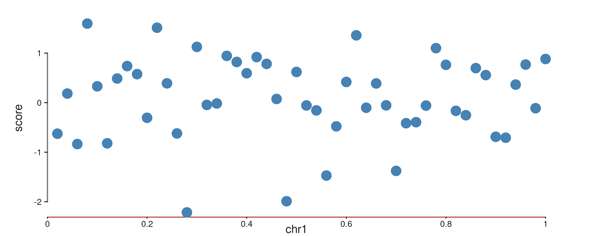
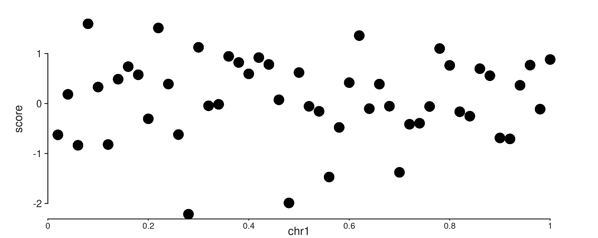
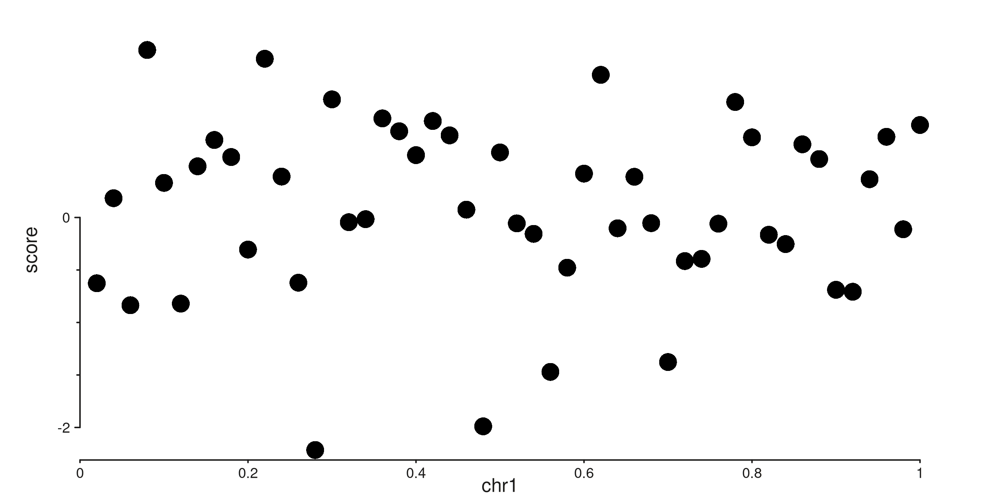
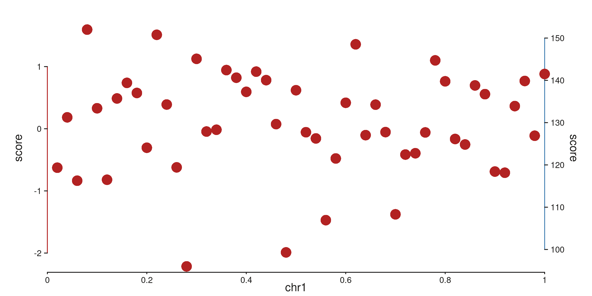
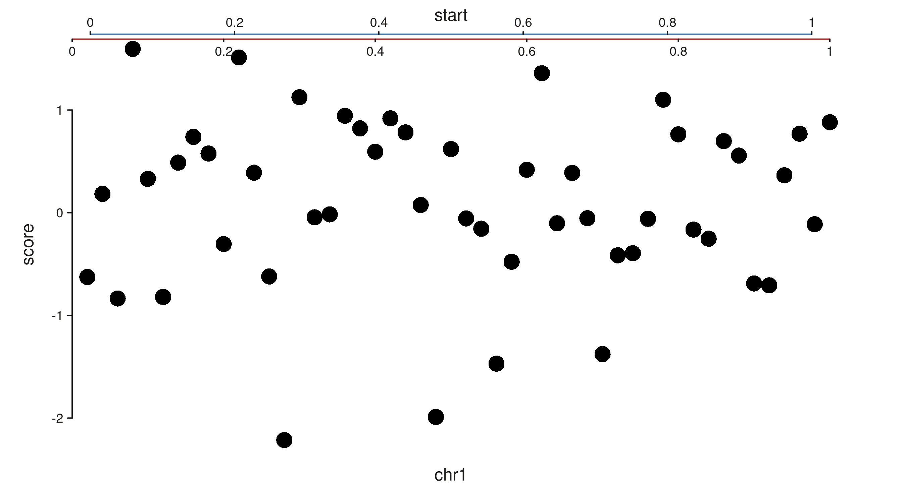
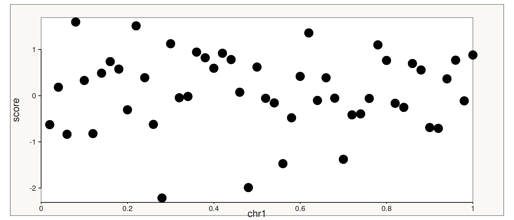
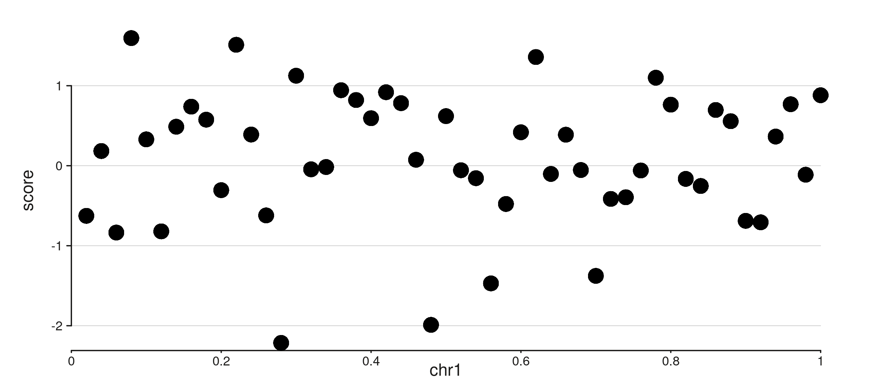
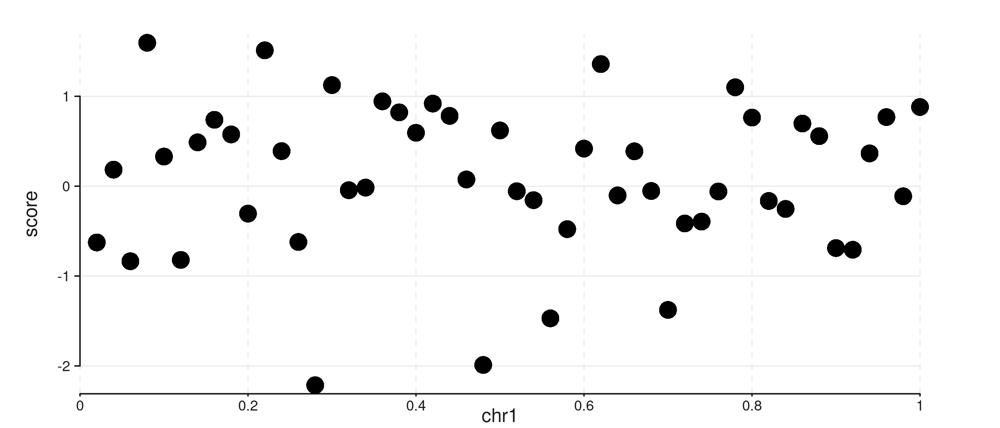
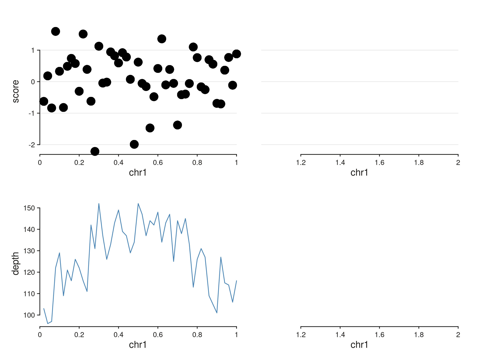
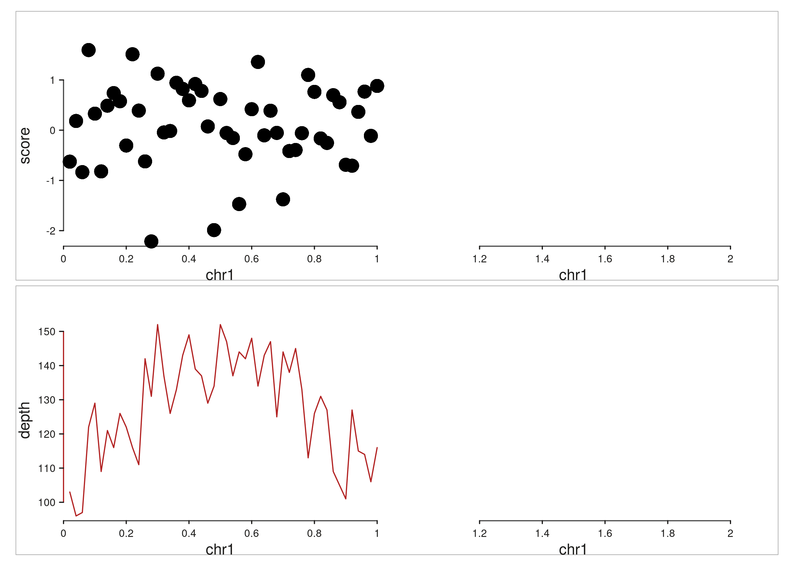

# Aesthetics, Axes, and Secondary Scales

``` r

library(SeqPlotR)
#> 
#> Attaching package: 'SeqPlotR'
#> The following object is masked from 'package:base':
#> 
#>     %||%
library(GenomicRanges)
#> Loading required package: stats4
#> Loading required package: BiocGenerics
#> Loading required package: generics
#> 
#> Attaching package: 'generics'
#> The following objects are masked from 'package:base':
#> 
#>     as.difftime, as.factor, as.ordered, intersect, is.element, setdiff,
#>     setequal, union
#> 
#> Attaching package: 'BiocGenerics'
#> The following objects are masked from 'package:stats':
#> 
#>     IQR, mad, sd, var, xtabs
#> The following objects are masked from 'package:base':
#> 
#>     anyDuplicated, aperm, append, as.data.frame, basename, cbind,
#>     colnames, dirname, do.call, duplicated, eval, evalq, Filter, Find,
#>     get, grep, grepl, is.unsorted, lapply, Map, mapply, match, mget,
#>     order, paste, pmax, pmax.int, pmin, pmin.int, Position, rank,
#>     rbind, Reduce, rownames, sapply, saveRDS, table, tapply, unique,
#>     unsplit, which.max, which.min
#> Loading required package: S4Vectors
#> 
#> Attaching package: 'S4Vectors'
#> The following object is masked from 'package:utils':
#> 
#>     findMatches
#> The following objects are masked from 'package:base':
#> 
#>     expand.grid, I, unname
#> Loading required package: IRanges
#> Loading required package: Seqinfo
```

SeqPlotR’s [`aes()`](http://andrewlynch.io/SeqPlotR/reference/aes.md)
argument on
[`seq_plot()`](http://andrewlynch.io/SeqPlotR/reference/seq_plot.md) and
[`seq_track()`](http://andrewlynch.io/SeqPlotR/reference/seq_track.md)
accepts ggplot2-style hierarchical theme keys. Dotted paths like
`axis.x1.line.col` let you target any axis component, and broader keys
(`axis.line.col`, `axis.x.line.col`) cascade into the more specific
slots. This vignette shows the hierarchy, scale controls (expansion,
break placement, axis capping), secondary axes, and track chrome.

## A shared example

The toy dataset pairs two incompatible measurements on the same genomic
positions: a z-scored signal centered around zero, and a read-depth
count in the 50–200 range. Plotting them on a single y-scale would crush
one of them, so this is a natural fit for a secondary axis.

``` r

win <- GRanges("chr1", IRanges(1, 1e6))
d <- GRanges("chr1",
             IRanges(seq(2e4, 1e6, by = 2e4), width = 1),
             score = rnorm(50),
             depth = round(rpois(50, 100) +
                           40 * sin(seq(0, pi, length.out = 50))))
```

The `%+%` operator returns a `seq_plot` invisibly, so to render a plot
we assign the expression to `p` and then reference it as the last line
of the chunk — knitr auto-prints the result via
[`print.SeqPlot()`](http://andrewlynch.io/SeqPlotR/reference/print.SeqPlot.md),
which calls `$plot()` on the current device.

## 1. Hierarchical theme keys

The axis namespace has four levels of specificity:

| Level | Example            | Meaning               |
|-------|--------------------|-----------------------|
| Root  | `axis.line.col`    | All axes              |
| Dim   | `axis.x.line.col`  | Both x axes (x1 + x2) |
| Side  | `axis.x1.line.col` | Primary x only        |
|       | `axis.x2.line.col` | Secondary x only      |

When SeqPlotR resolves a key, it walks from **most specific to most
general**: `axis.x1.line.col` -\> `axis.x.line.col` -\> `axis.line.col`
-\> built-in default. The first match wins.

``` r

p <- seq_plot() %+%
  seq_track(data = d, windows = win,
            aesthetics = aes(
              axis.line.col    = "grey50",   # all axes
              axis.y.line.lwd  = 1.5,        # both y axes
              axis.x1.line.col = "firebrick" # primary x overrides
            )) %+%
  seq_point(map(x = start, y = score),
            aesthetics = aes(color = "steelblue"))
p
```



## 2. Nested `aes()` values

The same keys can be written in a nested form.
`aes(axis.x = aes(position = "top"))` is identical to
`aes(axis.x.position = "top")`, so components can be grouped by topic
rather than spelled out one by one.

``` r

p <- seq_plot() %+%
  seq_track(data = d, windows = win,
            aesthetics = aes(
              axis.y = aes(
                line = aes(col = "grey20", lwd = 1.2),
                text = aes(size = 0.7)
              )
            )) %+%
  seq_point(map(x = start, y = score))
p
```



## 3. Scale expansion, breaks, and caps

Each axis’s scale options live under `axis.<side>.scale.*`:

- `scale.expand = c(mul, add)` — proportional (`mul` times the data
  range) and absolute padding around the data. Default `c(0.025, 0)`.
- `scale.breaks` — explicit break positions. Otherwise `n_breaks` picks
  [`pretty()`](https://rdrr.io/r/base/pretty.html) breaks.
- `scale.minor_breaks` — scalar (number of sub-divisions) or explicit
  vector.
- `scale.cap` — where the axis line starts and stops:
  - `"capped"` (default) runs from the first to the last break.
  - `"full"` spans the expanded plot range.
  - `"exact"` spans the unexpanded data range.
  - `"ticks"` suppresses the axis line and shows only tick marks.

``` r

p <- seq_plot() %+%
  seq_track(data = d, windows = win,
            aesthetics = aes(
              axis.y1.scale.limits        = c(-3, 3),
              axis.y1.scale.breaks        = c(-2, 0, 2),
              axis.y1.scale.cap           = "capped",
              axis.y1.scale.minor_breaks  = 3
            )) %+%
  seq_point(map(x = start, y = score))
p
```



Equivalent to the above if you prefer an explicit scale object:

``` r

seq_plot() %+%
  seq_track(data = d, windows = win,
            scale_y = seq_scale_continuous(
              limits       = c(-3, 3),
              breaks       = c(-2, 0, 2),
              minor_breaks = 3,
              cap          = "capped"
            )) %+%
  seq_point(map(x = start, y = score))
```

## 4. Secondary axes

An element opts in to the secondary axis by adding `axis.x = 2` or
`axis.y = 2` to its
[`map()`](http://andrewlynch.io/SeqPlotR/reference/map.md). SeqPlotR
then infers an independent scale from those elements, draws a second
axis, and positions the element against the new scale.

The default positions are x1 = bottom, x2 = top, y1 = left, y2 = right.

``` r

p <- seq_plot() %+%
  seq_track(data = d, windows = win,
            aesthetics = aes(
              axis.y1.line.col = "firebrick",
              axis.y2.line.col = "steelblue"
            )) %+%
  seq_point(map(x = start, y = score),
            aesthetics = aes(color = "firebrick")) %+%
  seq_line(map(x = start, y = depth, axis.y = 2),
           aesthetics = aes(color = "steelblue", linewidth = 1.2))
p
```



    #> 50 out-of-bounds data points excluded! (seq_line)

Moving an axis to an unusual position is just a matter of setting its
`position`. Both axes on the same side stack automatically, with the
lower-indexed axis (x1, y1) sitting closer to the panel.

``` r

p <- seq_plot() %+%
  seq_track(data = d, windows = win,
            aesthetics = aes(
              axis.x1.position = "top",
              axis.x2.position = "top",
              axis.x1.line.col = "firebrick",
              axis.x2.line.col = "steelblue"
            ),
            scale_x2 = seq_scale_continuous(limits = c(0, 1))) %+%
  seq_point(map(x = start, y = score))
p
```



## 5. Track and window chrome

The `track.*` namespace controls the rectangle shared by all windows;
`track.window.*` controls each per-window panel rectangle. These do not
inherit from each other — they’re semantically distinct.

``` r

p <- seq_plot() %+%
  seq_track(data = d, windows = win,
            aesthetics = aes(
              track.background.fill        = "#faf8f5",
              track.border.col             = "grey30",
              track.window.background.fill = "white",
              track.window.border.col      = "grey60"
            )) %+%
  seq_point(map(x = start, y = score))
p
```



## 6. Gridlines

Gridlines are drawn at the same positions as axis ticks, but are off by
default. Enable them per dimension with `axis.x.gridline = TRUE` or
`axis.y.gridline = TRUE` in
[`aes()`](http://andrewlynch.io/SeqPlotR/reference/aes.md) on either
[`seq_plot()`](http://andrewlynch.io/SeqPlotR/reference/seq_plot.md) or
[`seq_track()`](http://andrewlynch.io/SeqPlotR/reference/seq_track.md).
They follow the same dotted-path hierarchy as every other axis key —
`axis.gridline.*` sets base defaults, and `axis.x.gridline.*` /
`axis.y.gridline.*` override per dimension.

``` r

p <- seq_plot() %+%
  seq_track(data = d, windows = win,
            aesthetics = aes(
              axis.y.gridline       = TRUE,
              axis.y.gridline.color = "grey80",
              axis.y.gridline.lwd   = 0.5
            )) %+%
  seq_point(map(x = start, y = score))
p
```


You can also pass an
[`aes()`](http://andrewlynch.io/SeqPlotR/reference/aes.md) directly as
the value. Supplying any styling sub-keys is enough to enable the
gridline; no separate `= TRUE` is needed:

``` r

p <- seq_plot() %+%
  seq_track(data = d, windows = win,
            aesthetics = aes(
              axis.y.gridline = aes(color = "grey80", lwd = 0.5)
            )) %+%
  seq_point(map(x = start, y = score))
p
```



Both axes can be shown together. A shared base style comes from
`axis.gridline.*`, and per-dimension keys override it:

``` r

p <- seq_plot() %+%
  seq_track(data = d, windows = win,
            aesthetics = aes(
              axis.y.gridline       = TRUE,
              axis.x.gridline       = TRUE,
              axis.gridline.color   = "grey85",
              axis.gridline.lwd     = 0.4,
              axis.x.gridline.lty   = 2   # dashed x only
            )) %+%
  seq_point(map(x = start, y = score))
p
```



Gridlines respect the standard plot-level vs track-level theme
precedence. Here a plot-level `axis.y.gridline = TRUE` is suppressed on
track B via a track-level override:

``` r

win2 <- GRanges("chr1", IRanges(c(1, 1e6 + 1), c(1e6, 2e6)))

p <- seq_plot(aesthetics = aes(axis.y.gridline       = TRUE,
                               axis.gridline.color   = "grey85")) %+%
  seq_track(track_id = "A", data = d, windows = win2) %+%
  seq_point(map(x = start, y = score)) %__%
  seq_track(track_id = "B", data = d, windows = win2,
            aesthetics = aes(axis.y.gridline = FALSE)) %+%
  seq_line(map(x = start, y = depth), aesthetics = aes(color = "steelblue"))
p
```



## 7. Plot-level vs track-level themes

Themes set on
[`seq_plot()`](http://andrewlynch.io/SeqPlotR/reference/seq_plot.md)
apply to every track; themes on
[`seq_track()`](http://andrewlynch.io/SeqPlotR/reference/seq_track.md)
override them for that track only. This is the same precedence as
ggplot2’s `theme()` plus per-`facet` overrides.

``` r

win2 <- GRanges("chr1", IRanges(c(1, 1e6 + 1), c(1e6, 2e6)))

p <- seq_plot(aesthetics = aes(
    axis.line.col    = "grey30",
    axis.text.size   = 0.55,
    track.border.col = "grey70"
  )) %+%
  seq_track(track_id = "A", data = d, windows = win2) %+%
  seq_point(map(x = start, y = score)) %__%
  seq_track(track_id = "B", data = d, windows = win2,
            aesthetics = aes(axis.y1.line.col = "firebrick")) %+%
  seq_line(map(x = start, y = depth), aesthetics = aes(color = "firebrick"))
p
```



## Cheat sheet

- Any axis component:
  `axis[.side].{line,ticks,text,title}.{col,lwd,size,angle,visible}`.
- Any scale option:
  `axis[.side].scale.{limits,breaks,minor_breaks,expand,cap,n_breaks}`.
- Track position:
  `axis.<side>.position = "top"|"bottom"|"left"|"right"`.
- Route an element to a secondary axis: `map(axis.x = 2)` or
  `map(axis.y = 2)`.
- Flat and nested forms are equivalent: `aes(axis.x.line.col = "red")`
  == `aes(axis.x = aes(line = aes(col = "red")))`.
- Track chrome: `track.{background,border}.{fill,col,lwd,alpha}` and
  `track.window.{background,border}.{fill,col,lwd,alpha}`.
- Gridlines: `axis.x.gridline = TRUE` / `axis.y.gridline = TRUE` to
  enable; style via `axis.[x|y].gridline.{color, lwd, lty, alpha}`
  inheriting from `axis.gridline.*`. Passing `aes(color, lwd, ...)` as
  the value also enables.
