# SeqPlotR Basics: Composite Elements

This vignette walks through the composite elements in SeqPlotR using toy
`GRanges` data. Each section builds a small synthetic dataset and
renders the element via the `seq_plot() %+% seq_track() %+% <element>`
pipeline.

## Coordinate conventions

SeqPlotR automatically selects the x-axis unit from the **narrowest
window** in each track:

| Narrowest window width | Displayed unit | `scale_factor` |
|------------------------|----------------|----------------|
| ≥ 1 Mb (1,000,000 bp)  | Mb             | `1e-6`         |
| ≥ 100 bp               | kb             | `1e-3`         |
| \< 100 bp              | bp             | `1`            |

All windows in a track share the same unit so axis break intervals are
consistent across panels. Override per-track with
`seq_track(window_scale = ...)`, or per-window by setting
`mcols(windows)$scale` directly (highest priority). The examples below
use 2 Mb windows, which auto-infer the Mb unit.

``` r

library(SeqPlotR)
#> 
#> Attaching package: 'SeqPlotR'
#> The following object is masked from 'package:base':
#> 
#>     %||%
library(GenomicRanges)
#> Loading required package: stats4
#> Loading required package: BiocGenerics
#> Loading required package: generics
#> 
#> Attaching package: 'generics'
#> The following objects are masked from 'package:base':
#> 
#>     as.difftime, as.factor, as.ordered, intersect, is.element, setdiff,
#>     setequal, union
#> 
#> Attaching package: 'BiocGenerics'
#> The following objects are masked from 'package:stats':
#> 
#>     IQR, mad, sd, var, xtabs
#> The following objects are masked from 'package:base':
#> 
#>     anyDuplicated, aperm, append, as.data.frame, basename, cbind,
#>     colnames, dirname, do.call, duplicated, eval, evalq, Filter, Find,
#>     get, grep, grepl, is.unsorted, lapply, Map, mapply, match, mget,
#>     order, paste, pmax, pmax.int, pmin, pmin.int, Position, rank,
#>     rbind, Reduce, rownames, sapply, saveRDS, table, tapply, unique,
#>     unsplit, which.max, which.min
#> Loading required package: S4Vectors
#> 
#> Attaching package: 'S4Vectors'
#> The following object is masked from 'package:utils':
#> 
#>     findMatches
#> The following objects are masked from 'package:base':
#> 
#>     expand.grid, I, unname
#> Loading required package: IRanges
#> Loading required package: Seqinfo

# A single 2-Mb window on chr1 → axis labels read as 1.0, 1.5, 2.0 Mb.
win <- GRanges("chr1", IRanges(1e6, 3e6))
```

## Tracks, windows, and margins

Every track is allocated a rectangular cell in the page layout and
partitioned into **five nested zones**, two at the track level and three
at the window level:

- **Track outer margin** — outermost band on the track cell. Axis titles
  (taken from the track `mapping`) are drawn here.
  `seq_track(track_outer_margin = ...)`. Default `0.02`.
- **Track inner margin** — separates the title band from the window row.
  `seq_track(track_inner_margin = ...)`. Default `0.02`.
- **Window outer margin** — per-window spacer inside the track plot
  region. `seq_track(window_outer_margin = ...)`. Default `0`.
- **Window inner margin** — per-window band holding axis lines, ticks,
  and tick labels. `seq_track(window_inner_margin = ...)`. Default
  `0.02`.
- **Plot area** — what remains per window. Elements render here;
  `panel$inner` carries these coordinates.

Axis lines sit at the boundary between the plot area and the window
inner margin. The gap between adjacent windows is the plot- or
track-level `aes("window.gap.width" = ...)` (default `0.01`); the gap
between tracks is the plot-level `trackGaps` (default `0.01`). The old
`seq_track(window_margin = ...)` constructor argument is deprecated —
see *Window gap width* below.

The schematic below lays out two tracks × two windows using nothing but
SeqPlotR, with each zone coloured via the plot-level `trackBackground`,
`trackInnerBackground`, `windowBoxBackground`, `windowInnerBackground`,
and `windowBackground` aesthetics. `seq_text` places a label in each
plot area.

``` r

# Two windows (2 Mb and 1.5 Mb wide).
schematic_win <- GRanges(
  "chr1", IRanges(start = c(1e6, 5e6), end = c(3e6, 6.5e6)))

# One label centred inside each window for each track.
mk_labels <- function(track_name) {
  GRanges(
    "chr1", IRanges(start = c(2e6, 5.75e6), width = 1),
    label = paste0(track_name, "\nWindow ", c(1, 2))
  )
}
lbl_A <- mk_labels("Track A")
lbl_B <- mk_labels("Track B")

# Zone colors via plot-level aesthetics; axes turned off so the five
# nested rectangles are visible without interference.
schematic_aes <- aes(
  trackBackground        = "#F89A8A",  # track outer margin
  trackBorder            = "grey30",
  trackInnerBackground   = "#ECCB60",  # track inner margin
  trackInnerBorder       = "grey30",
  windowBoxBackground    = "#A699D0",  # window outer margin
  windowBoxBorder        = "grey30",
  windowInnerBackground  = "#BEC97E",  # window inner margin
  windowInnerBorder      = "grey30",
  windowBackground       = "#92BFDB",  # plot area
  windowBorder           = "grey30",
  xAxisLine = FALSE, xAxisTicks = FALSE, xAxisLabels = FALSE,
  xAxisTitle = FALSE,
  yAxisLine = FALSE, yAxisTicks = FALSE, yAxisLabels = FALSE,
  yAxisTitle = FALSE,
  trackGaps = 0.04,
  "window.gap.width" = 0.03
)

seq_plot(aesthetics = schematic_aes) %|%
  seq_track(track_id = "A",
            data = lbl_A,
            mapping = map(x = start, label = label),
            windows = schematic_win,
            track_outer_margin  = 0.035,
            track_inner_margin  = 0.025,
            window_outer_margin = 0.025,
            window_inner_margin = 0.035) %+%
  seq_text(aesthetics = aes(fontsize = 12, color = "#1C1B1A")) %__%
  seq_track(track_id = "B",
            data = lbl_B,
            mapping = map(x = start, label = label),
            windows = schematic_win,
            track_outer_margin  = 0.035,
            track_inner_margin  = 0.025,
            window_outer_margin = 0.025,
            window_inner_margin = 0.035) %+%
  seq_text(aesthetics = aes(fontsize = 12, color = "#1C1B1A")) -> p
p$plot()
```

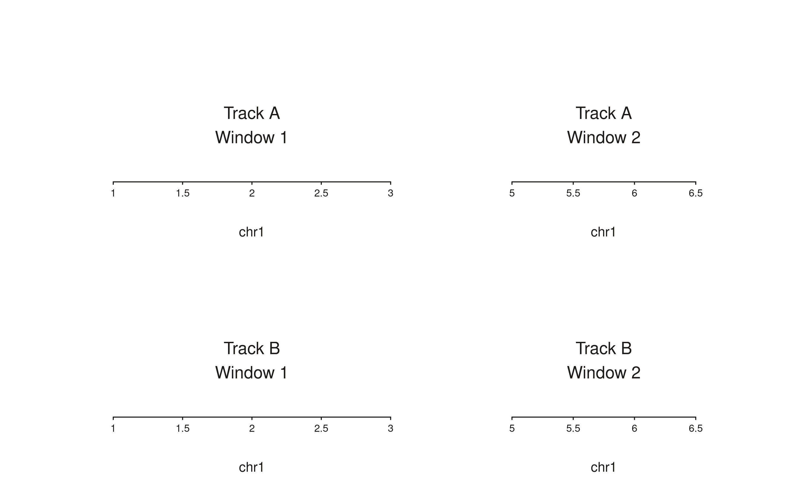

Reading the schematic, from outside to inside on each track:

- **Pink** — track outer margin (axis titles live here).
- **Yellow** — track inner margin.
- **Purple** — window outer margin (per-window spacer).
- **Green** — window inner margin (axis lines, ticks, tick labels live
  here).
- **Blue** — plot area, where elements render.
- The vertical green/blue split inside a track is the **window margin**
  between the two windows.
- The horizontal gap between the two tracks is the **track gap**.

The next chunk shows the same layout with real elements and axes on.
Axis titles appear in the track outer margin, pulling their text
directly from the track `mapping` (the x title is `start`, the y titles
are `score` and `impact`).

``` r

trkA_gr <- GRanges("chr1",
  IRanges(start = c(1.2e6, 1.8e6, 2.4e6, 5.2e6, 5.7e6, 6.2e6), width = 1e5),
  score = c(0.3, 0.7, 0.5, 0.6, 0.4, 0.8))

trkB_gr <- GRanges("chr1",
  IRanges(start = c(1.3e6, 2.0e6, 2.7e6, 5.3e6, 5.9e6, 6.3e6), width = 1),
  impact = c(0.5, 0.9, 0.4, 0.7, 0.3, 0.6))

real_aes <- aes(
  trackBackground      = "#FCEBEA",
  trackInnerBackground = "#FAF5DC",
  "window.gap.width"   = 0.02
)

seq_plot(aesthetics = real_aes) %|%
  seq_track(track_id = "Track A",
            data = trkA_gr,
            mapping = map(x = start, y = score),
            windows = schematic_win,
            track_outer_margin = 0.03,
            window_inner_margin = 0.04) %+%
  seq_bar(aesthetics = aes(fill = "#4385BE")) %__%
  seq_track(track_id = "Track B",
            data = trkB_gr,
            mapping = map(x = start, y = impact),
            windows = schematic_win,
            track_outer_margin = 0.03,
            window_inner_margin = 0.04) %+%
  seq_lollipop(aesthetics = aes(color = "#AF3029", linewidth = 1.2)) -> p
p$plot()
```

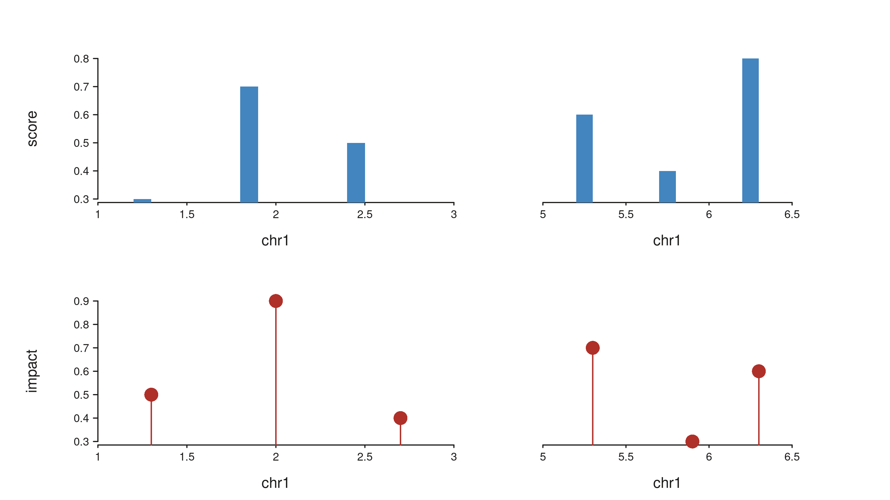

### Window gap width

`aes("window.gap.width" = <npc>)` controls the horizontal gap between
adjacent windows within a track. Set it on
[`seq_plot()`](http://andrewlynch.io/SeqPlotR/reference/seq_plot.md) to
apply across every track, or on a specific
[`seq_track()`](http://andrewlynch.io/SeqPlotR/reference/seq_track.md)
to override the plot-level value for that track only. Default is `0.01`.

``` r

gap_win <- GRanges(
  "chr1",
  IRanges(start = c(1, 1e6 + 1, 2e6 + 1), width = 1e6)
)
gap_lbl <- function(track_name) {
  GRanges(
    "chr1",
    IRanges(start = c(5e5, 1.5e6, 2.5e6), width = 1),
    label = paste0(track_name, "\nW", c(1, 2, 3))
  )
}

# Three tracks, three gap widths: collapsed, default, generous.
seq_plot(aesthetics = aes(
    windowBackground = "#92BFDB", windowBorder = "grey30",
    xAxisLine = FALSE, xAxisTicks = FALSE, xAxisLabels = FALSE,
    xAxisTitle = FALSE, yAxisLine = FALSE, yAxisTicks = FALSE,
    yAxisLabels = FALSE, yAxisTitle = FALSE,
    "window.gap.width" = 0   # plot-level default for all tracks
  )) %|%
  seq_track(track_id = "Collapsed (0)",
            data = gap_lbl("Collapsed"),
            mapping = map(x = start, label = label),
            windows = gap_win) %+%
  seq_text(aesthetics = aes(fontsize = 11)) %__%
  seq_track(track_id = "Default (0.01)",
            data = gap_lbl("Default"),
            mapping = map(x = start, label = label),
            windows = gap_win,
            aesthetics = aes("window.gap.width" = 0.01)) %+%
  seq_text(aesthetics = aes(fontsize = 11)) %__%
  seq_track(track_id = "Generous (0.05)",
            data = gap_lbl("Generous"),
            mapping = map(x = start, label = label),
            windows = gap_win,
            aesthetics = aes("window.gap.width" = 0.05)) %+%
  seq_text(aesthetics = aes(fontsize = 11)) -> p
p$plot()
```

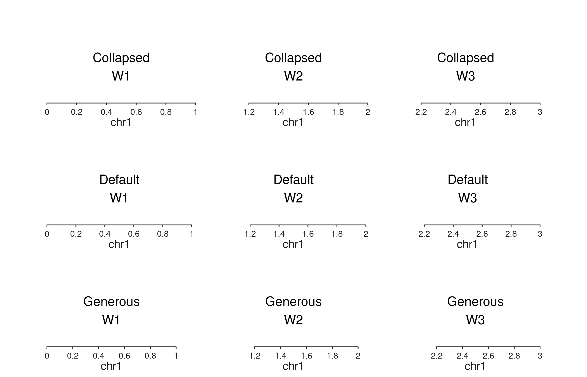

The legacy `seq_track(window_margin = ...)` constructor argument is
deprecated and emits a warning when used; switch to
`aes("window.gap.width" = ...)`. The older `aes(window_gaps = ...)` key
still works as an alias but `window.gap.width` takes priority when both
are set.

### Margin recipes

The five zones are independent knobs. The examples below share a single
small dataset and vary only the margin arguments so the effect of each
one is visible.

``` r

recipe_win <- GRanges("chr1", IRanges(1e6, 3e6))
recipe_gr  <- GRanges(
  "chr1",
  IRanges(start = seq(1.1e6, 2.9e6, by = 2e5), width = 8e4),
  score = runif(10, 0.2, 1.0)
)
```

**Minimal:** drop the axis titles and the track outer margin — the plot
fills the full track cell.

``` r

seq_plot(aesthetics = aes(xAxisTitle = FALSE, yAxisTitle = FALSE)) %|%
  seq_track(data = recipe_gr,
            mapping = map(x = start, y = score),
            windows = recipe_win,
            track_outer_margin = 0,
            window_inner_margin = 0.02) %+%
  seq_bar(aesthetics = aes(fill = "#4385BE")) -> p
p$plot()
```

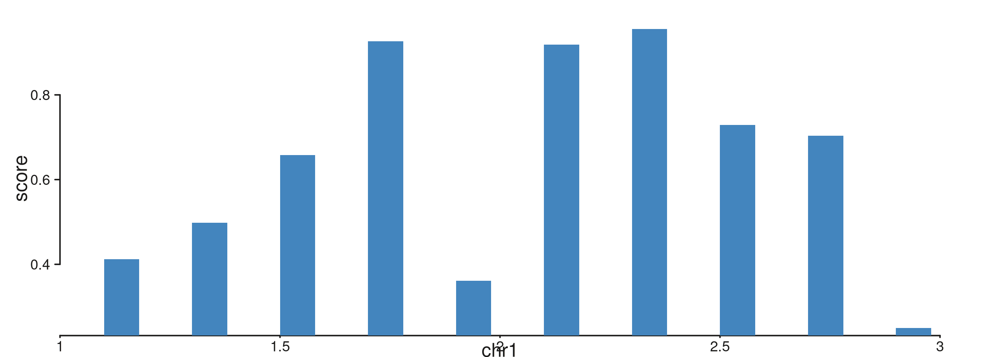

**Room for titles and labels:** widen both track and window margins. The
axis titles (`start`, `score`) auto-populate from the mapping.

``` r

seq_plot() %|%
  seq_track(data = recipe_gr,
            mapping = map(x = start, y = score),
            windows = recipe_win,
            track_outer_margin = c(0.05, 0.05, 0.02, 0.02),
            window_inner_margin = 0.06) %+%
  seq_bar(aesthetics = aes(fill = "#4385BE")) -> p
p$plot()
```

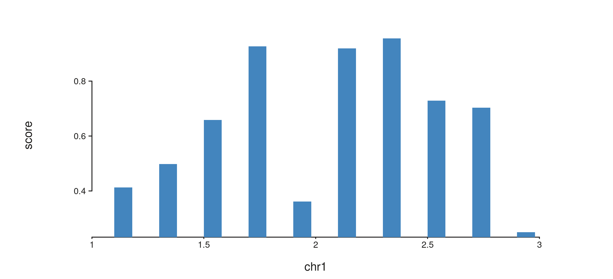

**Asymmetric margins:** the length-4 form uses base-R
`par(mar = c(bottom, left, top, right))` order. Below the x-axis title
gets a wider bottom band; the top edge stays flush.

``` r

seq_plot() %|%
  seq_track(data = recipe_gr,
            mapping = map(x = start, y = score),
            windows = recipe_win,
            track_outer_margin = c(0.06, 0.06, 0, 0),
            track_inner_margin = 0.015,
            window_inner_margin = 0.04) %+%
  seq_bar(aesthetics = aes(fill = "#4385BE")) -> p
p$plot()
```

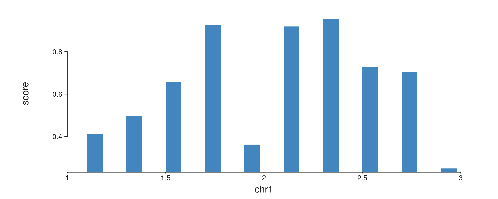

**Window inner vs window outer margin:** turn on `windowBoxBackground`
and `windowInnerBackground` to see the two per-window bands. The window
outer margin (purple) is an optional spacer; the window inner margin
(green) is where ticks and labels sit.

``` r

seq_plot(aesthetics = aes(
    windowBoxBackground   = "#C4B9E0",
    windowInnerBackground = "#BEC97E"
  )) %|%
  seq_track(data = recipe_gr,
            mapping = map(x = start, y = score),
            windows = recipe_win,
            track_outer_margin  = 0.03,
            track_inner_margin  = 0.01,
            window_outer_margin = 0.02,
            window_inner_margin = 0.05) %+%
  seq_bar(aesthetics = aes(fill = "#4385BE")) -> p
p$plot()
```

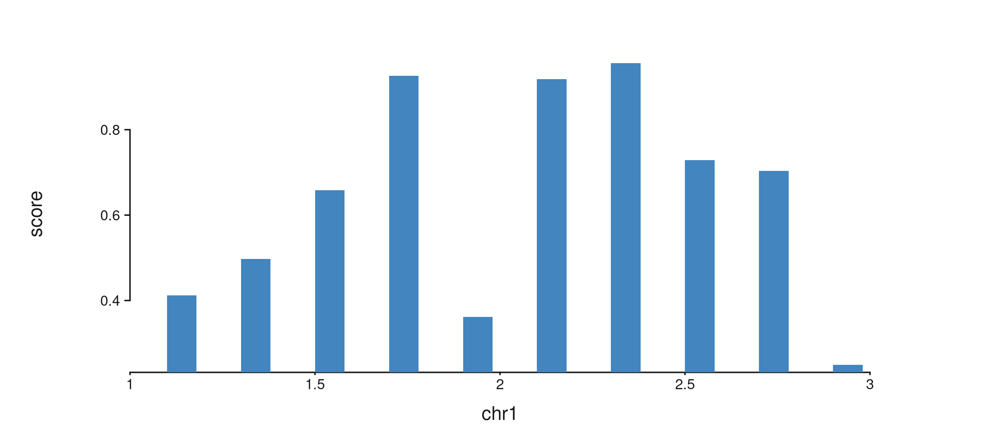

### Track and window sizing

Relative sizing is controlled by three arguments: `track_width` (within
a row), `track_height` (across rows), and the `scale` mcols column on
the `windows` GRanges (within a track’s plot region).

**Unequal track widths on one row.** Track A is 3× wider than B.

``` r

win_small <- GRanges("chr1", IRanges(1e6, 3e6))
gr_small  <- GRanges("chr1",
  IRanges(start = seq(1.1e6, 2.9e6, by = 2e5), width = 8e4),
  score = runif(10, 0.2, 1.0))

seq_plot() %|%
  seq_track(track_id = "A",
            data = gr_small,
            mapping = map(x = start, y = score),
            windows = win_small,
            track_width = 3) %+%
  seq_bar(aesthetics = aes(fill = "#4385BE")) %|%
  seq_track(track_id = "B",
            data = gr_small,
            mapping = map(x = start, y = score),
            windows = win_small,
            track_width = 1) %+%
  seq_lollipop(aesthetics = aes(color = "#AF3029")) -> p
p$plot()
```

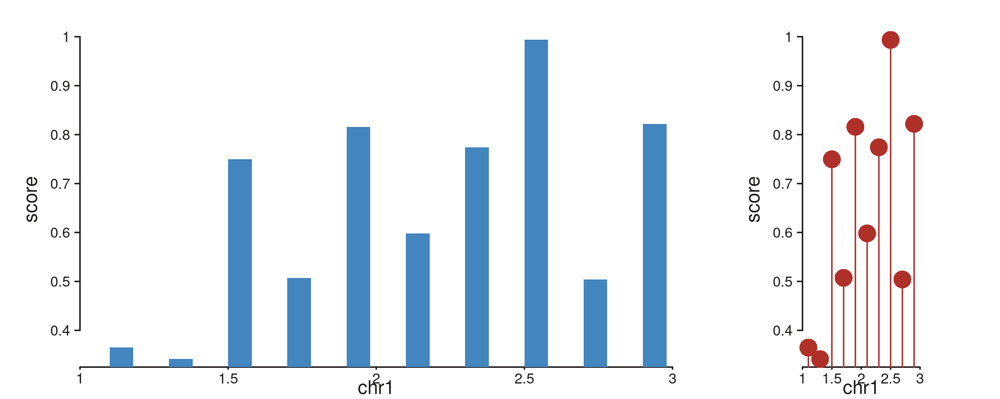

**Unequal track heights on stacked rows.** A points track twice as tall
as the bar track below it.

``` r

xs_sig <- seq(1.05e6, 2.95e6, length.out = 40)
sig_gr <- GRanges("chr1", IRanges(start = xs_sig, width = 1),
                  score = sin((xs_sig - 1e6) / 3e5) * 0.4 + 0.5)

seq_plot() %|%
  seq_track(track_id = "Signal",
            data = sig_gr,
            mapping = map(x = start, y = score),
            windows = win_small,
            track_height = 2) %+%
  seq_line(aesthetics = aes(color = "#4385BE", linewidth = 1.5)) %__%
  seq_track(track_id = "Bars",
            data = gr_small,
            mapping = map(x = start, y = score),
            windows = win_small,
            track_height = 1) %+%
  seq_bar(aesthetics = aes(fill = "#8B7EC8")) -> p
p$plot()
```

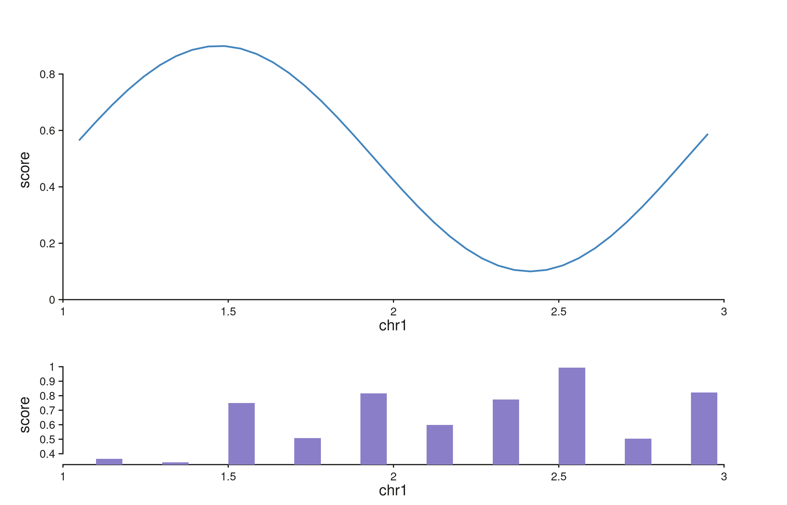

**Per-window scale factor.** Within a multi-window track, windows are
sized by `width(windows) * mcols(windows)$scale`. Defaults to the
auto-inferred scale for all windows. Setting one window’s scale to `0`
shrinks it to nothing; setting distinct scales compresses or expands
individual windows relative to others.

``` r

# Two windows of equal genomic width, but the second rendered at
# 2× the first's relative width.
scaled_win <- GRanges(
  "chr1", IRanges(start = c(1e6, 5e6), end = c(3e6, 7e6)))
S4Vectors::mcols(scaled_win)$scale <- c(1e-6, 2e-6)

scaled_gr <- GRanges("chr1",
  IRanges(start = c(seq(1.2e6, 2.8e6, length.out = 5),
                    seq(5.2e6, 6.8e6, length.out = 5)),
          width = 1e5),
  score = runif(10, 0.2, 1.0))

seq_plot() %|%
  seq_track(data = scaled_gr,
            mapping = map(x = start, y = score),
            windows = scaled_win) %+%
  seq_bar(aesthetics = aes(fill = "#4385BE")) -> p
p$plot()
```

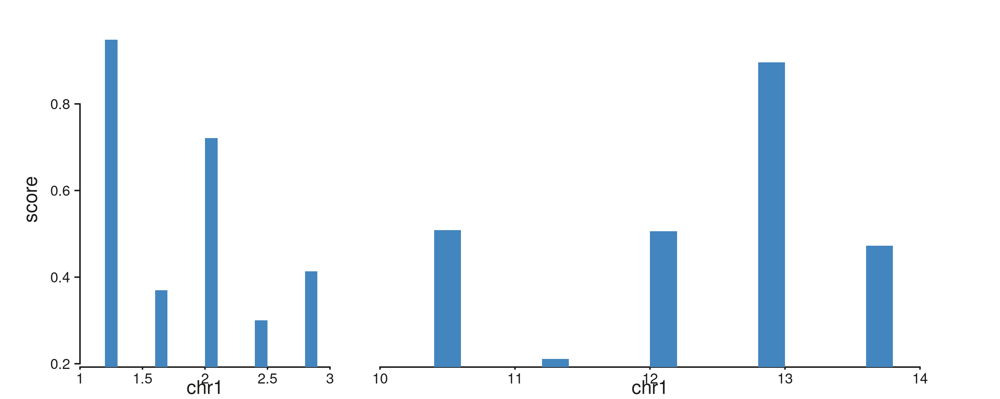

**Track-level unit override with `window_scale`.** Pass `window_scale`
on `seq_track` to force a fixed scale factor for all windows, or a
positional vector to set each window independently. `window_scale`
overrides the auto-inferred unit but is overridden by any
`mcols(windows)$scale` already present. Length-1 applies to all windows;
any other mismatched length triggers a warning and recycles.

``` r

# Two 5 Mb windows — auto-inference gives Mb, but we force kb.
mb_win <- GRanges("chr1", IRanges(start = c(1e6, 1e7 + 1), width = 5e6))
mb_gr  <- GRanges("chr1",
  IRanges(start = c(seq(1.2e6, 5.8e6, length.out = 5),
                    seq(1.02e7, 1.58e7, length.out = 5)),
          width = 2e5),
  score = runif(10, 0.2, 1.0))

seq_plot() %|%
  seq_track(data = mb_gr,
            mapping = map(x = start, y = score),
            windows = mb_win,
            window_scale = 1e-3) %+%
  seq_bar(aesthetics = aes(fill = "#4385BE")) -> p
p$plot()
```

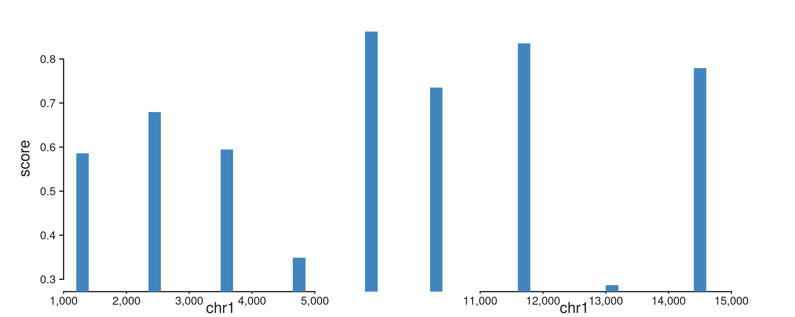

## `seq_bar` — simple bars

One filled rectangle per interval. With no `group` mapping, each bar’s
height is its mapped `y` value.

``` r

bar_gr <- GRanges(
  "chr1",
  IRanges(start = seq(1.1e6, 2.9e6, by = 2e5), width = 8e4),
  score = runif(10, 0.2, 1.0)
)

seq_plot() %|%
  seq_track(data = bar_gr,
            mapping = map(x = start, y = score),
            windows = win) %+%
  seq_bar() -> p
p$plot()
```

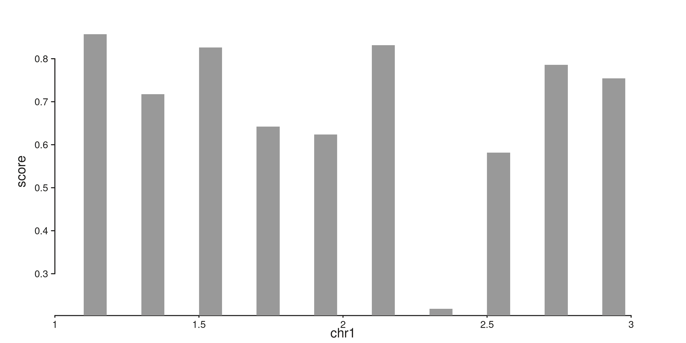

### Stacked bars

Supplying a `group` mapping causes bars at identical x positions to
stack. Colors are drawn from the Flexoki palette keyed on group level.

``` r

stack_gr <- GRanges(
  "chr1",
  IRanges(start = rep(seq(1.2e6, 2.8e6, by = 2e5), each = 3), width = 5e4),
  value    = runif(27, 0.1, 0.5),
  category = rep(c("A", "B", "C"), times = 9)
)

seq_plot() %|%
  seq_track(data = stack_gr,
            mapping = map(x = start, y = value, group = category),
            windows = win) %+%
  seq_bar() -> p
p$plot()
#> 8 out-of-bounds data points excluded! (seq_bar)
```

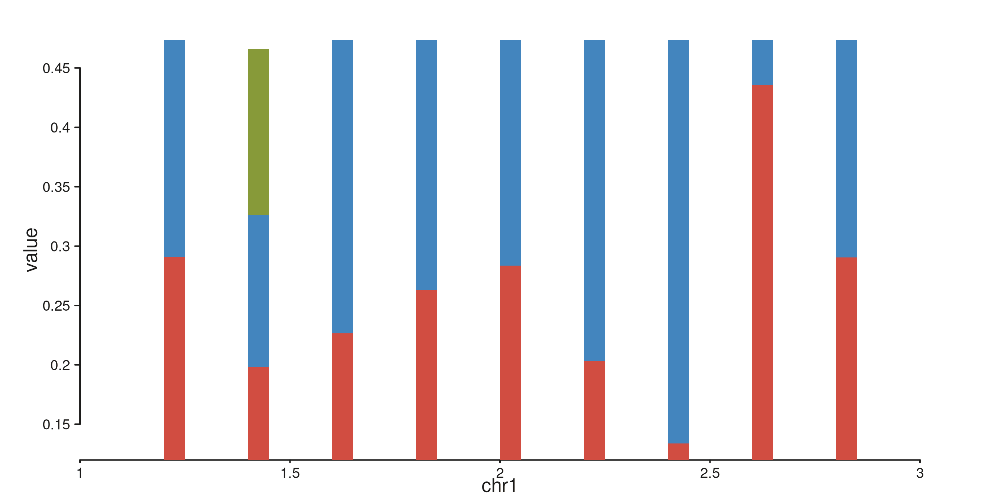

## `seq_ribbon` — filled band between two y series

Requires `y_min` and `y_max` mappings. Useful for confidence bands.

``` r

xs <- seq(1.05e6, 2.95e6, length.out = 50)
mu <- sin((xs - 1e6) / 3e5) * 0.3 + 0.5
band <- 0.15

ribbon_gr <- GRanges(
  "chr1", IRanges(start = xs, width = 1),
  mean = mu,
  lo   = mu - band,
  hi   = mu + band
)

seq_plot() %|%
  seq_track(data = ribbon_gr,
            mapping = map(x = start, y_min = lo, y_max = hi),
            windows = win) %+%
  seq_ribbon(aesthetics = aes(fill = "#4385BE", alpha = 0.5)) -> p
p$plot()
```

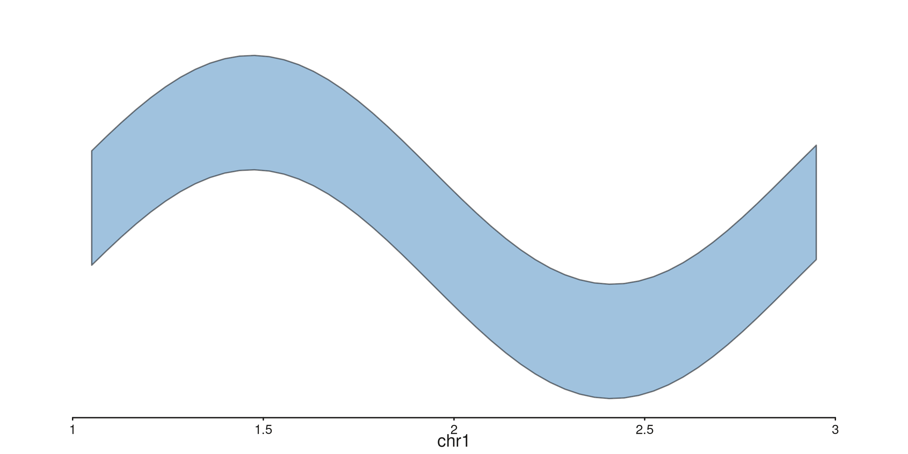

## `seq_density` — kernel density estimate

Computes [`stats::density()`](https://rdrr.io/r/stats/density.html) on
the mapped `y` and renders the distribution as a filled area. The
density evaluation axis runs horizontally, mapped through the track’s
`yscale`.

``` r

dens_gr <- GRanges(
  "chr1", IRanges(start = seq(1e6, 3e6, length.out = 200), width = 1),
  score = c(rnorm(120, mean = 0.3, sd = 0.05),
            rnorm(80,  mean = 0.7, sd = 0.08))
)

seq_plot() %|%
  seq_track(data = dens_gr,
            mapping = map(x = start, y = score),
            windows = win) %+%
  seq_density(aesthetics = aes(fill = "#879A39", alpha = 0.7)) -> p
p$plot()
```

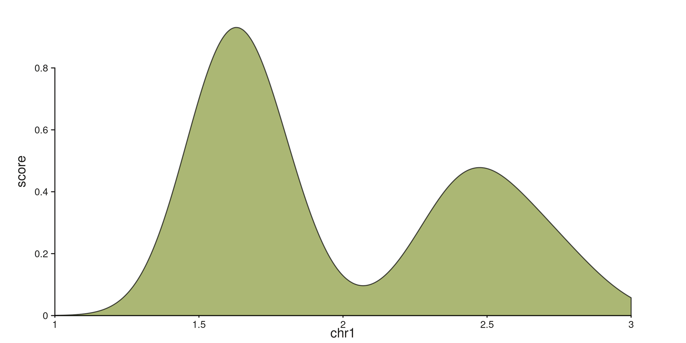

## `seq_tile` — rectangles per interval

### Unrotated (default): one rectangle per observation

``` r

tile_gr <- GRanges(
  "chr1",
  IRanges(start = seq(1.1e6, 2.9e6, by = 1e5), width = 8e4),
  fill_col = sample(flexoki_palette(5), 19, replace = TRUE)
)

seq_plot() %|%
  seq_track(data = tile_gr,
            mapping = map(x = start, fill = fill_col),
            windows = win) %+%
  seq_tile(aesthetics = aes(rotate = FALSE)) -> p
p$plot()
```

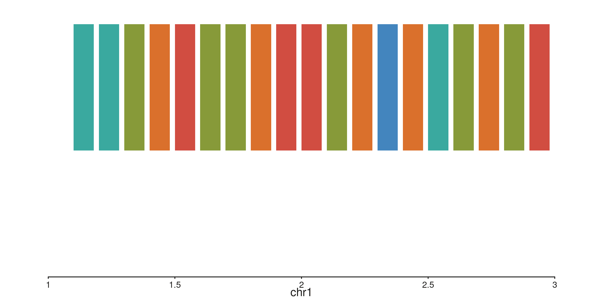

## `seq_lollipop` — stem + point

Vertical stem from `baseline` (default 0) to `y`, with a point at `y`.
Good for sparse, discrete events (e.g. mutation calls).

``` r

lp_gr <- GRanges(
  "chr1",
  IRanges(start = sample(seq(1.05e6, 2.95e6, by = 1e4), 15), width = 1),
  impact = runif(15, 0.2, 1.0)
)

seq_plot() %|%
  seq_track(data = lp_gr,
            mapping = map(x = start, y = impact),
            windows = win) %+%
  seq_lollipop(aesthetics = aes(color = "#AF3029", linewidth = 1.2)) -> p
p$plot()
```

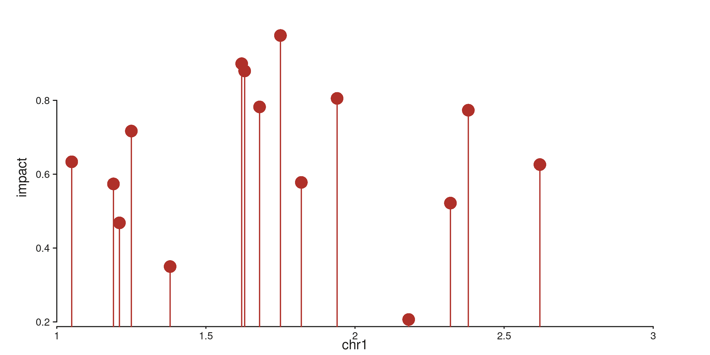

## `seq_gene` — format-agnostic gene models

All column references come through
[`map()`](http://andrewlynch.io/SeqPlotR/reference/map.md): `group`
joins features into one gene, `strand` orients the arrows, `type`
distinguishes exons from UTRs, `label` places the gene name, and `color`
tints each gene.

``` r

gene_gr <- GRanges(
  "chr1",
  IRanges(
    start = c(1.10e6, 1.20e6, 1.35e6, 1.50e6, 1.58e6,
              1.90e6, 2.05e6, 2.18e6, 2.30e6,
              2.55e6, 2.68e6, 2.80e6),
    width = c( 3e4,  6e4,  4e4,  5e4,  2e4,
               4e4,  8e4,  5e4,  3e4,
               6e4,  3e4,  5e4)
  ),
  gene_id   = c("A","A","A","A","A",
                "B","B","B","B",
                "C","C","C"),
  gene_name = c("TP53","TP53","TP53","TP53","TP53",
                "MYC","MYC","MYC","MYC",
                "BRCA1","BRCA1","BRCA1"),
  strand_col = c("+","+","+","+","+",
                 "-","-","-","-",
                 "+","+","+"),
  feature = c("UTR","exon","exon","exon","UTR",
              "UTR","exon","exon","UTR",
              "exon","exon","exon"),
  color = c(rep("#205EA6", 5),
            rep("#AF3029", 4),
            rep("#66800B", 3))
)

seq_plot() %|%
  seq_track(data = gene_gr,
            mapping = map(group  = gene_id,
                          type   = feature,
                          strand = strand_col,
                          label  = gene_name,
                          color  = color),
            windows = win) %+%
  seq_gene(map(group  = gene_id,
               type   = feature,
               strand = strand_col,
               label  = gene_name,
               color  = color)) -> p
p$plot()
```

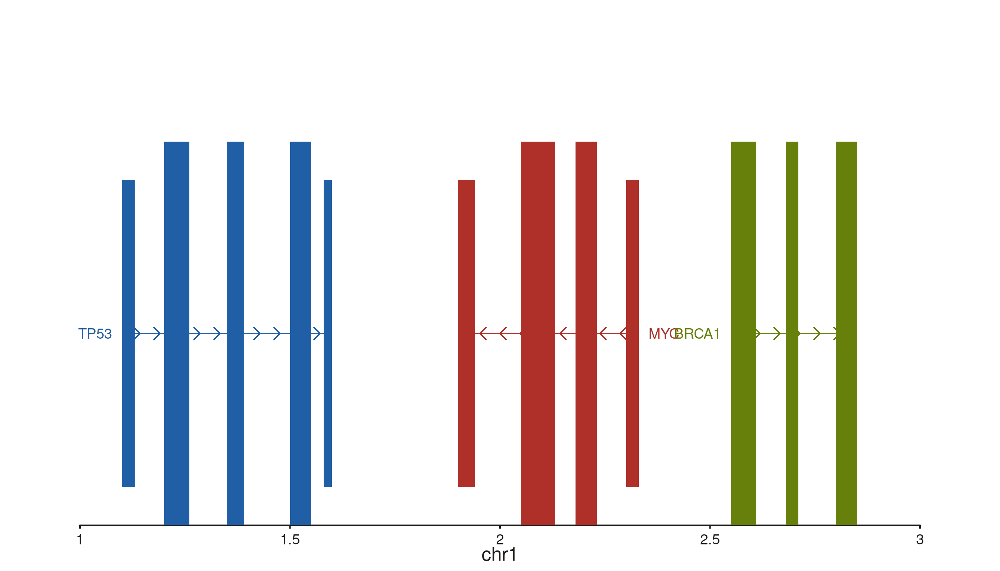

## Multi-region windows

A single `windows` GRanges may contain several ranges. Each window
becomes its own panel within the same track, with relative widths set by
`width(windows)`. The same mapping resolves against every window
independently, and per-panel x-scales reflect the local coordinates.

``` r

multi_win <- GRanges(
  "chr1",
  IRanges(start = c(1.0e6, 5.0e6), end = c(3.0e6, 6.5e6))
)

starts_A <- seq(1.1e6, 2.9e6, length.out = 10)  # 10 in window 1
starts_B <- seq(5.1e6, 6.4e6, length.out = 10)  # 10 in window 2
multi_gr <- GRanges(
  "chr1",
  IRanges(start = c(starts_A, starts_B), width = 5e4),
  score  = runif(20, 0.2, 1.0),
  region = rep(c("Region A", "Region B"), times = c(10, 10))
)

seq_plot() %|%
  seq_track(data = multi_gr,
            mapping = map(x = start, y = score, group = region),
            windows = multi_win) %+%
  seq_bar() -> p
p$plot()
```

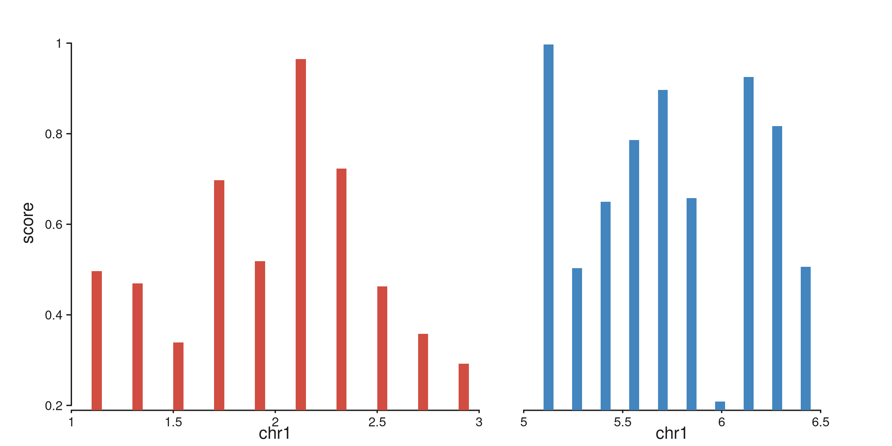

## Flipping the axes: genomic on x vs. genomic on y

By default every `seq_track` runs **genomic x** along its width and lets
elements choose the y-axis scale from their data. Pass
`scale_y = seq_scale_genomic(...)` to flip the track so genomic position
runs along **y** instead; then set `scale_x = seq_scale_continuous(...)`
(or `seq_scale_discrete(...)`) to carry a scalar / categorical value on
the x-axis. The same data can be rendered either way.

[`seq_track()`](http://andrewlynch.io/SeqPlotR/reference/seq_track.md)
exposes three arguments that drive this:

- `scale_x` — controls the x-axis scale (defaults to the genomic range
  of the track’s `windows`).
- `scale_y` — controls the y-axis scale. `seq_scale_genomic(...)`
  auto-enables `uses_genomic_y`.
- `y_windows` — shorthand to set a genomic y-range without constructing
  a scale object.

### Same gene set, two orientations

A small gene-level table (`log2fc` per gene, one point per gene):

``` r

gene_meta <- GRanges("chr1",
  IRanges(start = seq(1.1e6, 2.9e6, length.out = 14), width = 1e4),
  log2fc = c(-2.4, -1.3, 0.9, 2.1,  1.6, -0.5,  2.7,
              0.4, -1.8,  1.2, 0.2,  0.8, -2.2,  1.1),
  sig    = c("down","down","ns","up","up","ns","up",
             "ns","down","up","ns","ns","down","up"))

sig_cols <- c(up = "#AF3029", down = "#205EA6", ns = "#878580")
```

**Genomic x, scalar y (conventional).** `x = start` runs along the 1–3
Mb genomic window; `y = log2fc` is scalar.

``` r

seq_plot() %|%
  seq_track(data = gene_meta,
            mapping = map(x = start, y = log2fc, color = sig),
            windows = win) %+%
  seq_segment(mapping = map(x = start, x_end = start,
                            y = 0, y_end = log2fc, color = sig),
              aesthetics = aes(linewidth = 2)) %+%
  seq_point(aesthetics = aes(size = 0.9)) -> p
p$plot()
#> 14 out-of-bounds data points excluded! (seq_point)
```

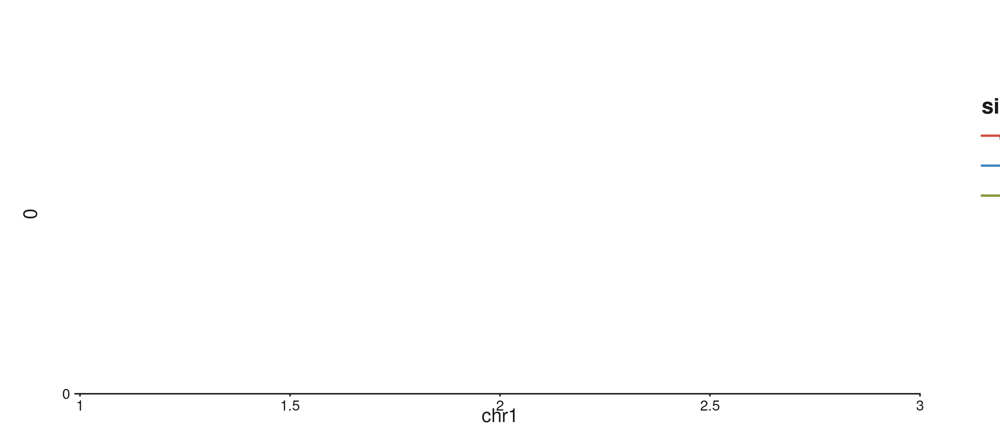

**Scalar x, genomic y (flipped).** `scale_x` carries `log2fc` in
`[-3, 3]`; `scale_y = seq_scale_genomic(win)` puts genomic position on
the vertical axis. The lollipops now fan out horizontally from `x = 0`,
with one row per gene at its true genomic coordinate.

``` r

seq_plot() %|%
  seq_track(data = gene_meta,
            mapping = map(x = log2fc, y = mid, color = sig),
            windows = win,
            scale_x = seq_scale_continuous(limits = c(-3, 3)),
            scale_y = seq_scale_genomic(win),
            track_width = 0.6) %+%
  seq_segment(mapping = map(x = 0, x_end = log2fc,
                            y = mid, y_end = mid, color = sig),
              aesthetics = aes(linewidth = 2)) %+%
  seq_point(aesthetics = aes(size = 0.9)) -> p
p$plot()
```

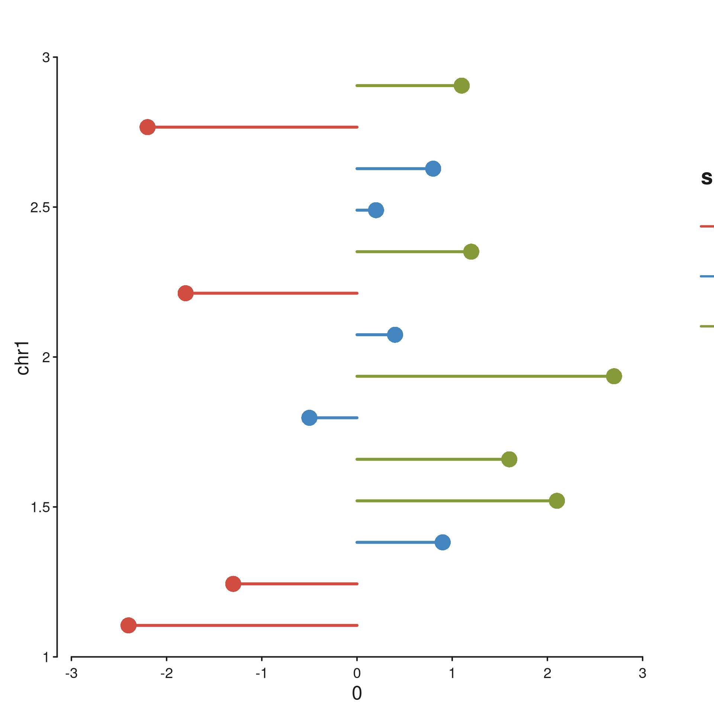

The two plots encode the same table — only the orientation of the
genomic axis changes. In the flipped version the y-tick labels fall back
to Mb units (the genomic `yScaleFactor`, matching the x-axis default) so
`1.5 Mb` reads as `1.5` rather than `1,500,000`.

### Coverage signal flipped onto the y-axis

The same principle extends to continuous signal. Below, a coverage curve
is shown first in the conventional orientation, then flipped so depth
runs along x and genomic position along y — useful as a narrow sidebar
next to a wider browser panel.

``` r

cov_xs <- seq(1.05e6, 2.95e6, length.out = 200)
cov_gr <- GRanges("chr1", IRanges(cov_xs, width = 1),
                  depth = 0.5 + 0.3 * sin((cov_xs - 1e6) / 3e5))
```

``` r

seq_plot() %|%
  seq_track(data = cov_gr,
            mapping = map(x = start, y = depth),
            windows = win) %+%
  seq_area(aesthetics = aes(fill = "#4385BE",
                            color = "#205EA6",
                            alpha = 0.6, linewidth = 0.7)) -> p
p$plot()
```

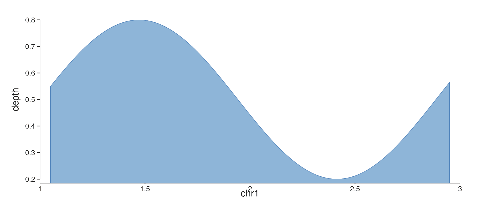

``` r

seq_plot() %|%
  seq_track(data = cov_gr,
            mapping = map(x = depth, y = start),
            windows = win) %+%
  seq_area(aesthetics = aes(fill = "#4385BE",
                            color = "#205EA6",
                            alpha = 0.6, linewidth = 0.7)) -> p
p$plot()
```

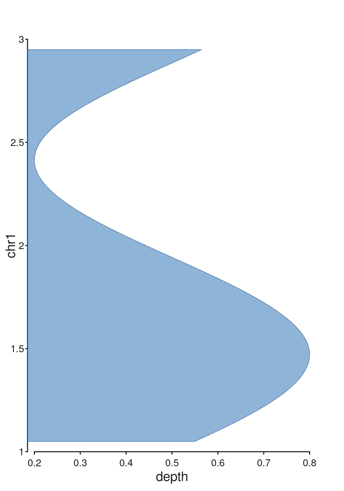

### Hi-C-style rotated tiles

Rotated tiles (`aes(rotate = TRUE)`) place each observation as a diamond
in `(genomic_x, genomic_y)` space — the natural representation for Hi-C
contacts or any 2D genomic relationship. Both axes are genomic; pass a
[`seq_scale_genomic()`](http://andrewlynch.io/SeqPlotR/reference/seq_scale_genomic.md)
`scale_y` built from the distance-bin `GRanges`.

``` r

n_contacts <- 60
hic_win <- GRanges("chr1", IRanges(1e6, 3e6))

# Toy Hi-C: pick x-bins, then y-bins offset by a genomic distance.
x_starts <- sample(seq(1.05e6, 2.95e6, by = 2e4), n_contacts, replace = TRUE)
y_offset <- sample(seq(2e4, 8e5, by = 2e4), n_contacts, replace = TRUE)

x_gr <- GRanges("chr1", IRanges(start = x_starts,            width = 2e4),
                score = runif(n_contacts))
y_gr <- GRanges("chr1", IRanges(start = x_starts + y_offset, width = 2e4))

# Map [0,1] scores → a soft red ramp for the fill column.
score_to_color <- function(s) {
  pal <- grDevices::colorRampPalette(c("#F4A4C2", "#A02C6D"))(100)
  pal[pmin(pmax(round(s * 99) + 1, 1), 100)]
}
x_gr$fill_col <- score_to_color(x_gr$score)

seq_plot() %|%
  seq_track(data = x_gr,
            mapping = map(x = start, fill = fill_col),
            windows = hic_win,
            scale_y = seq_scale_genomic(
              GRanges("chr1", IRanges(0, max(y_offset) + 2e4)))) %+%
  seq_tile(data2 = y_gr, aesthetics = aes(rotate = TRUE)) -> p
p$plot()
```

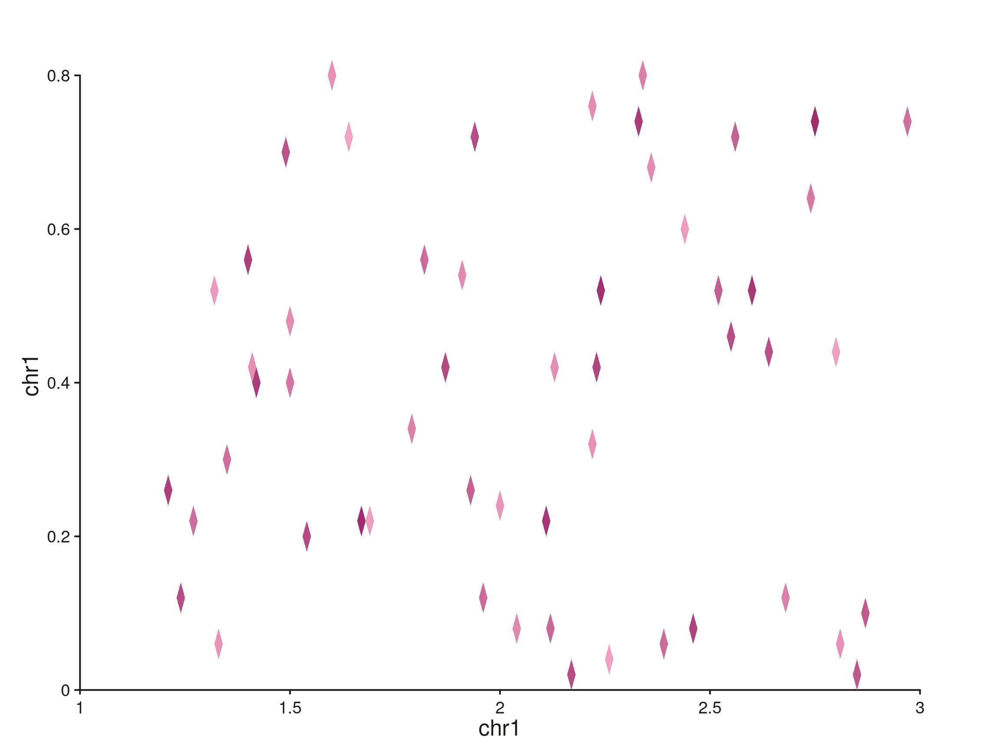

## Combining multiple composites

Stack several tracks in one plot to mix composite types. Each track
keeps its own data, mapping, and y-scale.

``` r

seq_plot() %|%
  seq_track(track_id = "Signal",
            data = ribbon_gr,
            mapping = map(x = start, y_min = lo, y_max = hi),
            windows = win) %+%
  seq_ribbon(aesthetics = aes(fill = "#4385BE", alpha = 0.5)) %__%
  seq_track(track_id = "Bars",
            data = bar_gr,
            mapping = map(x = start, y = score),
            windows = win) %+%
  seq_bar(aesthetics = aes(fill = "#8B7EC8")) %__%
  seq_track(track_id = "Genes",
            data = gene_gr,
            mapping = map(group  = gene_id,
                          type   = feature,
                          strand = strand_col,
                          label  = gene_name,
                          color  = color),
            windows = win) %+%
  seq_gene(map(group  = gene_id,
               type   = feature,
               strand = strand_col,
               label  = gene_name,
               color  = color)) -> p
p$plot()
```

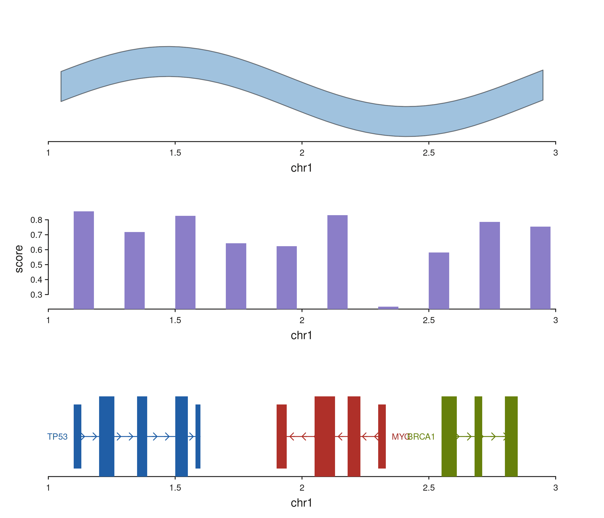

## Pre-defined patchwork layouts

Passing a layout string to `seq_plot(layout = ...)` fixes each track’s
position by `track_id`. Every letter in the string names a track and
marks the cells it covers; `#` is a blank cell.
`seq_track(direction = ...)` is ignored in this mode — position is
driven entirely by the string.

The layout below reserves the top row for a signal ribbon and a density
sidebar, a middle row for bars that spans the whole width, and a bottom
row for gene models.
[`seq_preview_layout()`](http://andrewlynch.io/SeqPlotR/reference/seq_preview_layout.md)
renders the layout up-front so you can verify the geometry before adding
data.

``` r

layout_str <- "
AAAB
CCCC
DDDD
"
seq_preview_layout(layout = layout_str)
```

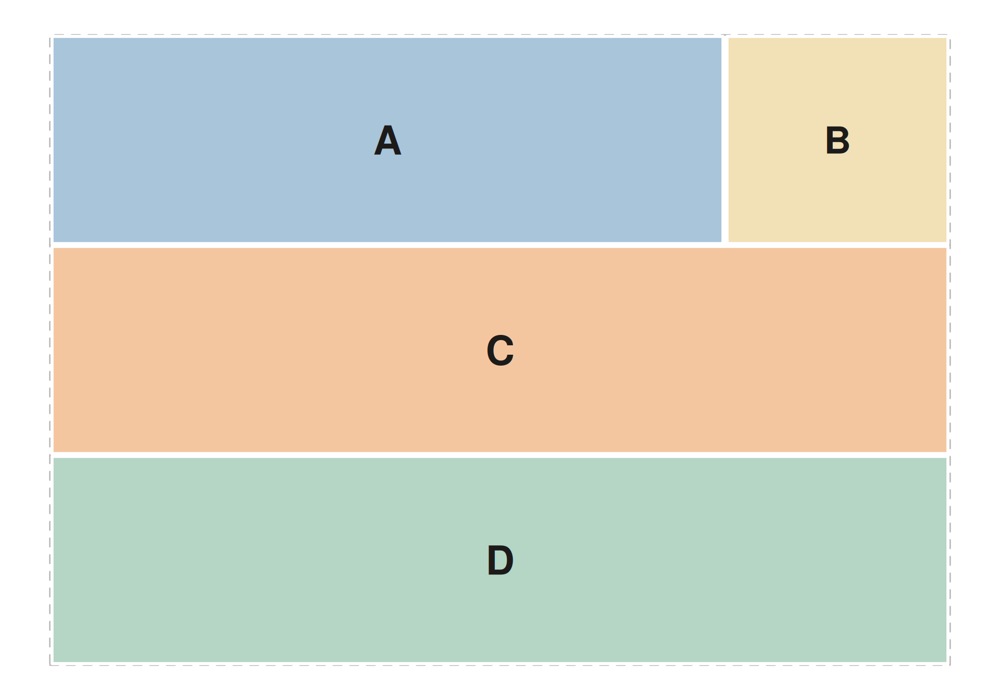

``` r

seq_plot(layout = layout_str) %+%
  seq_track(track_id = "A",
            data = ribbon_gr,
            mapping = map(x = start, y_min = lo, y_max = hi),
            windows = win) %+%
  seq_ribbon(aesthetics = aes(fill = "#4385BE", alpha = 0.5)) %+%
  seq_track(track_id = "B",
            data = dens_gr,
            mapping = map(x = start, y = score),
            windows = win) %+%
  seq_density(aesthetics = aes(fill = "#879A39", alpha = 0.7)) %+%
  seq_track(track_id = "C",
            data = bar_gr,
            mapping = map(x = start, y = score),
            windows = win) %+%
  seq_bar(aesthetics = aes(fill = "#8B7EC8")) %+%
  seq_track(track_id = "D",
            data = gene_gr,
            mapping = map(group  = gene_id,
                          type   = feature,
                          strand = strand_col,
                          label  = gene_name,
                          color  = color),
            windows = win) %+%
  seq_gene(map(group  = gene_id,
               type   = feature,
               strand = strand_col,
               label  = gene_name,
               color  = color)) -> p
p$plot()
```

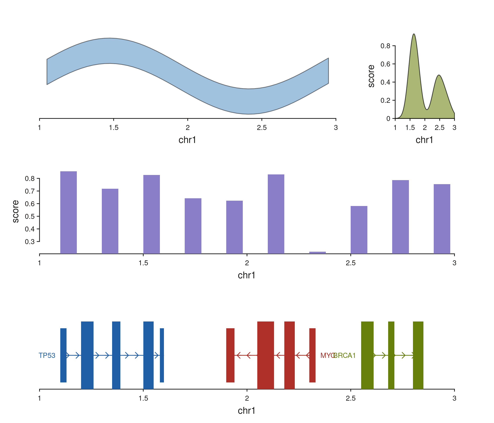

### A plot that spans multiple rows

A letter’s region in the layout string is its axis-aligned bounding box,
so any letter whose cells form a contiguous rectangle can span multiple
rows, multiple columns, or both. In the layout below, `B` occupies both
rows of the right-hand column while `A` and `C` share the left column
and `D` spans the full width of the third row.

``` r

span_layout <- "
AABB
CCBB
DDDD
"
seq_preview_layout(layout = span_layout)
```

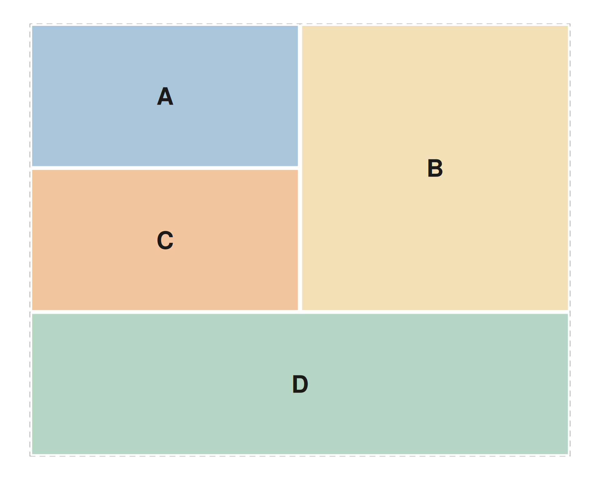

The rendered plot puts a density summary (track B) alongside two stacked
detail tracks (A = ribbon, C = bars), with a genes track beneath them.
Because the density track spans both rows on the right, its y-extent is
the full height of `A` + `C` together.

``` r

seq_plot(layout = span_layout) %+%
  seq_track(track_id = "A",
            data = ribbon_gr,
            mapping = map(x = start, y_min = lo, y_max = hi),
            windows = win) %+%
  seq_ribbon(aesthetics = aes(fill = "#4385BE", alpha = 0.5)) %+%
  seq_track(track_id = "B",
            data = dens_gr,
            mapping = map(x = start, y = score),
            windows = win) %+%
  seq_density(aesthetics = aes(fill = "#879A39", alpha = 0.7)) %+%
  seq_track(track_id = "C",
            data = bar_gr,
            mapping = map(x = start, y = score),
            windows = win) %+%
  seq_bar(aesthetics = aes(fill = "#8B7EC8")) %+%
  seq_track(track_id = "D",
            data = gene_gr,
            mapping = map(group  = gene_id,
                          type   = feature,
                          strand = strand_col,
                          label  = gene_name,
                          color  = color),
            windows = win) %+%
  seq_gene(map(group  = gene_id,
               type   = feature,
               strand = strand_col,
               label  = gene_name,
               color  = color)) -> p
p$plot()
```

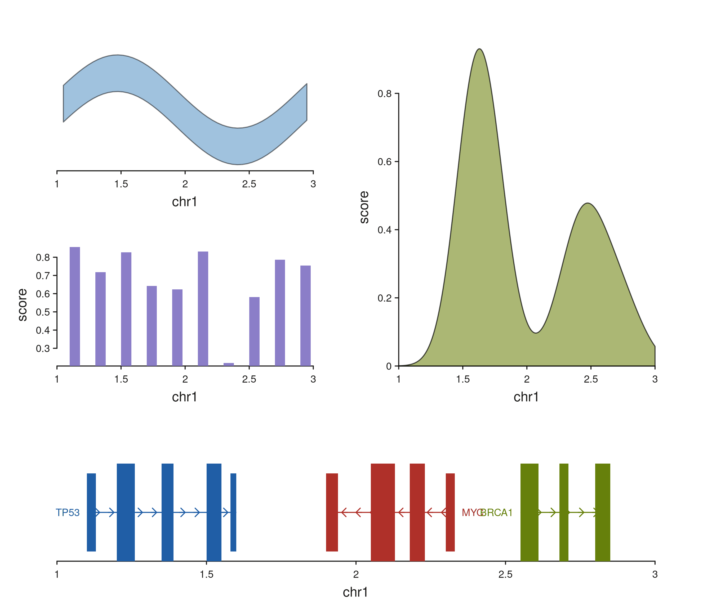

Layout-string rules:

- Every non-`#` letter must form a **rectangular** bounding box
  (SeqPlotR errors if an `L`-shape or other non-rectangle is detected).
- `#` cells render as empty space — no track, no axes.
- Tracks whose `track_id` is not present in the string are silently
  skipped, so the same set of
  [`seq_track()`](http://andrewlynch.io/SeqPlotR/reference/seq_track.md)
  calls can be reused across different layout strings.
