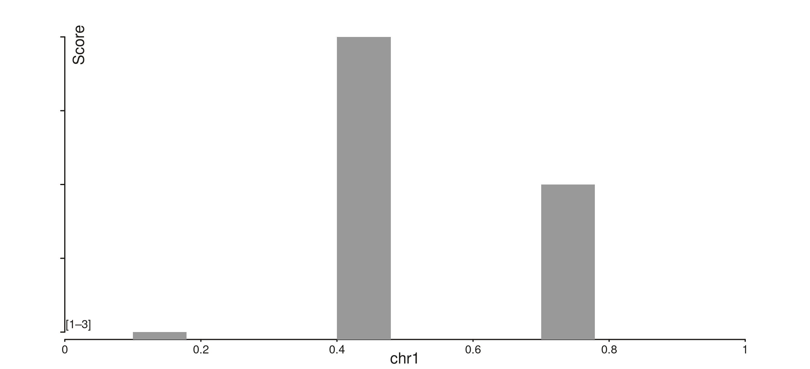
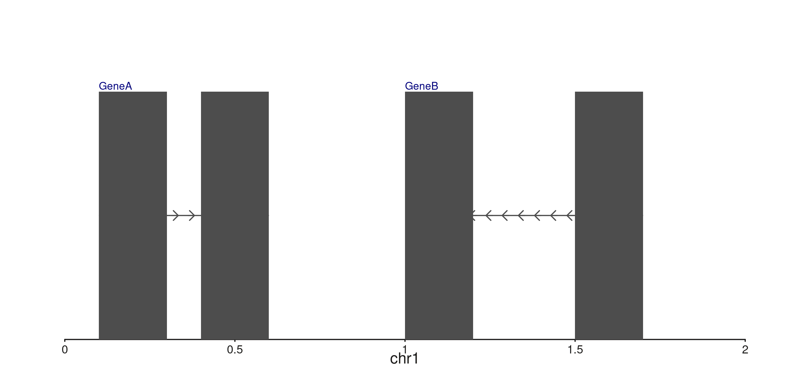
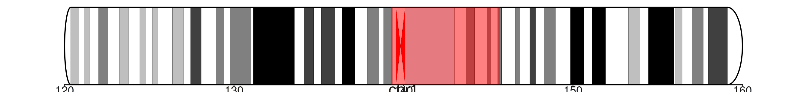
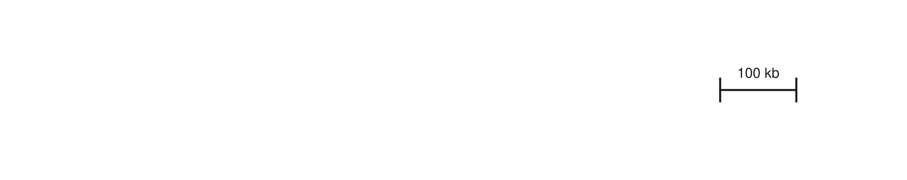

# Batch 9: In-panel axes, seq_reads, seq_scalebar, and file connections

``` r

library(SeqPlotR)
library(GenomicRanges)
```

Batch 9 introduces six independent feature groups: in-panel axis title /
range labels, composable `seq_gene` label placement, ideogram scope and
style options,
[`seq_reads()`](http://andrewlynch.io/SeqPlotR/reference/seq_reads.md)
for IGV-style alignment views,
[`seq_scalebar()`](http://andrewlynch.io/SeqPlotR/reference/seq_scalebar.md)
for axis-free length references, and a small family of on-demand file
connection helpers
([`open_bigwig()`](http://andrewlynch.io/SeqPlotR/reference/open_bigwig.md),
[`open_bam()`](http://andrewlynch.io/SeqPlotR/reference/open_bam.md),
[`open_hic()`](http://andrewlynch.io/SeqPlotR/reference/open_hic.md)).

## In-panel axis titles and range labels

The default behaviour of axes has not changed — titles render in the
margin band and per-tick labels stack along the axis. Two new theme keys
let you override this on a per-axis basis: `axis.<dim>.title.position`
and `axis.<dim>.labels.style` / `.position`.

``` r

win <- GRanges("chr1", IRanges(1, 1000))
gr  <- GRanges("chr1", IRanges(c(100, 400, 700), width = 80),
               score = c(1, 3, 2))

p <- seq_plot() %+%
  (seq_track(
     data    = gr, windows = win,
     aesthetics = aes(
       "axis.y.title.text"      = "Score",
       "axis.y.title.position"  = c(0.02, 0.95),
       "axis.y.labels.style"    = "range",
       "axis.y.labels.position" = c(0.02, 0.05)
     )
   ) %+%
   seq_bar(map(x = start, y = score)))
p$plot()
```



The y-axis here lives entirely inside the panel — the title sits at NPC
`(0.02, 0.95)` (top-left), and a single bracketed range label `[lo–hi]`
sits in the bottom-left corner instead of the per-tick labels.

## Composable seq_gene label placement

`seq_gene` previously placed labels strand-aware to one side of each
gene. The new `gene.label` aes lets you compose label x/y placement
independently using `c("start"|"end", "top"|"bottom")`.

``` r

gr_genes <- GRanges("chr1",
  IRanges(start = c(100,  400, 1000, 1500),
          end   = c(300,  600, 1200, 1700)),
  gene_id    = c("geneA", "geneA", "geneB", "geneB"),
  gene_name  = c("GeneA", "GeneA", "GeneB", "GeneB"),
  strand_col = c("+", "+", "-", "-"),
  feat_type  = c("exon", "exon", "exon", "exon")
)

win_g <- GRanges("chr1", IRanges(1, 2000))

p <- seq_plot() %+%
  (seq_track(data = gr_genes, windows = win_g) %+%
   seq_gene(
     map(group = gene_id, label = gene_name,
         strand = strand_col, type = feat_type),
     aesthetics = aes(
       gene.label = aes(position = c("start", "top"),
                        color    = "navy",
                        size     = 0.55)
     )
   ))
p$plot()
```



## Ideogram scope and style

`seq_ideogram(scope = "full")` renders the entire chromosome — not just
the bands overlapping the current window — and overlays a translucent
highlight box marking a sub-range. `style = "rounded"` adds rounded caps
to the two telomere ends.

For axis labels that read chromosome coordinates, give the track the
whole chromosome as its `windows`, then pass `highlight_range` to mark
the sub-range of interest:

``` r

cb <- load_cytobands()
chr1_full <- GRanges("chr1", IRanges(1, 248956422))
zoom_in   <- GRanges("chr1", IRanges(1.2e8, 1.6e8))

p <- seq_plot() %+%
  seq_track(windows = zoom_in, height = 1.5) %+%
   seq_ideogram(cb,
                scope           = "full",
                style           = "rounded",
                highlight_range = zoom_in,
                aesthetics = aes(
                  highlight       = aes(fill = "red", alpha = 0.5),
                  telomere.radius = 1
                ))
p$plot()
```



`telomere.radius = 1.0` produces a full half-circle cap (cap depth =
band height / 2 in inches); smaller values give a shallower curve.

## Reference scalebars

[`seq_scalebar()`](http://andrewlynch.io/SeqPlotR/reference/seq_scalebar.md)
draws a horizontal length reference at a user-controlled panel position.
Useful when the x-axis is hidden but you still want to communicate
scale.

``` r

win_sb <- GRanges("chr1", IRanges(1, 1e6))

p <- seq_plot() %+%
  (seq_track(
     windows    = win_sb,
     aesthetics = aes("axis.x1.visible" = FALSE)) %+%
   seq_scalebar(length_bp = 1e5,
                hjust     = 0.95,
                vjust     = 0.5,
                bar_lwd   = 1.5))
p$plot()
```



The label auto-formats from the bp length: `1e5` → `"100 kb"`, `2e6` →
`"2 Mb"`, `500` → `"500 bp"`. Override with `label = "..."`.

## File connection helpers

[`open_bigwig()`](http://andrewlynch.io/SeqPlotR/reference/open_bigwig.md),
[`open_bam()`](http://andrewlynch.io/SeqPlotR/reference/open_bam.md),
and [`open_hic()`](http://andrewlynch.io/SeqPlotR/reference/open_hic.md)
return lightweight S3 connection objects. Each probes the file header at
construction (a few hundred bytes of I/O), records the per-format
`max_fetch_bp` guardrail, and exposes a `$fetch(region)` method that
pulls only the requested genomic span on demand.

``` r

bw  <- open_bigwig("path/to/signal.bw")
bw                       # <SeqBigWig>  ...  max_fetch_bp: 50,000,000
sig <- bw$fetch(GRanges("chr1", IRanges(1, 1e6)))   # GRanges of signal

bam <- open_bam("path/to/aln.bam")
bam$fetch(GRanges("chr1", IRanges(20363000, 20370000)))

hic <- open_hic("path/to/contacts.hic", resolution = 25000)
hic$fetch(GRanges("chr1", IRanges(1e7, 1.1e7)))
```

The guardrail fires *before* I/O — asking for a span wider than
`max_fetch_bp` raises an informative error rather than silently loading
an entire chromosome.

``` r

is_seq_file_conn(list())            # FALSE
#> [1] FALSE
is_seq_file_conn("path/to/file.bw") # FALSE
#> [1] FALSE
```

## seq_reads() — IGV-style alignment view

[`seq_reads()`](http://andrewlynch.io/SeqPlotR/reference/seq_reads.md)
loads alignments from an indexed BAM at construction time, packs them
into rows by insert length (or start), and renders chevron polygons
(right-pointing for `+` strand, left for `−`). Mate pairs are linked by
a thin horizontal line by default.

``` r

win  <- GRanges("chr1", IRanges(20363000, 20370000))
reads <- seq_reads("path/to/aln.bam", win,
                   sort_by    = "insert_length",
                   link_mates = TRUE)

seq_plot() %+%
  (seq_track(windows = win, height = 4) %+% reads)
```

Each read becomes one chevron; mate pairs share a single packed row and
are connected by their outer extent. The `max_width` guardrail (default
100 kb) fires before any BAM I/O when a window is too wide.

When a sample BAM is available, the same call renders an IGV-style row-
packed view of the underlying alignments:

``` r

win_reads <- GRanges("chr20", IRanges(30000000, 30050000))
reads <- seq_reads(demo_bam, win_reads, max_reads = 500)

p <- seq_plot() %+%
  (seq_track(windows = win_reads, height = 4) %+% reads)
p$plot()
```
