# SeqPlotR Elements: Primitives, Composites, and Ideograms

This vignette is a visual catalogue of every drawable in SeqPlotR —
every primitive (`seq_point`, `seq_line`, `seq_segment`, `seq_curve`,
`seq_path`, `seq_poly`, `seq_area`, `seq_text`), every composite
(`seq_bar`, `seq_ribbon`, `seq_density`, `seq_tile`, `seq_lollipop`,
`seq_gene`, `seq_sequence`), and the ideogram (`seq_ideogram`). The
later sections stitch them together with multi-region windows and a
patchwork layout so you can see what a realistic mixed browser track
looks like.

``` r

library(SeqPlotR)
#> 
#> Attaching package: 'SeqPlotR'
#> The following object is masked from 'package:base':
#> 
#>     %||%
library(GenomicRanges)
#> Loading required package: stats4
#> Loading required package: BiocGenerics
#> Loading required package: generics
#> 
#> Attaching package: 'generics'
#> The following objects are masked from 'package:base':
#> 
#>     as.difftime, as.factor, as.ordered, intersect, is.element, setdiff,
#>     setequal, union
#> 
#> Attaching package: 'BiocGenerics'
#> The following objects are masked from 'package:stats':
#> 
#>     IQR, mad, sd, var, xtabs
#> The following objects are masked from 'package:base':
#> 
#>     anyDuplicated, aperm, append, as.data.frame, basename, cbind,
#>     colnames, dirname, do.call, duplicated, eval, evalq, Filter, Find,
#>     get, grep, grepl, is.unsorted, lapply, Map, mapply, match, mget,
#>     order, paste, pmax, pmax.int, pmin, pmin.int, Position, rank,
#>     rbind, Reduce, rownames, sapply, saveRDS, table, tapply, unique,
#>     unsplit, which.max, which.min
#> Loading required package: S4Vectors
#> 
#> Attaching package: 'S4Vectors'
#> The following object is masked from 'package:utils':
#> 
#>     findMatches
#> The following objects are masked from 'package:base':
#> 
#>     expand.grid, I, unname
#> Loading required package: IRanges
#> Loading required package: Seqinfo

# Two genomic regions, used throughout for multi-window demos.
multi_win <- GRanges("chr1",
  IRanges(start = c(1.0e6, 5.0e6),
          end   = c(3.0e6, 6.5e6)))

# Single-window convenience for the small element demos.
win <- GRanges("chr1", IRanges(1e6, 3e6))
```

## Primitives

Every primitive shares the same three-stage contract (`initialize` →
`prep` → `draw`) and the same shorthand:
`seq_<name>(map(...), aesthetics = aes(...))`. What differs is the
[`map()`](http://andrewlynch.io/SeqPlotR/reference/map.md) vocabulary
each one consumes. Per-track `data` + `mapping` are inherited, so a
single
[`seq_track()`](http://andrewlynch.io/SeqPlotR/reference/seq_track.md)
can host several primitives drawing from the same table.

### `seq_point` — one glyph per observation

Required [`map()`](http://andrewlynch.io/SeqPlotR/reference/map.md)
fields: `x`, `y`. Optional: `color`, `fill`, `size`, `shape`, `alpha`.

``` r

xs       <- seq(1.05e6, 2.95e6, length.out = 40)
point_gr <- GRanges("chr1", IRanges(xs, width = 1),
                    score = sin((xs - 1e6) / 5e5) + rnorm(40, 0, 0.12),
                    cat   = sample(c("A", "B", "C"), 40, replace = TRUE))

seq_plot() %|%
  seq_track(data = point_gr,
            mapping = map(x = start, y = score),
            windows = win) %+%
  seq_point(map(color = cat),
            aesthetics = aes(size = 0.7, alpha = 0.9)) -> p
p$plot()
```

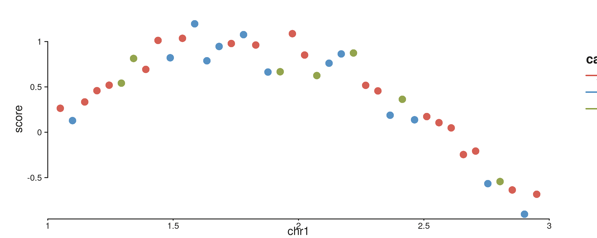

### `seq_line` — connected line through points

Required: `x`, `y`. `aes(type = "step")` switches to a step line (useful
for signal tracks that represent piecewise-constant values).

``` r

line_xs <- seq(1.05e6, 2.95e6, length.out = 100)
line_gr <- GRanges("chr1", IRanges(line_xs, width = 1),
                   signal = sin((line_xs - 1e6) / 3e5) * 0.4 + 0.5,
                   step   = round(sin((line_xs - 1e6) / 3e5) * 2) / 4 + 0.5)

seq_plot() %|%
  seq_track(track_id = "Smooth",
            data = line_gr,
            mapping = map(x = start, y = signal),
            windows = win) %+%
  seq_line(aesthetics = aes(color = "#205EA6", linewidth = 1.4)) %|%
  seq_track(track_id = "Step",
            data = line_gr,
            mapping = map(x = start, y = step),
            windows = win) %+%
  seq_line(aesthetics = aes(color = "#AF3029",
                            linewidth = 1.4,
                            type = "step")) -> p
p$plot()
```

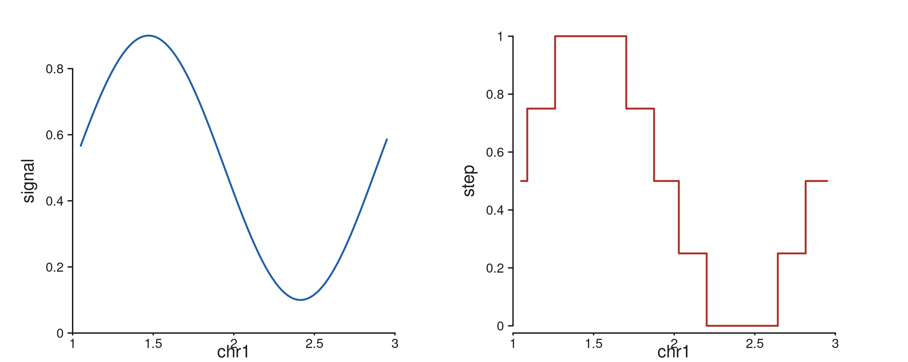

### `seq_segment` — one straight line per row

Required: `x`, `x_end`, `y`, `y_end`. Great for quick interval marks — a
peak span, a read pair, a Manhattan-style baseline.

``` r

seg_gr <- GRanges("chr1",
  IRanges(start = seq(1.1e6, 2.9e6, by = 2.5e5), width = 1),
  x_end = seq(1.1e6, 2.9e6, by = 2.5e5) + 1.5e5,
  y     = runif(8, 0.2, 0.6),
  y_end = runif(8, 0.4, 0.9),
  grp   = rep(c("up", "down"), length.out = 8))

seq_plot() %|%
  seq_track(data = seg_gr,
            mapping = map(x = start, x_end = x_end,
                          y = y, y_end = y_end, color = grp),
            windows = win) %+%
  seq_segment(aesthetics = aes(linewidth = 2, alpha = 0.85)) -> p
p$plot()
```

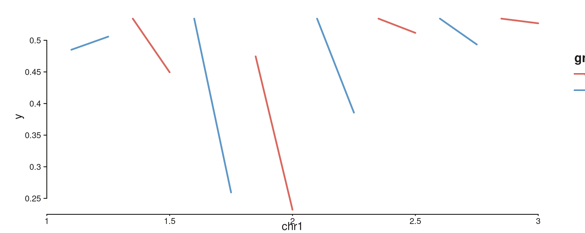

### `seq_curve` — Bezier curve with data-space control points

Required: `x`, `y`, `x_end`, `y_end`. `aes(curvature)` sets the
fractional y-offset of the control points (default `0.3`). Handy for
visualising directional relationships (a transcript splice, a read pair)
without stealing the arch slot (`seq_arc`) used for SV calls.

``` r

curve_gr <- GRanges("chr1",
  IRanges(start = c(1.2e6, 1.7e6, 2.3e6), width = 1),
  x_end = c(1.5e6, 2.1e6, 2.7e6),
  y     = c(0.2,   0.3,   0.25),
  y_end = c(0.5,   0.7,   0.6))

seq_plot() %|%
  seq_track(data = curve_gr,
            mapping = map(x = start, x_end = x_end,
                          y = y, y_end = y_end),
            windows = win) %+%
  seq_curve(aesthetics = aes(curvature = 0.5,
                             color = "#66800B",
                             linewidth = 1.4)) -> p
p$plot()
```

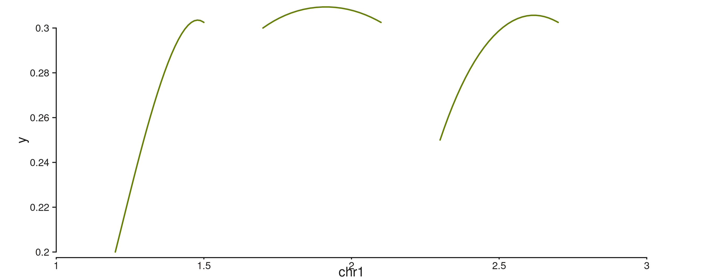

### `seq_path` — poly-line through grouped points

Required: `x`, `y`. Optional `group` splits the path into several
disconnected lines. Good for plotting per-group traces on one track.

``` r

group_xs <- seq(1.05e6, 2.95e6, length.out = 30)
path_gr  <- GRanges("chr1",
  IRanges(start = rep(group_xs, 3), width = 1),
  y     = c(sin((group_xs - 1e6) / 5e5) * 0.2 + 0.4,
            cos((group_xs - 1e6) / 4e5) * 0.2 + 0.5,
                 ((group_xs - 1e6) / 2e6) * 0.3 + 0.3),
  trace = rep(c("A", "B", "C"), each = 30))

seq_plot() %|%
  seq_track(data = path_gr,
            mapping = map(x = start, y = y,
                          group = trace, color = trace),
            windows = win) %+%
  seq_path(aesthetics = aes(linewidth = 1.3, alpha = 0.85)) -> p
p$plot()
```

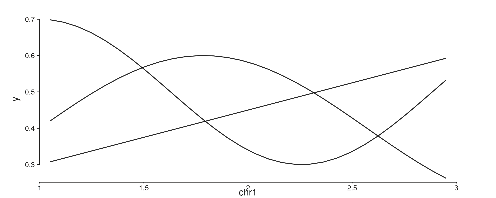

### `seq_poly` — filled polygon(s) from vertices

Required: `x`, `y`. Optional `group` partitions vertices across multiple
polygons. Use for custom region highlights and hand-shaped overlays.
Below: three filled triangles, one per gene body.

``` r

tri_starts <- c(1.20e6, 1.80e6, 2.40e6)
tri_widths <- c(2.5e5,  3.0e5,  2.0e5)

poly_gr <- GRanges("chr1",
  IRanges(start = rep(tri_starts, each = 3), width = 1),
  x_v = c(rbind(tri_starts,
                tri_starts + tri_widths / 2,
                tri_starts + tri_widths)),
  y_v = rep(c(0.2, 0.8, 0.2), times = 3),
  grp = rep(paste0("tri", 1:3), each = 3))

seq_plot() %|%
  seq_track(data = poly_gr,
            mapping = map(x = x_v, y = y_v,
                          group = grp, fill = grp),
            windows = win) %+%
  seq_poly(aesthetics = aes(color = "white", alpha = 0.8)) -> p
p$plot()
```

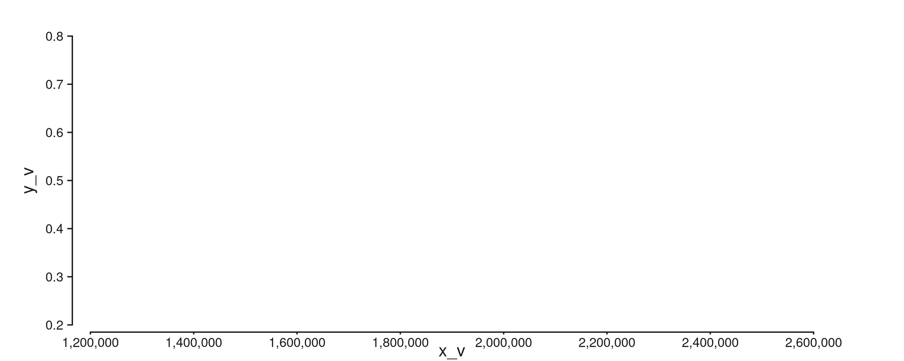

### `seq_area` — filled area under a curve

Required: `x`, `y`. Optional `aes(baseline = ...)` sets the closing
y-value (default `0`). Coverage curves, pileups, smoothed density fills.

``` r

area_xs <- seq(1.05e6, 2.95e6, length.out = 80)
area_gr <- GRanges("chr1", IRanges(area_xs, width = 1),
                   depth = 0.5 + 0.3 * sin((area_xs - 1e6) / 4e5) +
                           rnorm(80, 0, 0.02))

seq_plot() %|%
  seq_track(data = area_gr,
            mapping = map(x = start, y = depth),
            windows = win) %+%
  seq_area(aesthetics = aes(fill = "#4385BE",
                            color = "#205EA6",
                            alpha = 0.65,
                            linewidth = 0.8)) -> p
p$plot()
```

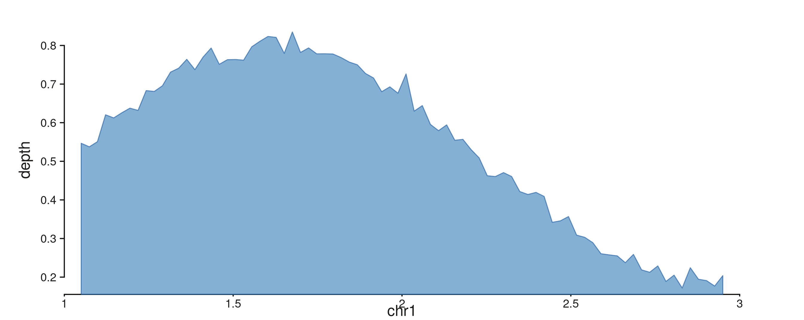

### `seq_text` — per-observation labels

Required: `x`, `y`, `label`. Optional: `size`, `color`, `angle`,
`hjust`, `vjust`.

``` r

text_gr <- GRanges("chr1",
  IRanges(start = c(1.30e6, 1.90e6, 2.50e6), width = 1),
  y_pos = c(0.75, 0.45, 0.85),
  lbl   = c("peak_1", "peak_2", "peak_3"))

seq_plot() %|%
  seq_track(data = text_gr,
            mapping = map(x = start, y = y_pos, label = lbl),
            windows = win) %+%
  seq_text(aesthetics = aes(fontsize = 12,
                            color = "#AF3029",
                            hjust = 0.5)) -> p
p$plot()
```

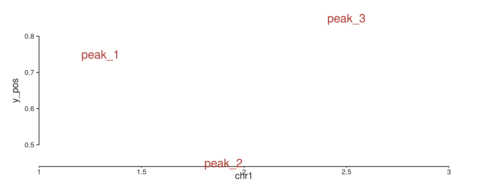

## Composites

Composites chain primitives (often plus a small amount of
pre-computation) to provide higher-level idioms. Each composite inherits
from its underlying primitive and exposes a narrower, task-specific
[`map()`](http://andrewlynch.io/SeqPlotR/reference/map.md) vocabulary.

### `seq_bar` — per-interval rectangles

One rectangle per observation; `group` stacks bars at identical x
positions.

``` r

bar_gr <- GRanges("chr1",
  IRanges(start = seq(1.1e6, 2.9e6, by = 2e5), width = 8e4),
  score = runif(10, 0.2, 1.0))

seq_plot() %|%
  seq_track(data = bar_gr,
            mapping = map(x = start, y = score),
            windows = win) %+%
  seq_bar(aesthetics = aes(fill = "#4385BE")) -> p
p$plot()
```

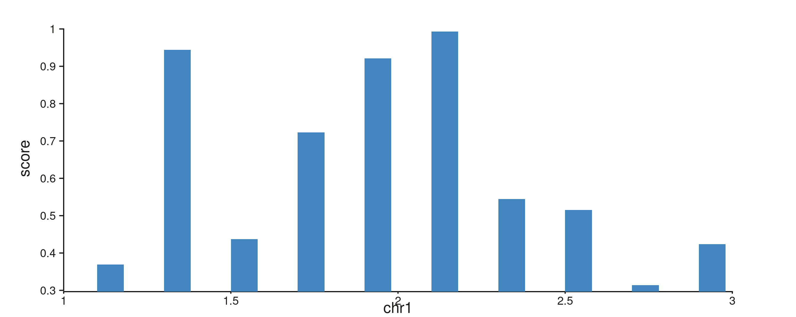

### `seq_ribbon` — band between two y series

Required: `y_min`, `y_max`. Confidence bands, min/max pileups, CI
envelopes — anything that needs a shaded interval per x.

``` r

ribbon_xs <- seq(1.05e6, 2.95e6, length.out = 60)
ribbon_mu <- sin((ribbon_xs - 1e6) / 3e5) * 0.3 + 0.5
ribbon_gr <- GRanges("chr1", IRanges(ribbon_xs, width = 1),
                     mean = ribbon_mu,
                     lo   = ribbon_mu - 0.12,
                     hi   = ribbon_mu + 0.12)

seq_plot() %|%
  seq_track(data = ribbon_gr,
            mapping = map(x = start, y_min = lo, y_max = hi),
            windows = win) %+%
  seq_ribbon(aesthetics = aes(fill = "#4385BE", alpha = 0.5)) -> p
p$plot()
```

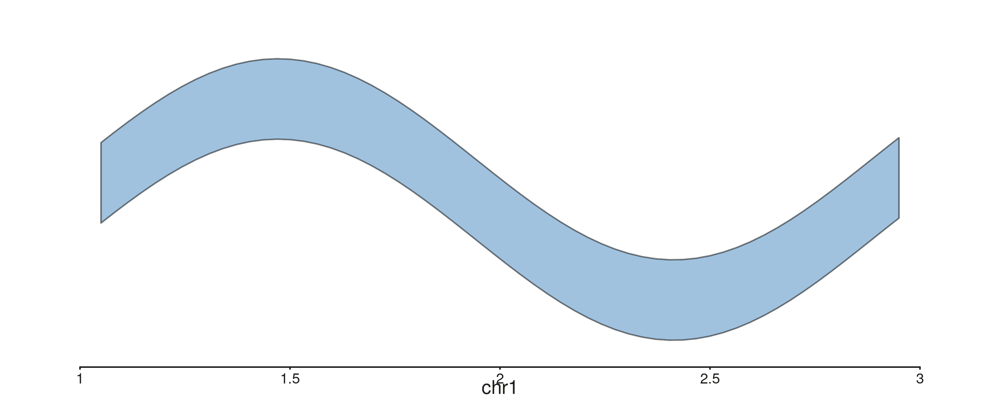

### `seq_density` — kernel density estimate

Calls [`stats::density()`](https://rdrr.io/r/stats/density.html) on the
resolved `y` and renders the result as a filled area. Pre-computed
densities should use
[`seq_area()`](http://andrewlynch.io/SeqPlotR/reference/seq_area.md)
directly.

``` r

dens_gr <- GRanges("chr1",
  IRanges(start = seq(1e6, 3e6, length.out = 200), width = 1),
  score = c(rnorm(120, mean = 0.3, sd = 0.05),
            rnorm(80,  mean = 0.7, sd = 0.08)))

seq_plot() %|%
  seq_track(data = dens_gr,
            mapping = map(x = start, y = score),
            windows = win) %+%
  seq_density(aesthetics = aes(fill = "#879A39", alpha = 0.7)) -> p
p$plot()
```

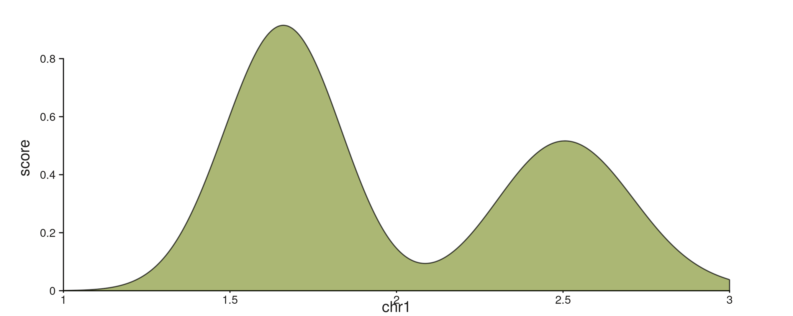

### `seq_tile` — rectangles per interval

Flat mode: one rectangle per observation. Rotated mode
(`aes(rotate = TRUE)`) turns each tile into a diamond — the standard
Hi-C representation when combined with a genomic y-axis (see the
`basics` vignette for a full example).

``` r

tile_gr <- GRanges("chr1",
  IRanges(start = seq(1.1e6, 2.9e6, by = 1e5), width = 8e4),
  fill_col = sample(flexoki_palette(5), 19, replace = TRUE))

seq_plot() %|%
  seq_track(data = tile_gr,
            mapping = map(x = start, fill = fill_col),
            windows = win) %+%
  seq_tile() -> p
p$plot()
```

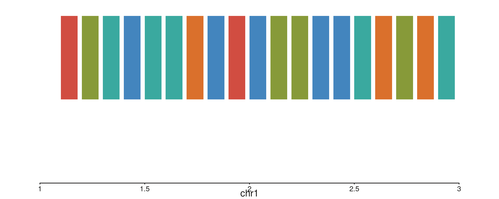

### `seq_lollipop` — stem + point

Vertical stem from `baseline` (default `0`) up to `y`, with a point at
`y`. Standard for sparse discrete events (mutation impact, peak
summits).

``` r

lp_gr <- GRanges("chr1",
  IRanges(start = sample(seq(1.05e6, 2.95e6, by = 1e4), 15), width = 1),
  impact = runif(15, 0.2, 1.0))

seq_plot() %|%
  seq_track(data = lp_gr,
            mapping = map(x = start, y = impact),
            windows = win) %+%
  seq_lollipop(aesthetics = aes(color = "#AF3029", linewidth = 1.2)) -> p
p$plot()
```

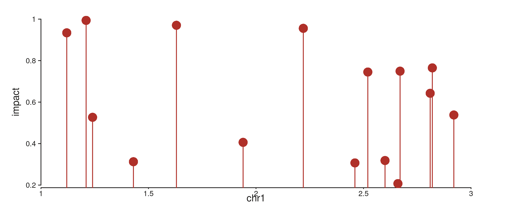

### `seq_gene` — format-agnostic gene models

Every column reference comes through
[`map()`](http://andrewlynch.io/SeqPlotR/reference/map.md): `group`
joins features into one gene, `strand` orients the arrows, `type`
distinguishes exons from UTRs, `label` places the gene name, `color`
tints each gene.

``` r

gene_gr <- GRanges("chr1",
  IRanges(
    start = c(1.10e6, 1.20e6, 1.35e6, 1.50e6, 1.58e6,
              1.90e6, 2.05e6, 2.18e6, 2.30e6,
              2.55e6, 2.68e6, 2.80e6),
    width = c( 3e4,  6e4,  4e4,  5e4,  2e4,
               4e4,  8e4,  5e4,  3e4,
               6e4,  3e4,  5e4)
  ),
  gene_id    = rep(c("A", "B", "C"), times = c(5, 4, 3)),
  gene_name  = rep(c("TP53", "MYC", "BRCA1"), times = c(5, 4, 3)),
  strand_col = rep(c("+", "-", "+"),       times = c(5, 4, 3)),
  feature = c("UTR","exon","exon","exon","UTR",
              "UTR","exon","exon","UTR",
              "exon","exon","exon"),
  color = c(rep("#205EA6", 5),
            rep("#AF3029", 4),
            rep("#66800B", 3)))

seq_plot() %|%
  seq_track(data = gene_gr,
            mapping = map(group  = gene_id,
                          type   = feature,
                          strand = strand_col,
                          label  = gene_name,
                          color  = color),
            windows = win) %+%
  seq_gene(map(group  = gene_id,
               type   = feature,
               strand = strand_col,
               label  = gene_name,
               color  = color)) -> p
p$plot()
```


#### Backbone styles

`backbone_type` controls the gene backbone rendering. `"arrow"`
(default) places chevron arrows to show strand direction. `"solid"`
draws a plain line; `"dashed"` uses a dashed line — useful for predicted
or low-confidence models.

``` r

seq_plot() %|%
  seq_track(data = gene_gr,
            mapping = map(group  = gene_id,
                          type   = feature,
                          strand = strand_col,
                          label  = gene_name,
                          color  = color),
            windows = win) %+%
  seq_gene(map(group  = gene_id,
               type   = feature,
               strand = strand_col,
               label  = gene_name,
               color  = color),
           backbone_type = "dashed") -> p
p$plot()
```

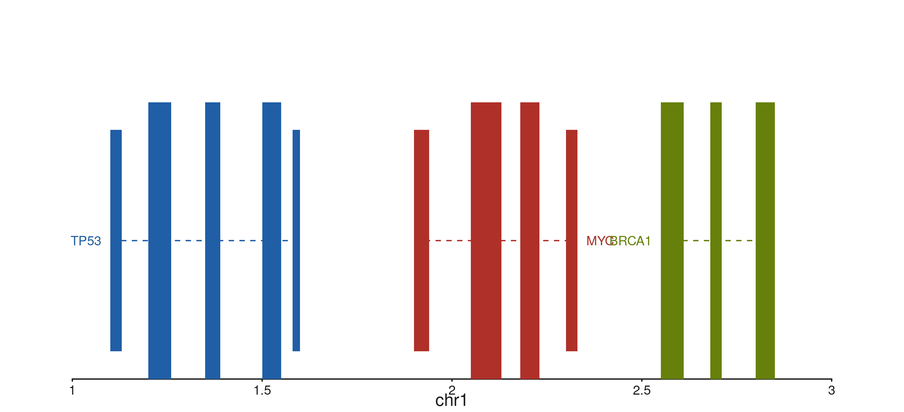

#### TSS start-site arrow

`show_start = TRUE` draws a flag arrow above the first exon (by row
order) of each gene. For genes where the annotated first exon differs
from the true TSS, pass `tss_position = list(gene_id = c(start, end))`
to override the auto-detected position per gene.

``` r

seq_plot() %|%
  seq_track(data = gene_gr,
            mapping = map(group  = gene_id,
                          type   = feature,
                          strand = strand_col,
                          label  = gene_name,
                          color  = color),
            windows = win) %+%
  seq_gene(map(group  = gene_id,
               type   = feature,
               strand = strand_col,
               label  = gene_name,
               color  = color),
           show_start = TRUE) -> p
p$plot()
```

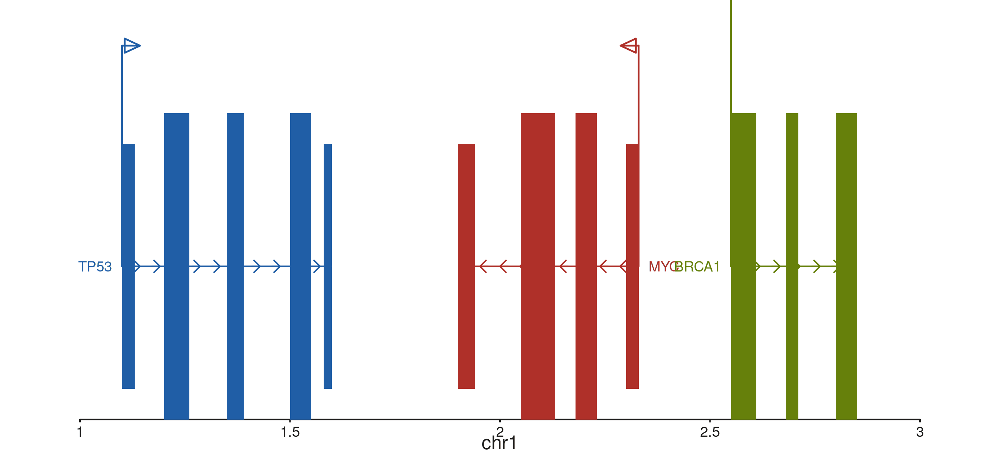

#### Strand separation

`separate_strands = TRUE` partitions the track interior into two
horizontal sub-bands: `"+"` strand genes at the top and `"-"` strand
genes at the bottom. A dashed line marks the band boundary and each band
is labelled. Silently ignored when only one strand is present.

``` r

seq_plot() %|%
  seq_track(data = gene_gr,
            mapping = map(group  = gene_id,
                          type   = feature,
                          strand = strand_col,
                          label  = gene_name,
                          color  = color),
            windows = win) %+%
  seq_gene(map(group  = gene_id,
               type   = feature,
               strand = strand_col,
               label  = gene_name,
               color  = color),
           separate_strands = TRUE) -> p
p$plot()
```

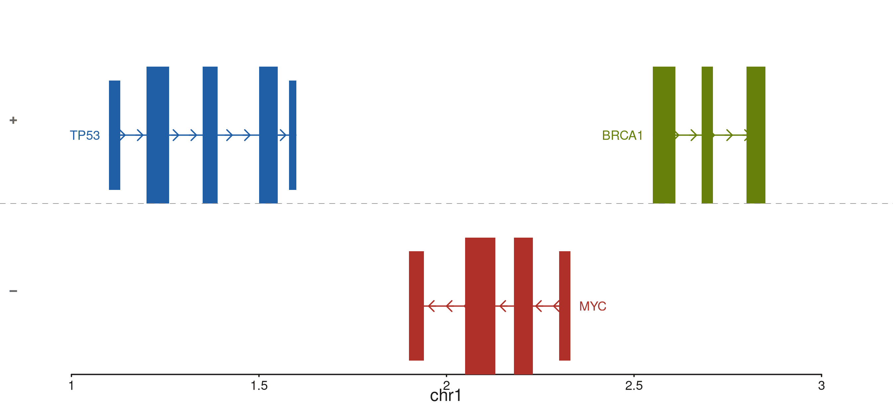

#### All features combined

`separate_strands`, `show_start`, and `backbone_type` are independent
and compose freely. Here both are on with a solid backbone — useful when
the track already conveys directionality through the strand band layout.

``` r

seq_plot() %|%
  seq_track(data = gene_gr,
            mapping = map(group  = gene_id,
                          type   = feature,
                          strand = strand_col,
                          label  = gene_name,
                          color  = color),
            windows = win,
            track_height = 1.2) %+%
  seq_gene(map(group  = gene_id,
               type   = feature,
               strand = strand_col,
               label  = gene_name,
               color  = color),
           backbone_type    = "solid",
           show_start       = TRUE,
           separate_strands = TRUE) -> p
p$plot()
```

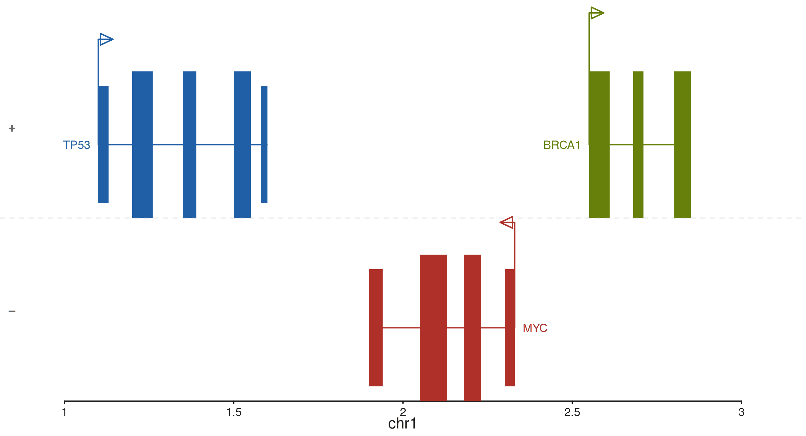

#### Style type

`style_type` selects the per-gene rendering style. `"exon"` (default) is
the full backbone-plus-exon-boxes view shown above; `"gene"` collapses
each gene to a single chevron-shaped polygon spanning the gene extent —
useful when exon detail is not needed and screen space is tight;
`"point"` reduces each gene to a single filled circle at the TSS, ideal
for very dense overviews. Labels are drawn in all three modes.

``` r

seq_plot() %|%
  seq_track(data = gene_gr,
            mapping = map(group  = gene_id,
                          type   = feature,
                          strand = strand_col,
                          label  = gene_name,
                          color  = color),
            windows = win) %+%
  seq_gene(map(group  = gene_id,
               type   = feature,
               strand = strand_col,
               label  = gene_name,
               color  = color),
           style_type = "exon") -> p
p$plot()
```


``` r

seq_plot() %|%
  seq_track(data = gene_gr,
            mapping = map(group  = gene_id,
                          type   = feature,
                          strand = strand_col,
                          label  = gene_name,
                          color  = color),
            windows = win) %+%
  seq_gene(map(group  = gene_id,
               type   = feature,
               strand = strand_col,
               label  = gene_name,
               color  = color),
           style_type = "gene") -> p
p$plot()
```

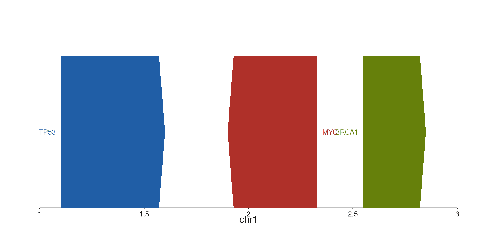

``` r

seq_plot() %|%
  seq_track(data = gene_gr,
            mapping = map(group  = gene_id,
                          type   = feature,
                          strand = strand_col,
                          label  = gene_name,
                          color  = color),
            windows = win) %+%
  seq_gene(map(group  = gene_id,
               type   = feature,
               strand = strand_col,
               label  = gene_name,
               color  = color),
           style_type = "point") -> p
p$plot()
```

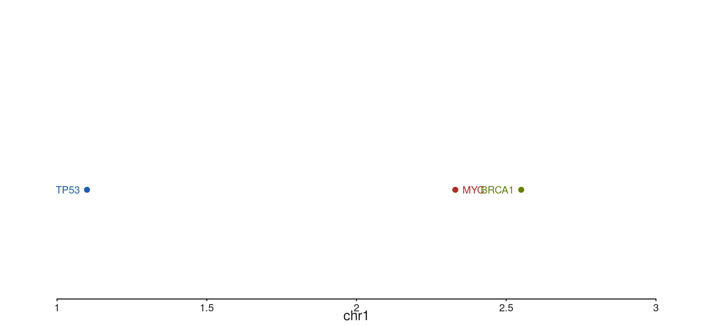

#### Dense dataset — tier stacking

When genes overlap, `seq_gene` stacks them into non-overlapping tiers
automatically. With `separate_strands = TRUE` each strand band has its
own tier stack, keeping the two strands visually separated even at high
gene density.

``` r

set.seed(7)
n_genes  <- 14
starts   <- sort(sample(seq(1.05e6, 2.6e6, by = 5e4), n_genes))
widths   <- sample(seq(5e4, 3e5, by = 2e4), n_genes, replace = TRUE)
strands  <- sample(c("+", "-"), n_genes, replace = TRUE)
colors_d <- ifelse(strands == "+", "#205EA6", "#AF3029")
gids_d   <- paste0("G", seq_len(n_genes))

dense_gr <- GRanges("chr1",
  IRanges(start = starts, width = widths),
  gene_id    = gids_d,
  gene_name  = gids_d,
  strand_col = strands,
  feature    = "exon",
  color      = colors_d)

seq_plot() %|%
  seq_track(data = dense_gr,
            mapping = map(group  = gene_id,
                          type   = feature,
                          strand = strand_col,
                          label  = gene_name,
                          color  = color),
            windows = win,
            track_height = 1.4) %+%
  seq_gene(map(group  = gene_id,
               type   = feature,
               strand = strand_col,
               label  = gene_name,
               color  = color),
           separate_strands = TRUE) -> p
p$plot()
```

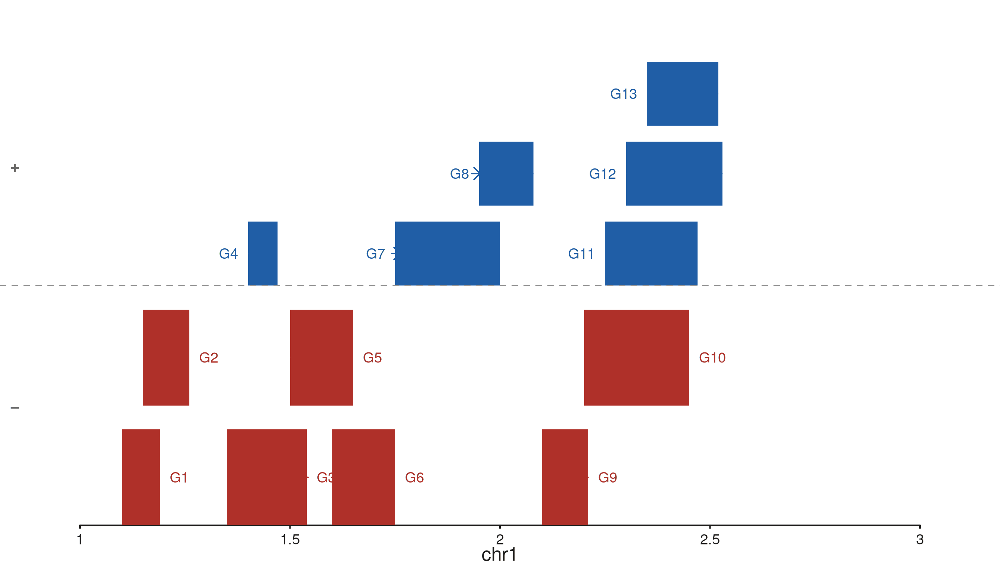

### `seq_sequence` — IGV-style nucleotide display

[`seq_sequence()`](http://andrewlynch.io/SeqPlotR/reference/seq_sequence.md)
renders a coloured rectangle for each nucleotide in windows up to 200 bp
wide. Wider windows emit a message and render nothing. Colours follow
the UCSC standard by default: `A` green, `T` red, `C` blue, `G`
orange/gold. Each rectangle is drawn at 99 % of its slot width so a thin
gap separates adjacent bases.

Supply the nucleotides via `sequence` (a character string) or have them
fetched automatically from a BSgenome package via `genome`. Set
`show_letters = TRUE` to overlay the base letter for windows ≤ 80 bp.

``` r

seq50  <- paste(rep(c("A","T","C","G","G","A","C","T","T","A"), 5), collapse = "")
win50  <- GRanges("chr1", IRanges(1, 50))

seq_plot() %|%
  seq_track(windows = win50, track_height = 0.7) %+%
  seq_sequence(sequence = seq50, show_letters = TRUE) -> p
p$plot()
```

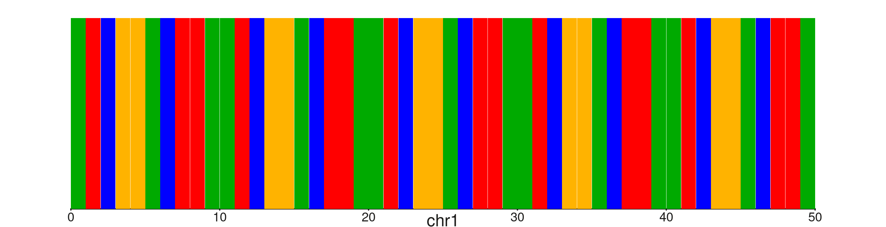

#### Blocks-only view for wider windows

When the window is between 80 and 200 bp the letters are suppressed
(`show_letters` is silently ignored) but the coloured blocks still
render. This gives a compact composition pattern view without the
clutter of overlapping labels.

``` r

seq100 <- paste(rep(c("A","T","C","G"), 25), collapse = "")
win100 <- GRanges("chr1", IRanges(1, 100))

seq_plot() %|%
  seq_track(windows = win100, track_height = 0.7) %+%
  seq_sequence(sequence = seq100) -> p
p$plot()
```

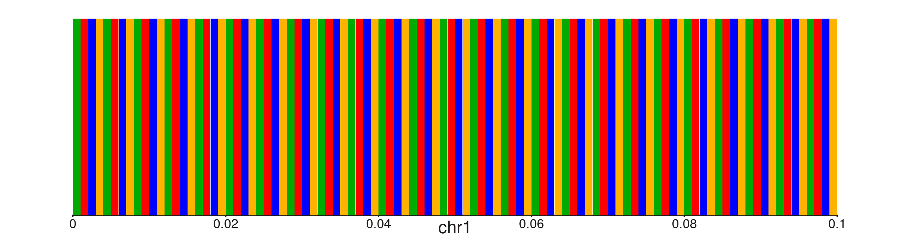

#### Custom colors

Pass a named character vector to `colors` to override any or all of the
UCSC defaults. Below, a soft pastel palette is used to make the track
less visually dominant when layered with other elements.

``` r

pastel <- c(A = "#A8D8A8", T = "#F4A7A7", C = "#A7C4F4", G = "#FAD9A1",
            N = "#DDDDDD")

seq_plot() %|%
  seq_track(windows = win50, track_height = 0.7) %+%
  seq_sequence(sequence = seq50, show_letters = TRUE, colors = pastel) -> p
p$plot()
```

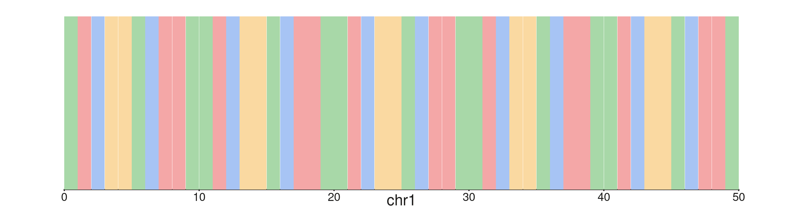

#### Stacked with a coverage track

`rect_height` reserves a fraction of the track height for the rectangles
— useful when placing `seq_sequence` above a signal track. The sequence
track gets a short `track_height` allocation so the coverage area
dominates.

``` r

win60  <- GRanges("chr1", IRanges(1, 60))
seq60  <- paste(rep(c("A","C","G","T"), 15), collapse = "")

cov_xs60 <- seq(1, 60, length.out = 60)
cov_gr60 <- GRanges("chr1", IRanges(start = cov_xs60, width = 1),
                    depth = 0.4 + 0.4 * sin(seq(0, 2 * pi, length.out = 60)))

seq_plot() %|%
  seq_track(windows = win60, track_height = 0.55) %+%
    seq_sequence(sequence = seq60,
                 show_letters = TRUE,
                 rect_height  = 0.7) %__%
  seq_track(data = cov_gr60,
            mapping = map(x = start, y = depth),
            windows = win60) %+%
    seq_area(aesthetics = aes(fill = "#4385BE",
                              color = "#205EA6",
                              alpha = 0.65,
                              linewidth = 0.8)) -> p
p$plot()
```

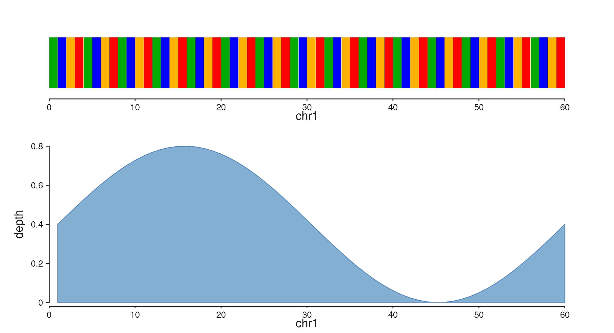

## `seq_ideogram` — chromosome bands

[`seq_ideogram()`](http://andrewlynch.io/SeqPlotR/reference/seq_ideogram.md)
consumes a `GRanges` of cytogenetic bands with a `gieStain` mcol and
draws each band as a Giemsa-shaded rectangle. Paired `acen` bands
collapse into two red triangles meeting at the centromere. Load the
bundled hg38 cytoband table with
\[[`load_cytobands()`](http://andrewlynch.io/SeqPlotR/reference/load_cytobands.md)\].

### A single chromosome

`create_genome_windows("chr1")` expands to a GRanges spanning the full
chromosome, so the ideogram fills the panel end-to-end.

``` r

cb <- load_cytobands()

seq_plot() %|%
  seq_track(track_id = "chr1",
            windows = create_genome_windows("chr1")) %+%
  seq_ideogram(data = cb) -> p
p$plot()
```

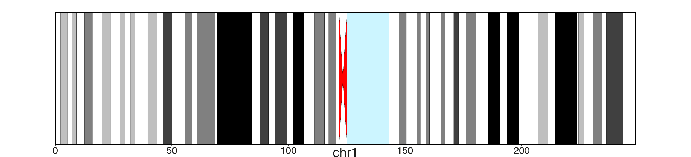

### Multi-chromosome strip

A `windows` GRanges with multiple ranges lays each chromosome out in its
own panel inside the same track. A handful of chromosomes stacked
side-by-side gives an at-a-glance karyotype.

``` r

karyo_win <- create_genome_windows(c("chr1", "chr4", "chr7",
                                     "chr14", "chrX"))

seq_plot() %|%
  seq_track(track_id = "Karyotype",
            windows = karyo_win) %+%
  seq_ideogram(data = cb) -> p
p$plot()
```

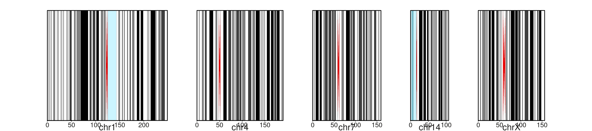

## Multi-region windows

A multi-range `windows` GRanges lays every range out as a separate panel
inside a single track. Mappings resolve per-panel, so the same element
draws independently on each region. Below: two non-adjacent regions on
chr1 rendered as side-by-side panels.

``` r

starts_A <- seq(1.1e6, 2.9e6, length.out = 12)
starts_B <- seq(5.1e6, 6.4e6, length.out = 12)

multi_gr <- GRanges("chr1",
  IRanges(start = c(starts_A, starts_B), width = 5e4),
  score  = runif(24, 0.2, 1.0),
  region = rep(c("A", "B"), each = 12))

seq_plot() %|%
  seq_track(data = multi_gr,
            mapping = map(x = start, y = score, group = region),
            windows = multi_win) %+%
  seq_bar() -> p
p$plot()
```

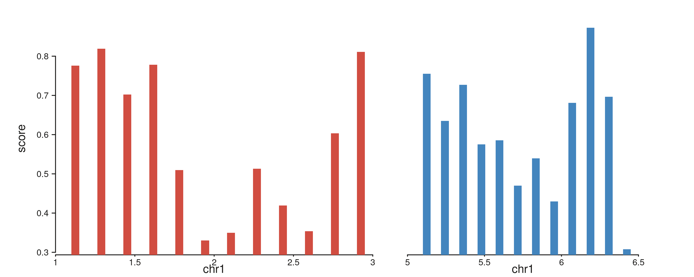

Windows can carry per-panel `scale` mcols to bias their relative widths
— e.g. a 1 Mb region next to a 100 kb region shown at the same panel
width so the smaller region is legible:

``` r

scaled_win <- GRanges("chr1",
  IRanges(start = c(1.0e6, 5.0e6), end = c(3.0e6, 5.1e6)))
mcols(scaled_win)$scale <- c(1e-6, 1e-5)

starts_C <- seq(1.1e6, 2.9e6, length.out = 12)
starts_D <- seq(5.01e6, 5.09e6, length.out = 12)
scaled_gr <- GRanges("chr1",
  IRanges(start = c(starts_C, starts_D), width = 2e4),
  score  = runif(24, 0.2, 1.0))

seq_plot() %|%
  seq_track(data = scaled_gr,
            mapping = map(x = start, y = score),
            windows = scaled_win) %+%
  seq_lollipop(aesthetics = aes(color = "#AF3029")) -> p
p$plot()
```

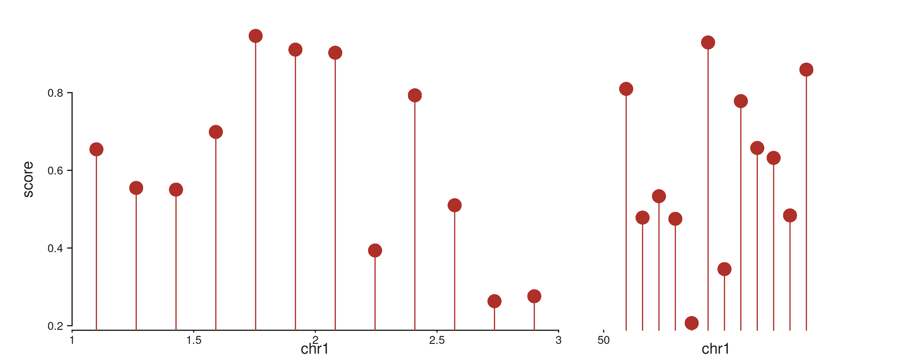

## Complex layout — patchwork browser

`seq_plot(layout = "...")` accepts a patchwork string where each non-`#`
letter is a `track_id`-addressed cell. The example below lays out a
six-track genome browser on two regions: an ideogram strip across the
top, a signal ribbon + density sidebar on the next row, a bar track and
a lollipop track in the middle, and gene models spanning the full width
of the bottom row.

[`seq_preview_layout()`](http://andrewlynch.io/SeqPlotR/reference/seq_preview_layout.md)
shows the geometry up-front — no data required — so you can iterate the
string independently of the element code.

``` r

layout_str <- "
IIII
AAAB
CCDD
GGGG
GGGG
"
seq_preview_layout(layout = layout_str)
```

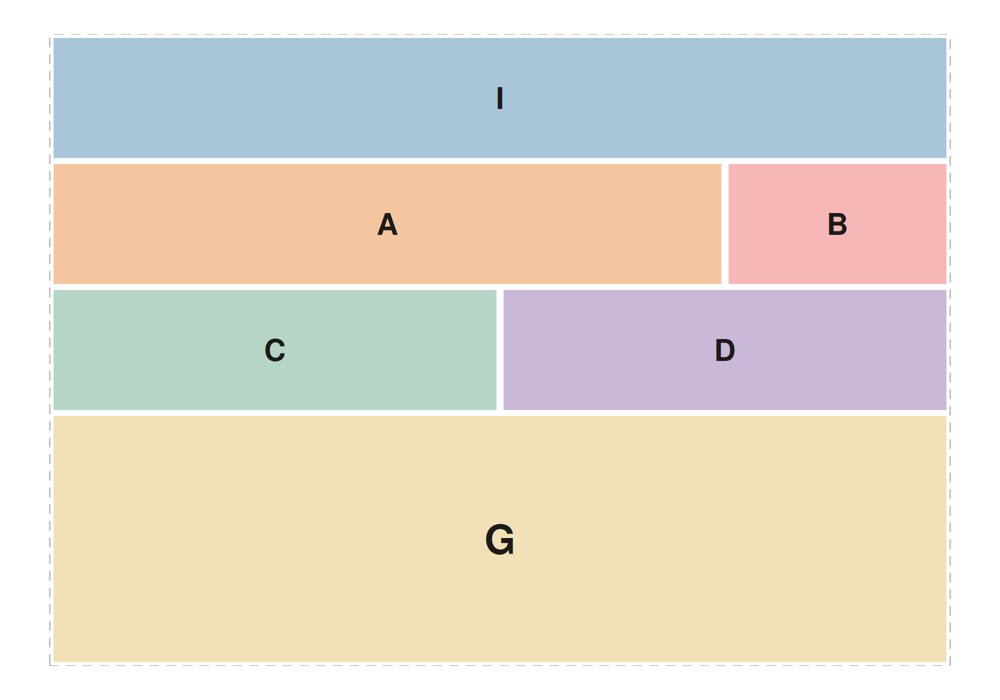

Each track’s `data` / `mapping` is declared independently. Tracks whose
`track_id` isn’t present in the layout string are silently skipped, so
the same operator chain can be reused across different layouts by
swapping the string.

``` r

# Shared elements + per-track datasets --------------------------------------
sig_xs <- seq(1.05e6, 2.95e6, length.out = 80)
sig_mu <- sin((sig_xs - 1e6) / 3e5) * 0.25 + 0.55
sig_gr <- GRanges("chr1", IRanges(sig_xs, width = 1),
                  mean = sig_mu,
                  lo   = sig_mu - 0.1,
                  hi   = sig_mu + 0.1)

density_gr <- GRanges("chr1",
  IRanges(start = seq(1e6, 3e6, length.out = 200), width = 1),
  score = c(rnorm(120, 0.3, 0.05),
            rnorm(80,  0.7, 0.08)))

mut_gr <- GRanges("chr1",
  IRanges(start = sample(seq(1.05e6, 2.95e6, by = 1e4), 18), width = 1),
  impact = runif(18, 0.2, 1.0))

seq_plot(layout = layout_str) %+%
  # I — ideogram strip
  seq_track(track_id = "I",
            windows = create_genome_windows("chr1:1000000-3000000")) %+%
    seq_ideogram(data = cb) %+%
  # A — signal ribbon
  seq_track(track_id = "A",
            data = sig_gr,
            mapping = map(x = start, y_min = lo, y_max = hi),
            windows = win) %+%
    seq_ribbon(aesthetics = aes(fill = "#4385BE", alpha = 0.5)) %+%
  # B — density sidebar
  seq_track(track_id = "B",
            data = density_gr,
            mapping = map(x = start, y = score),
            windows = win) %+%
    seq_density(aesthetics = aes(fill = "#879A39", alpha = 0.7)) %+%
  # C — bar summary
  seq_track(track_id = "C",
            data = bar_gr,
            mapping = map(x = start, y = score),
            windows = win) %+%
    seq_bar(aesthetics = aes(fill = "#8B7EC8")) %+%
  # D — lollipop mutation calls
  seq_track(track_id = "D",
            data = mut_gr,
            mapping = map(x = start, y = impact),
            windows = win) %+%
    seq_lollipop(aesthetics = aes(color = "#AF3029", linewidth = 1.2)) %+%
  # G — gene models spanning the full bottom row
  seq_track(track_id = "G",
            data = gene_gr,
            mapping = map(group  = gene_id,
                          type   = feature,
                          strand = strand_col,
                          label  = gene_name,
                          color  = color),
            windows = win) %+%
    seq_gene(map(group  = gene_id,
                 type   = feature,
                 strand = strand_col,
                 label  = gene_name,
                 color  = color)) -> p
p$plot()
```

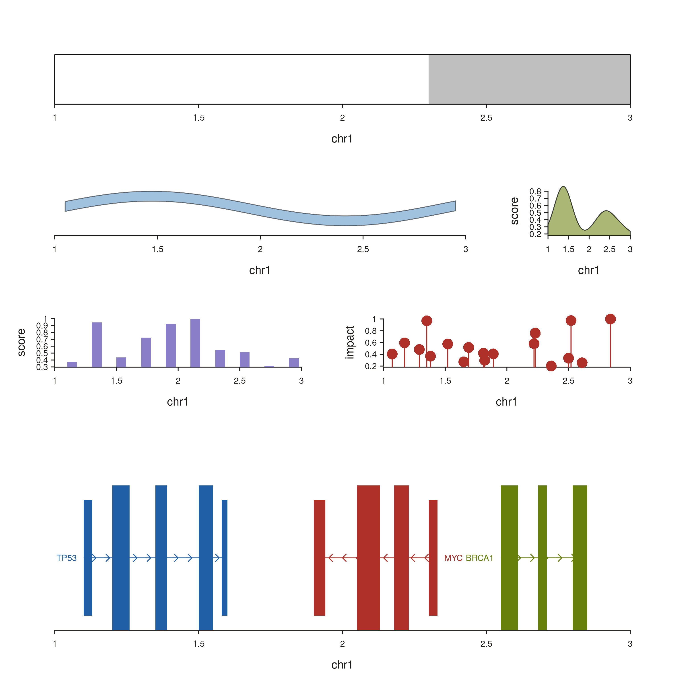

The same set of elements assembles with a positional chain — useful when
the track count is modest and a patchwork string is overkill. Here a
2-row, 2-region browser pairs a coverage area and a multi-region bar
track above a gene strip:

``` r

# Coverage signal spanning both regions
multi_sig_xs <- c(seq(1.05e6, 2.95e6, length.out = 60),
                  seq(5.05e6, 6.45e6, length.out = 50))
multi_sig_gr <- GRanges("chr1", IRanges(multi_sig_xs, width = 1),
  depth = 0.5 + 0.25 * sin((multi_sig_xs - 1e6) / 4e5))

# Gene models split across the two regions
multi_gene_gr <- GRanges("chr1",
  IRanges(start = c(1.20e6, 1.35e6, 1.50e6,
                    2.05e6, 2.18e6, 2.30e6,
                    5.15e6, 5.25e6, 5.38e6,
                    6.10e6, 6.20e6, 6.32e6),
          width = rep(c(8e4, 6e4, 5e4), 4)),
  gene_id    = rep(c("G1", "G2", "G3", "G4"), each = 3),
  gene_name  = rep(c("G1", "G2", "G3", "G4"), each = 3),
  strand_col = rep(c("+", "-", "+", "-"),     each = 3),
  feature = rep("exon", 12),
  color   = rep(c("#205EA6", "#AF3029", "#66800B", "#BC5215"), each = 3))

seq_plot() %|%
  seq_track(track_id = "Coverage",
            data = multi_sig_gr,
            mapping = map(x = start, y = depth),
            windows = multi_win, track_height = 1.0) %+%
    seq_area(aesthetics = aes(fill = "#4385BE",
                              color = "#205EA6",
                              alpha = 0.55,
                              linewidth = 0.7)) %__%
  seq_track(track_id = "Bars",
            data = multi_gr,
            mapping = map(x = start, y = score, group = region),
            windows = multi_win, track_height = 0.8) %+%
    seq_bar() %__%
  seq_track(track_id = "Genes",
            data = multi_gene_gr,
            mapping = map(group  = gene_id,
                          type   = feature,
                          strand = strand_col,
                          label  = gene_name,
                          color  = color),
            windows = multi_win, track_height = 1.2) %+%
    seq_gene(map(group  = gene_id,
                 type   = feature,
                 strand = strand_col,
                 label  = gene_name,
                 color  = color)) -> p
p$plot()
```

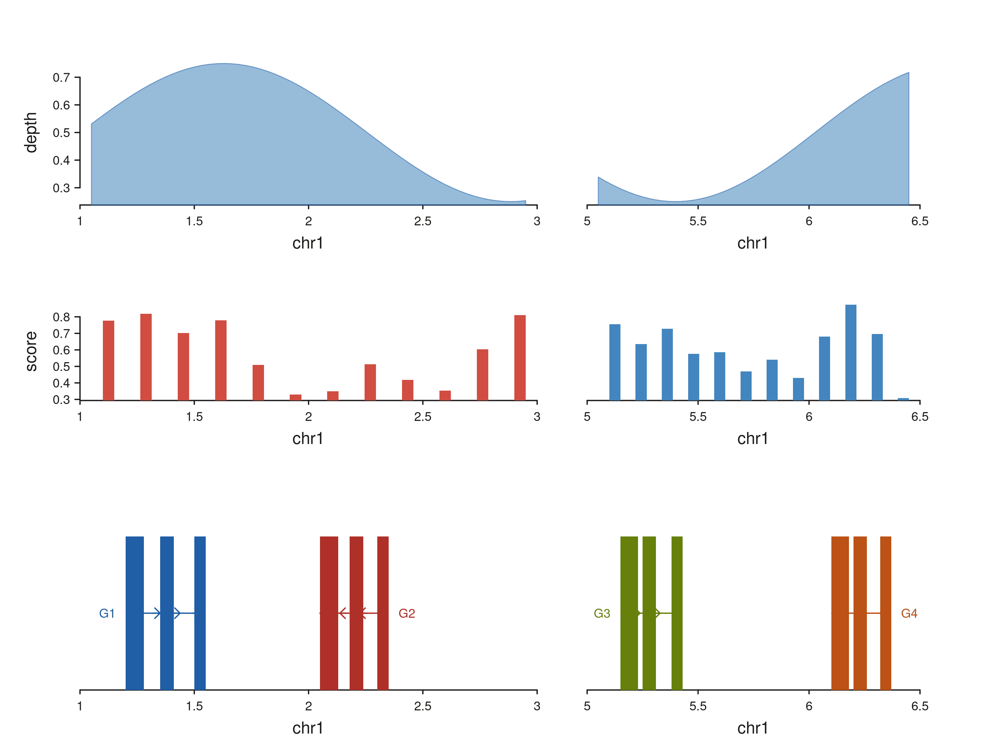

Each track’s panels align vertically across rows because they share the
same `windows` GRanges — so the left panel in `Coverage`, `Bars`, and
`Genes` all show the same 1–3 Mb region, and the right panel shows 5–6.5
Mb. Cross-track links (`seq_string`, `seq_synteny`, `seq_zoom`) can be
dropped on top of a layout like this; see the `links` vignette for
worked examples.
