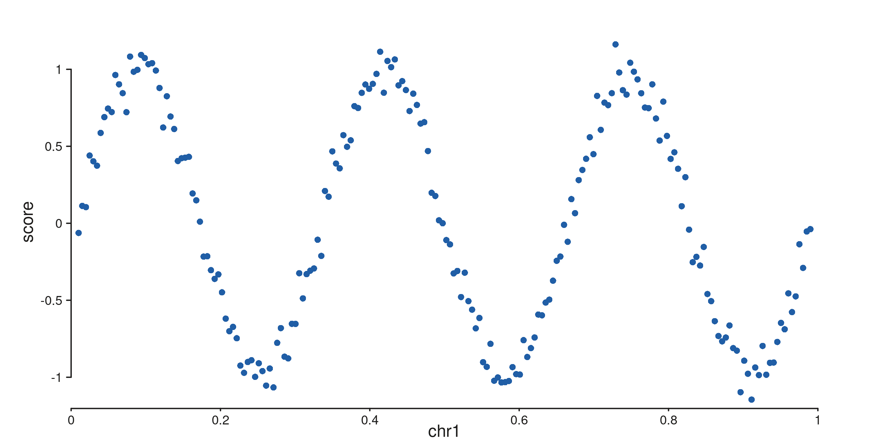
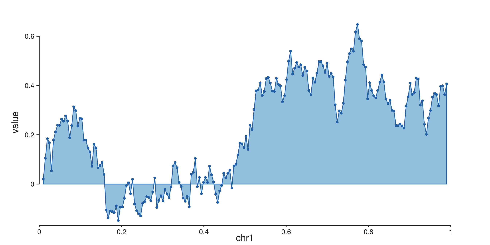
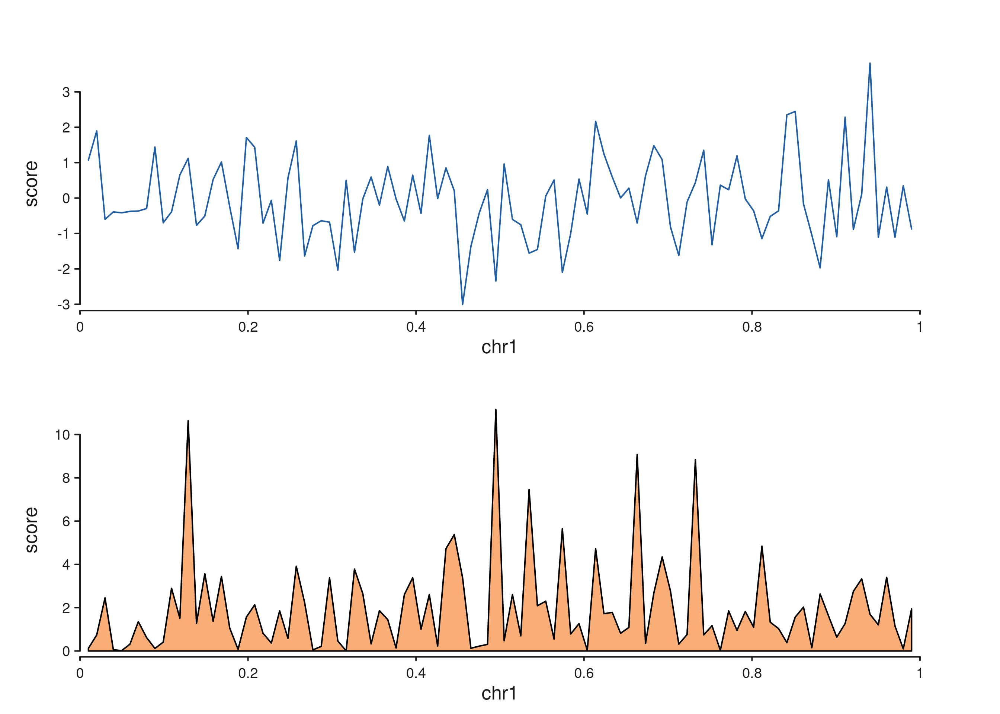

# Getting Started with SeqPlotR

SeqPlotR builds genomic figures by composing a plot, tracks, and
elements with a single `%+%` operator — modelled on ggplot2 but
specialised for `GRanges` data. This vignette walks through the minimum
you need to render a plot end-to-end.

``` r

library(SeqPlotR)
#> 
#> Attaching package: 'SeqPlotR'
#> The following object is masked from 'package:base':
#> 
#>     %||%
library(GenomicRanges)
#> Loading required package: stats4
#> Loading required package: BiocGenerics
#> Loading required package: generics
#> 
#> Attaching package: 'generics'
#> The following objects are masked from 'package:base':
#> 
#>     as.difftime, as.factor, as.ordered, intersect, is.element, setdiff,
#>     setequal, union
#> 
#> Attaching package: 'BiocGenerics'
#> The following objects are masked from 'package:stats':
#> 
#>     IQR, mad, sd, var, xtabs
#> The following objects are masked from 'package:base':
#> 
#>     anyDuplicated, aperm, append, as.data.frame, basename, cbind,
#>     colnames, dirname, do.call, duplicated, eval, evalq, Filter, Find,
#>     get, grep, grepl, is.unsorted, lapply, Map, mapply, match, mget,
#>     order, paste, pmax, pmax.int, pmin, pmin.int, Position, rank,
#>     rbind, Reduce, rownames, sapply, saveRDS, table, tapply, unique,
#>     unsplit, which.max, which.min
#> Loading required package: S4Vectors
#> 
#> Attaching package: 'S4Vectors'
#> The following object is masked from 'package:utils':
#> 
#>     findMatches
#> The following objects are masked from 'package:base':
#> 
#>     expand.grid, I, unname
#> Loading required package: IRanges
#> Loading required package: Seqinfo
```

## The four primitives you need

A SeqPlotR figure is always built from these pieces:

| Piece | What it does |
|----|----|
| [`seq_plot()`](http://andrewlynch.io/SeqPlotR/reference/seq_plot.md) | Creates a new plot. |
| [`seq_track()`](http://andrewlynch.io/SeqPlotR/reference/seq_track.md) | Adds a genomic panel with a `windows` range. |
| `map(...)` | Declares data-driven aesthetics (`x`, `y`, `color`, …). |
| `aes(...)` | Declares constant aesthetics and theme keys. |

Elements (`seq_point`, `seq_line`, `seq_area`, …) are drawn inside a
track. The `%+%` operator chains everything together and dispatches on
the right-hand side’s class.

## A first plot

``` r

win <- GRanges("chr1", IRanges(1, 1e6))
gr  <- GRanges("chr1",
               IRanges(start = seq(1e4, 9.9e5, length.out = 200), width = 1),
               score = sin(seq(0, 6*pi, length.out = 200)) +
                       rnorm(200, 0, 0.1))

p <- seq_plot() %+%
  seq_track(data = gr, mapping = map(x = start, y = score), windows = win) %+%
  seq_point(aesthetics = aes(color = "#205EA6", size = 0.4))

p$plot()
```



The track holds the defaults (data, mapping, windows); the element
[`seq_point()`](http://andrewlynch.io/SeqPlotR/reference/seq_point.md)
inherits them.

## Layering several elements in one track

`%+%` on a plot adds elements to the **most recently added track**, so
two elements in a row draw on top of each other:

``` r

gr_line <- GRanges("chr1",
                   IRanges(seq(1e4, 9.9e5, length.out = 200), width = 1),
                   value = cumsum(rnorm(200)) * 0.05)

p <- seq_plot() %+%
  seq_track(data = gr_line, mapping = map(x = start, y = value), windows = win) %+%
  seq_area(aesthetics = aes(fill = "#92BFDB", color = "#205EA6", baseline = 0)) %+%
  seq_point(aesthetics = aes(color = "#205EA6", size = 0.3))

p$plot()
```



## Two tracks side by side: `%|%` and `%__%`

`%|%` and `%__%` are convenience aliases for `%+%` that set
`direction = "right"` or `direction = "under"` on the track they
introduce:

``` r

gr_a <- GRanges("chr1", IRanges(seq(1e4, 9.9e5, length.out = 100), width = 1),
                score = rnorm(100))
gr_b <- GRanges("chr1", IRanges(seq(1e4, 9.9e5, length.out = 100), width = 1),
                score = rexp(100, rate = 0.5))

p <- seq_plot() %|%
  seq_track(data = gr_a, mapping = map(x = start, y = score),
            windows = win, track_id = "A") %+% seq_line(aesthetics = aes(color = "#205EA6")) %__%
  seq_track(data = gr_b, mapping = map(x = start, y = score),
            windows = win, track_id = "B") %+% seq_area(aesthetics = aes(fill = "#F9AE77"))

p$plot()
```



## Printing

`seq_plot` carries an S3 `print` method, so a bare expression in a
script or knitr chunk auto-renders — `p$plot()` is equivalent.

## Where to go next

- [`vignette("patchwork-layouts", "SeqPlotR")`](http://andrewlynch.io/SeqPlotR/articles/patchwork-layouts.md)
  — multi-cell layouts with a layout string.
- [`vignette("wrappers", "SeqPlotR")`](http://andrewlynch.io/SeqPlotR/articles/wrappers.md)
  — higher-level wrappers (`seq_copynumber`, `seq_hic`, `seq_chip`, …).
- [`vignette("links", "SeqPlotR")`](http://andrewlynch.io/SeqPlotR/articles/links.md)
  — cross-track arcs, arches, synteny, and zoom links.
