# Hi-C Visualization

[`seq_hic()`](http://andrewlynch.io/SeqPlotR/reference/seq_hic.md)
renders Hi-C contact matrices in four interchangeable styles. Each call
produces one `seq_plot` with a single track in the chosen style — to
combine styles or stitch together regions, call
[`seq_hic()`](http://andrewlynch.io/SeqPlotR/reference/seq_hic.md)
multiple times and compose the results with
[`seq_resolve()`](http://andrewlynch.io/SeqPlotR/reference/seq_resolve.md),
`%+%`, `%|%` or `%__%`.

``` r

library(SeqPlotR)
#> 
#> Attaching package: 'SeqPlotR'
#> The following object is masked from 'package:base':
#> 
#>     %||%
library(GenomicRanges)
#> Loading required package: stats4
#> Loading required package: BiocGenerics
#> Loading required package: generics
#> 
#> Attaching package: 'generics'
#> The following objects are masked from 'package:base':
#> 
#>     as.difftime, as.factor, as.ordered, intersect, is.element, setdiff,
#>     setequal, union
#> 
#> Attaching package: 'BiocGenerics'
#> The following objects are masked from 'package:stats':
#> 
#>     IQR, mad, sd, var, xtabs
#> The following objects are masked from 'package:base':
#> 
#>     anyDuplicated, aperm, append, as.data.frame, basename, cbind,
#>     colnames, dirname, do.call, duplicated, eval, evalq, Filter, Find,
#>     get, grep, grepl, is.unsorted, lapply, Map, mapply, match, mget,
#>     order, paste, pmax, pmax.int, pmin, pmin.int, Position, rank,
#>     rbind, Reduce, rownames, sapply, saveRDS, table, tapply, unique,
#>     unsplit, which.max, which.min
#> Loading required package: S4Vectors
#> 
#> Attaching package: 'S4Vectors'
#> The following object is masked from 'package:utils':
#> 
#>     findMatches
#> The following objects are masked from 'package:base':
#> 
#>     expand.grid, I, unname
#> Loading required package: IRanges
#> Loading required package: Seqinfo
```

## Synthetic data

The examples below use the same Hi-C contact simulator carried over from
`THEfunc/inst/examples/08_rotated_hic_heatmap.R`: every upper-triangular
bin pair `(i, j)` is assigned a contact strength of
`exp(-distance * decay_rate) * lognormal(noise)`, then symmetrised by
mirroring `(j, i)`.

``` r

# Hi-C simulator (THEfunc port).
generate_hic_matrix <- function(n_bins, decay_rate = 0.2) {
  ij    <- expand.grid(i = seq_len(n_bins), j = seq_len(n_bins))
  upper <- ij$j >= ij$i
  ij    <- ij[upper, , drop = FALSE]
  d     <- ij$j - ij$i
  s     <- pmax(0.01, exp(-d * decay_rate) * rlnorm(nrow(ij), 0, 0.3))
  upper_df <- data.frame(bin_i = ij$i, bin_j = ij$j, strength = s)
  off      <- d > 0
  lower_df <- data.frame(bin_i = ij$j[off], bin_j = ij$i[off],
                         strength = s[off])
  rbind(upper_df, lower_df)
}

# Convenience: build a `seq_hic`-shaped GRanges for a single region.
hic_region <- function(chrom, start, end, bin_size, decay = 0.2,
                       seed = NULL) {
  if (!is.null(seed)) set.seed(seed)
  bin_starts <- seq(start, end - bin_size, by = bin_size)
  n          <- length(bin_starts)
  mat        <- generate_hic_matrix(n, decay_rate = decay)
  GRanges(chrom,
          IRanges(bin_starts[mat$bin_i], width = bin_size),
          i_start = bin_starts[mat$bin_i],
          i_end   = bin_starts[mat$bin_i] + bin_size,
          j_start = bin_starts[mat$bin_j],
          j_end   = bin_starts[mat$bin_j] + bin_size,
          score   = mat$strength)
}

# Multi-region: per-chromosome intra-chrom matrices, concatenated.
hic_multi <- function(regions, bin_size, decay = 0.2, base_seed = 100) {
  parts <- lapply(seq_along(regions), function(k) {
    r <- regions[[k]]
    hic_region(r[[1]], r[[2]], r[[3]], bin_size,
               decay = decay, seed = base_seed + k)
  })
  do.call(c, parts)
}
```

## The four styles at a glance

A single 5 Mb region rendered in each of the four styles. The first two
(`full`, `diagonal`) keep both axes genomic; the last two (`triangle`,
`rectangle`) rotate by 45° so the y-axis becomes interaction distance in
bp.

``` r

gr  <- hic_region("chr1", 40e6, 45e6, bin_size = 1e5, decay = 0.25,
                  seed = 1)
win <- GRanges("chr1", IRanges(40e6, 45e6))
```

### `style = "full"`

``` r

seq_hic(gr, windows = win, style = "full")$plot()
```

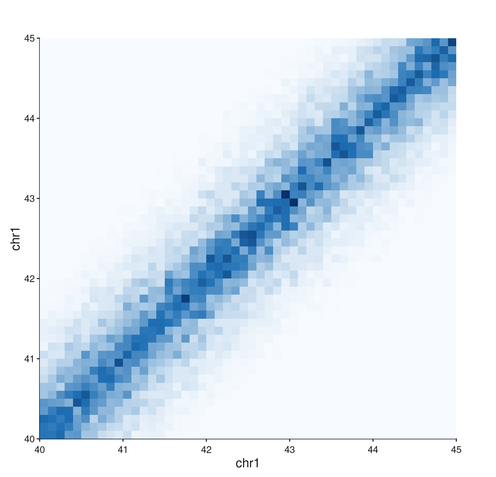

Symmetric square heatmap with genomic position on both axes. This is the
canonical view but uses the most space — half the panel is a mirror of
the other.

### `style = "diagonal"`

``` r

seq_hic(gr, windows = win, style = "diagonal")$plot()
```

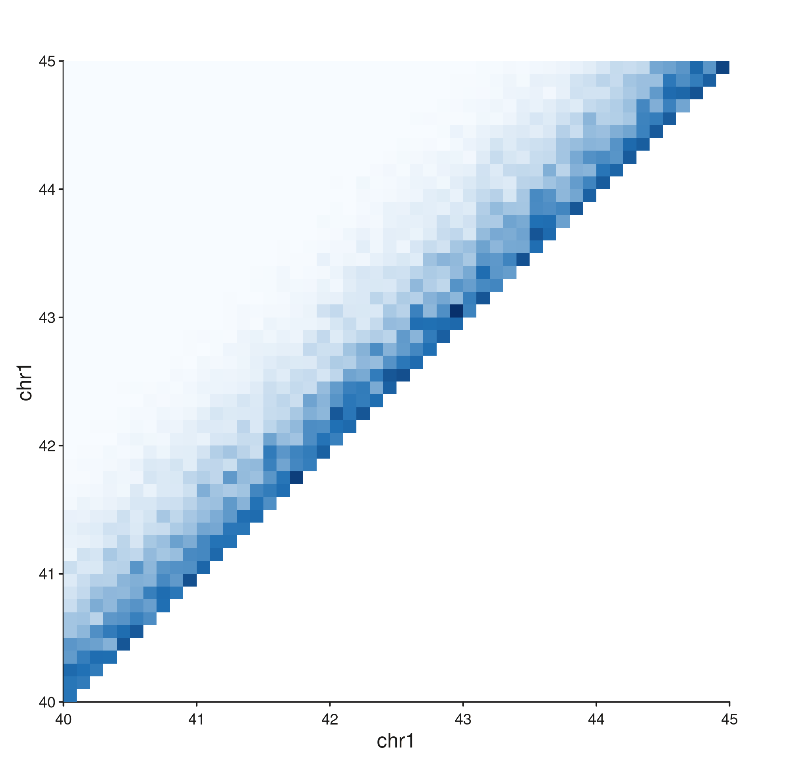

Same coordinate system as `"full"`, but the lower-triangular mirror is
dropped — the diagonal is the dominant feature.

### `style = "triangle"`

``` r

seq_hic(gr, windows = win, style = "triangle")$plot()
```

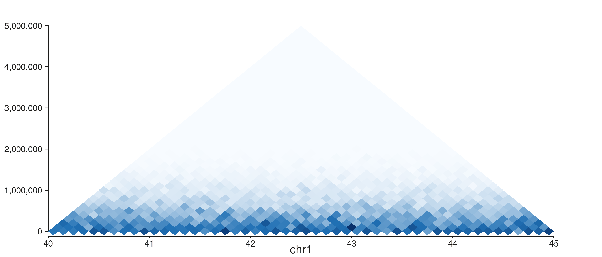

45° rotation: x is genomic position, y is **interaction distance** in
bp. The y-axis tops out at the largest distance present in the data.
Most space-efficient — and the standard for browser-style Hi-C tracks.

### `style = "rectangle"`

``` r

seq_hic(gr, windows = win, style = "rectangle", max_dist = 2e6)$plot()
```

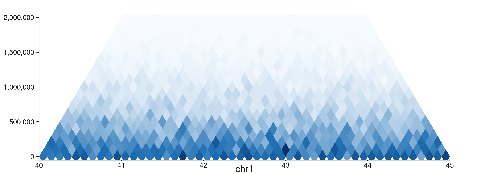

The same rotation, but `max_dist` caps the distance axis. Use this when
long-range contacts are sparse or out of scope — the visible rectangle
is filled with the biologically interesting near-diagonal band.

## Multiple regions on the x axis

`windows` accepts a multi-range `GRanges` — each range becomes its own
side-by-side panel, sharing the same y axis. Perfect for comparing
several loci at a glance.

``` r

regs <- list(list("chrA", 0, 3e6),
             list("chrB", 0, 3e6),
             list("chrC", 0, 3e6))
gr_multi <- hic_multi(regs, bin_size = 1e5, decay = 0.25)
#> Warning in .merge_two_Seqinfo_objects(x, y): The 2 combined objects have no sequence levels in common. (Use
#>   suppressWarnings() to suppress this warning.)
#> Warning in .merge_two_Seqinfo_objects(x, y): The 2 combined objects have no sequence levels in common. (Use
#>   suppressWarnings() to suppress this warning.)
win_multi <- GRanges(c("chrA", "chrB", "chrC"),
                     IRanges(c(1, 1, 1), c(3e6, 3e6, 3e6)))
```

### Multi-region triangle

``` r

seq_hic(gr_multi, windows = win_multi, style = "triangle")$plot()
```

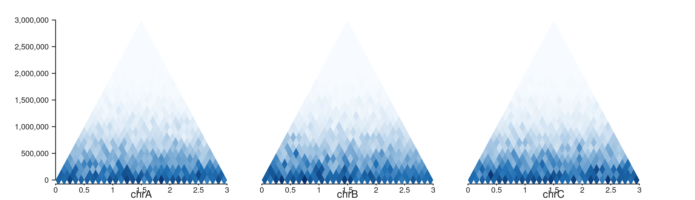

Each chromosome’s contact matrix in its own triangular panel. The
distance axis is shared so distance scales remain comparable across
panels.

### Multi-region rectangle

``` r

seq_hic(gr_multi, windows = win_multi, style = "rectangle",
        max_dist = 1.5e6)$plot()
```

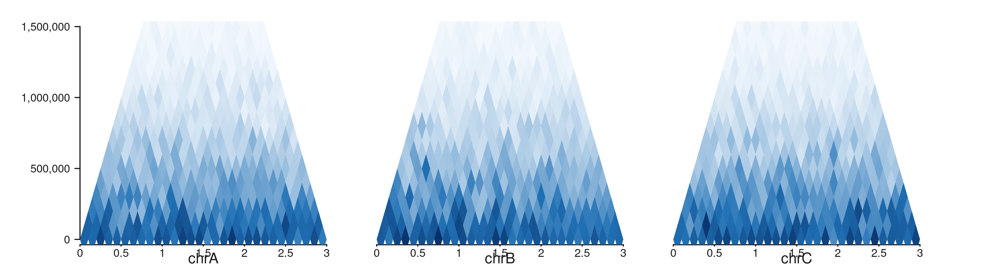

The capped distance axis makes side-by-side comparison particularly
clean — every panel uses the same y-extent, so visual “weight” directly
reflects contact density.

### Multi-region full

``` r

seq_hic(gr_multi, windows = win_multi, style = "full")$plot()
```

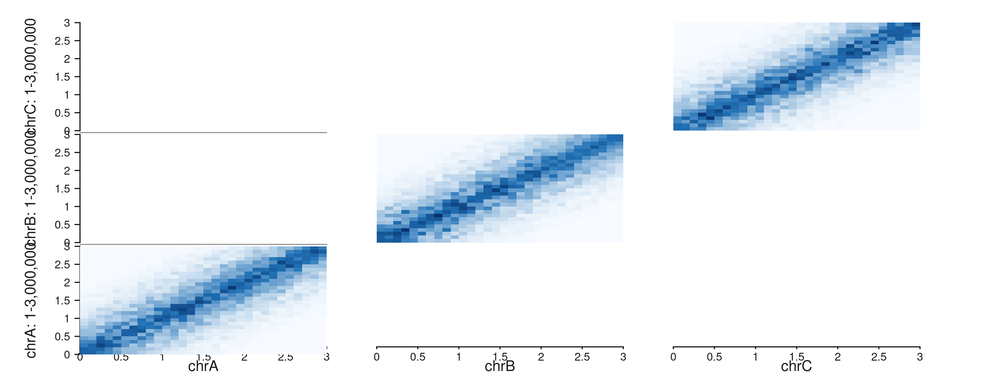

Each panel is the symmetric 2D matrix for that region.

### Multi-region diagonal

``` r

seq_hic(gr_multi, windows = win_multi, style = "diagonal")$plot()
```

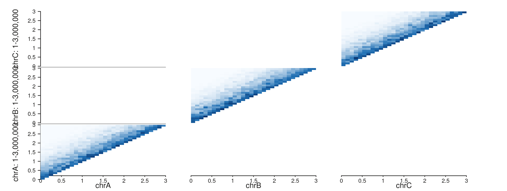

## Multiple regions on the y axis

`y_windows` controls the genomic y-axis for the `full` and `diagonal`
styles independently from `windows`. By default it mirrors `windows`
(square matrix). Pass a multi-region `GRanges` to stack several y-axis
windows vertically — each gets its own sub-panel with axis labels and a
title naming the chromosome and range, and a thin horizontal separator
marks the boundary.

To represent inter-chromosomal contacts, the input `GRanges` carries an
optional `j_chrom` mcols column giving the j-bin’s chromosome (the
GRanges seqname is the i-bin’s chromosome). When `j_chrom` is absent
both bins are taken to be on the same chromosome.

``` r

# x: chr1 (1 region). y: stacked chrA + chrB (2 regions).
# Mixed contact set: chr1×chr1 (intra), chr1↔chrA, chr1↔chrB.
set.seed(7)
n_per <- 250
i_st  <- sort(sample(seq(1, 4e6 - 1e5, by = 1e5), n_per, replace = TRUE))
mk <- function(j_chrom) data.frame(
  i_chrom = "chr1",
  i_start = i_st, i_end = i_st + 1e5,
  j_chrom = j_chrom,
  j_start = sort(sample(seq(1, 4e6 - 1e5, by = 1e5), n_per, replace = TRUE)),
  score   = rexp(n_per, rate = 0.4),
  stringsAsFactors = FALSE
)
df <- rbind(mk("chrA"), mk("chrB"))
df$j_end <- df$j_start + 1e5

gr_multiy <- GRanges(
  df$i_chrom, IRanges(df$i_start, df$i_end),
  i_start = df$i_start, i_end = df$i_end,
  j_chrom = df$j_chrom, j_start = df$j_start, j_end = df$j_end,
  score   = df$score
)

win_x_one <- GRanges("chr1",            IRanges(1, 4e6))
win_y_two <- GRanges(c("chrA", "chrB"), IRanges(c(1, 1), c(4e6, 4e6)))
```

``` r

seq_hic(gr_multiy,
        windows   = win_x_one,
        y_windows = win_y_two,
        style     = "full")$plot()
```

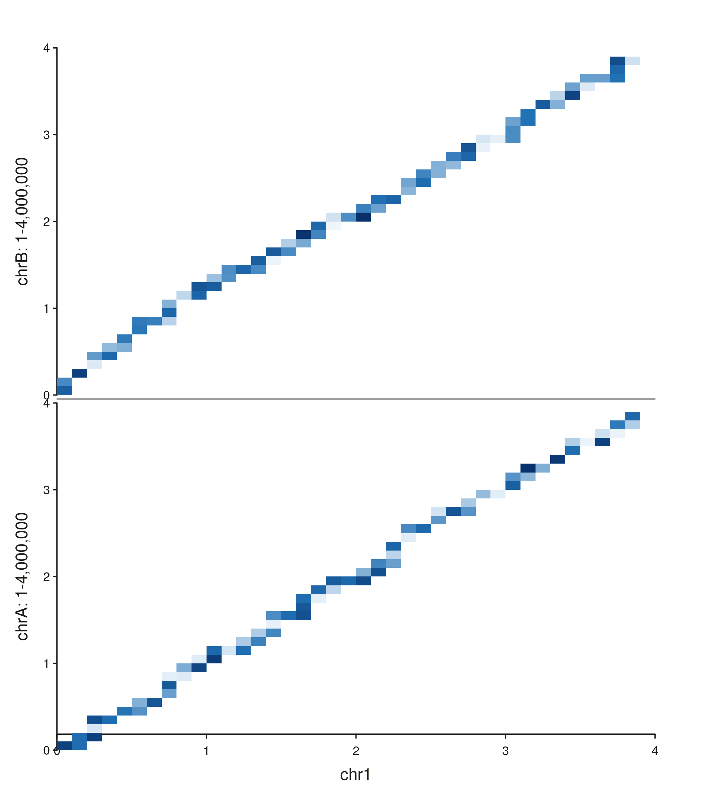

The bottom panel shows `chr1 × chrA` contacts; the top panel shows
`chr1 × chrB`. Each y sub-panel has its own genomic scale, so the two
pairs are directly comparable.

## Combining x-axis regions into a single panel

By default each x-axis region in `windows` renders as its own panel.
Setting `combine_windows = TRUE` concatenates them into a single virtual
panel — useful when *cross-window* contacts (e.g. an inter-chromosomal
translocation) need to appear in one continuous view. Each original
window keeps its own per-window axis labels and title, and a thin
vertical separator marks the boundary.

`combine_windows` is implemented at the
\[[`seq_track()`](http://andrewlynch.io/SeqPlotR/reference/seq_track.md)\]
level, so this option is available to every track type — not just Hi-C.

``` r

# Two-region data: intra-chr14, intra-chr5, plus a "translocation"
# band of inter-chromosomal contacts concentrated near a breakpoint.
set.seed(11)
bs   <- 1e5  # bin size
mk_intra <- function(chrom, start, end, decay = 0.25, seed_off = 0) {
  starts <- seq(start, end - bs, by = bs)
  n      <- length(starts)
  set.seed(seed_off)
  mat <- generate_hic_matrix(n, decay_rate = decay)
  data.frame(i_chrom = chrom,  i_start = starts[mat$bin_i],
             i_end   = starts[mat$bin_i] + bs,
             j_chrom = chrom,  j_start = starts[mat$bin_j],
             j_end   = starts[mat$bin_j] + bs,
             score   = mat$strength,
             stringsAsFactors = FALSE)
}
mk_inter <- function(c1, s1, e1, c2, s2, e2, n = 200, focus = c(0.4, 0.7)) {
  i_st <- s1 + round(runif(n, focus[1], focus[2]) * (e1 - s1) / bs) * bs
  j_st <- s2 + round(runif(n, focus[1], focus[2]) * (e2 - s2) / bs) * bs
  rbind(
    data.frame(i_chrom = c1, i_start = i_st, i_end = i_st + bs,
               j_chrom = c2, j_start = j_st, j_end = j_st + bs,
               score   = rexp(n, rate = 0.4) + 0.5,
               stringsAsFactors = FALSE),
    data.frame(i_chrom = c2, i_start = j_st, i_end = j_st + bs,
               j_chrom = c1, j_start = i_st, j_end = i_st + bs,
               score   = rexp(n, rate = 0.4) + 0.5,
               stringsAsFactors = FALSE)
  )
}

intra14 <- mk_intra("chr14", 98e6,  100e6, seed_off = 1)
intra5  <- mk_intra("chr5",  170e6, 172e6, seed_off = 2)
inter   <- mk_inter("chr14", 98e6,  100e6, "chr5", 170e6, 172e6, n = 250)
all_df  <- rbind(intra14, intra5, inter)

gr_combined <- GRanges(
  all_df$i_chrom, IRanges(all_df$i_start, all_df$i_end),
  i_start = all_df$i_start, i_end = all_df$i_end,
  j_chrom = all_df$j_chrom, j_start = all_df$j_start, j_end = all_df$j_end,
  score   = all_df$score
)
win_combined <- GRanges(c("chr14", "chr5"),
                        IRanges(c(98e6, 170e6), c(100e6, 172e6)))
```

### `combine_windows = TRUE` — triangle

The two intra-chromosomal contact decays sit on either side of a
boundary, with the cross-chromosomal “translocation” rising as a
floating diamond between them.

``` r

seq_hic(gr_combined,
        windows         = win_combined,
        style           = "triangle",
        combine_windows = TRUE,
        palette         = "reds")$plot()
```

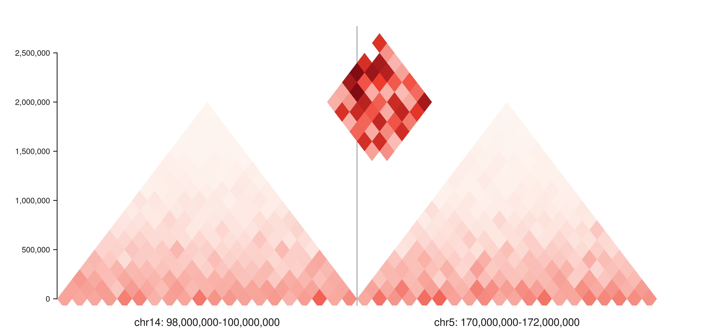

### `combine_windows = TRUE` — full

The same contact set as a 2D matrix. The diagonal lights up in each
intra-chromosomal quadrant, with a bright inter-chromosomal block in the
off-diagonal quadrants.

``` r

seq_hic(gr_combined,
        windows           = win_combined,
        y_windows         = win_combined,
        style             = "full",
        combine_windows   = TRUE,
        combine_y_windows = TRUE,
        palette           = "reds")$plot()
```

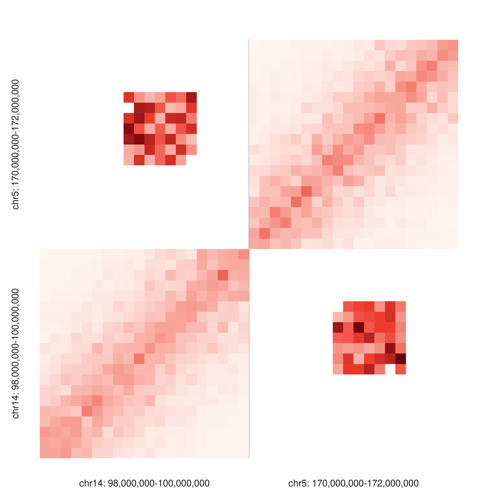

## Multiple regions on both axes — composing a region grid

For a 2-D matrix-of-matrices view (every x-region paired with every
y-region), build one
[`seq_hic()`](http://andrewlynch.io/SeqPlotR/reference/seq_hic.md) per
cell and lay them out with a patchwork string. This sidesteps the need
for multi-region y sub-axes inside a single track and gives full control
over per-cell sizing and labels.

``` r

# Two-region intra-chrom data plus a contrived "off-diagonal" view.
gr_A <- hic_region("chrA", 0, 3e6, bin_size = 1e5, decay = 0.20, seed = 11)
gr_B <- hic_region("chrB", 0, 3e6, bin_size = 1e5, decay = 0.30, seed = 12)
win_A <- GRanges("chrA", IRanges(1, 3e6))
win_B <- GRanges("chrB", IRanges(1, 3e6))
```

``` r

layout <- "
AB
CD
"
p_AA <- seq_hic(gr_A, windows = win_A, style = "full",
                track_id = "A")
p_AB <- seq_hic(gr_A, windows = win_A, y_windows = win_B,
                style = "full", track_id = "B")
p_BA <- seq_hic(gr_B, windows = win_B, y_windows = win_A,
                style = "full", track_id = "C")
p_BB <- seq_hic(gr_B, windows = win_B, style = "full",
                track_id = "D")

fig <- seq_plot(layout = layout)
fig <- seq_resolve(fig, p_AA, p_AB, p_BA, p_BB)
fig$plot()
```

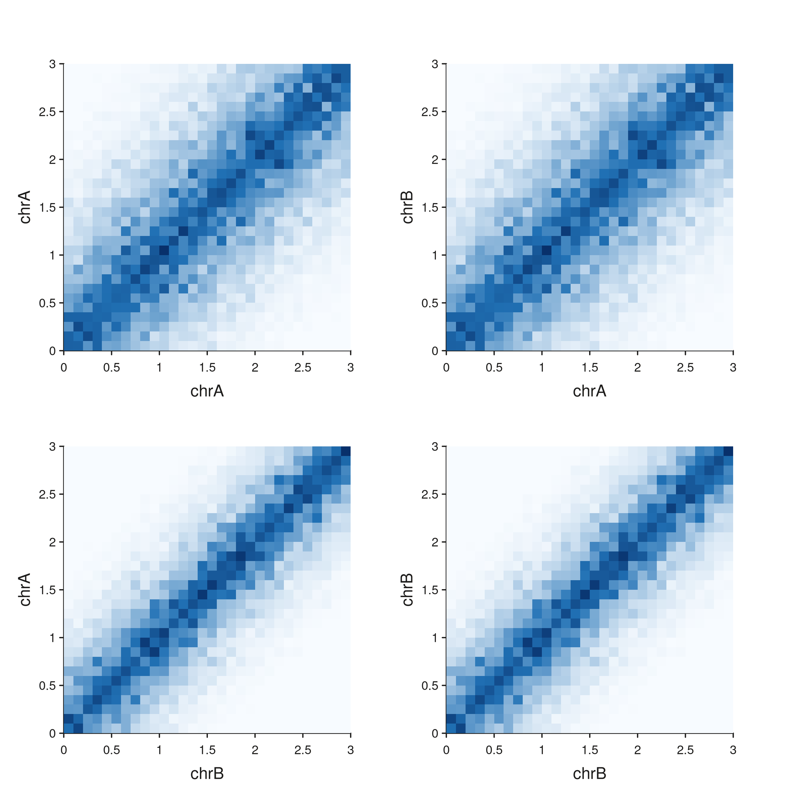

The diagonal cells (top-left, bottom-right) are intra-chromosomal
contact maps; the off-diagonals show the asymmetric `chrA × chrB` and
`chrB × chrA` views.

## Flipping the axes — `flip_x` / `flip_y`

[`seq_hic()`](http://andrewlynch.io/SeqPlotR/reference/seq_hic.md)
accepts `flip_x` and `flip_y` to mirror an axis. Tick labels follow the
orientation, so the data and the labels stay in sync. The most common
use is plotting a *downward-pointing* triangle underneath another track.

### Triangle, point down

``` r

seq_hic(gr, windows = win, style = "triangle",
        flip_y = TRUE)$plot()
```

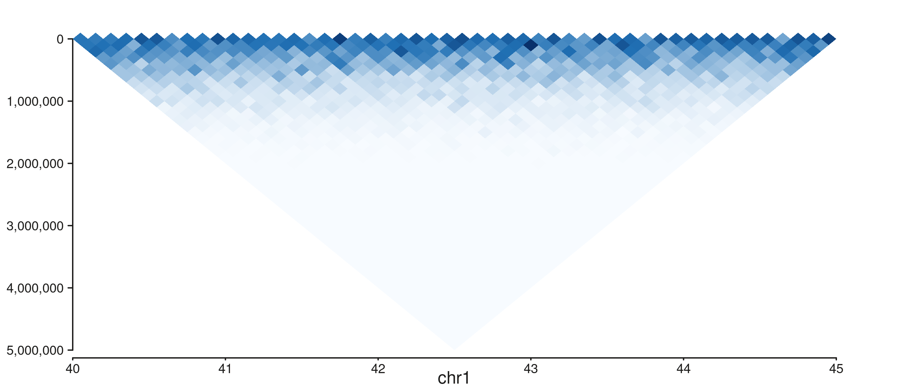

### Diagonal, lower triangle

``` r

seq_hic(gr, windows = win, style = "diagonal",
        flip_y = TRUE)$plot()
```

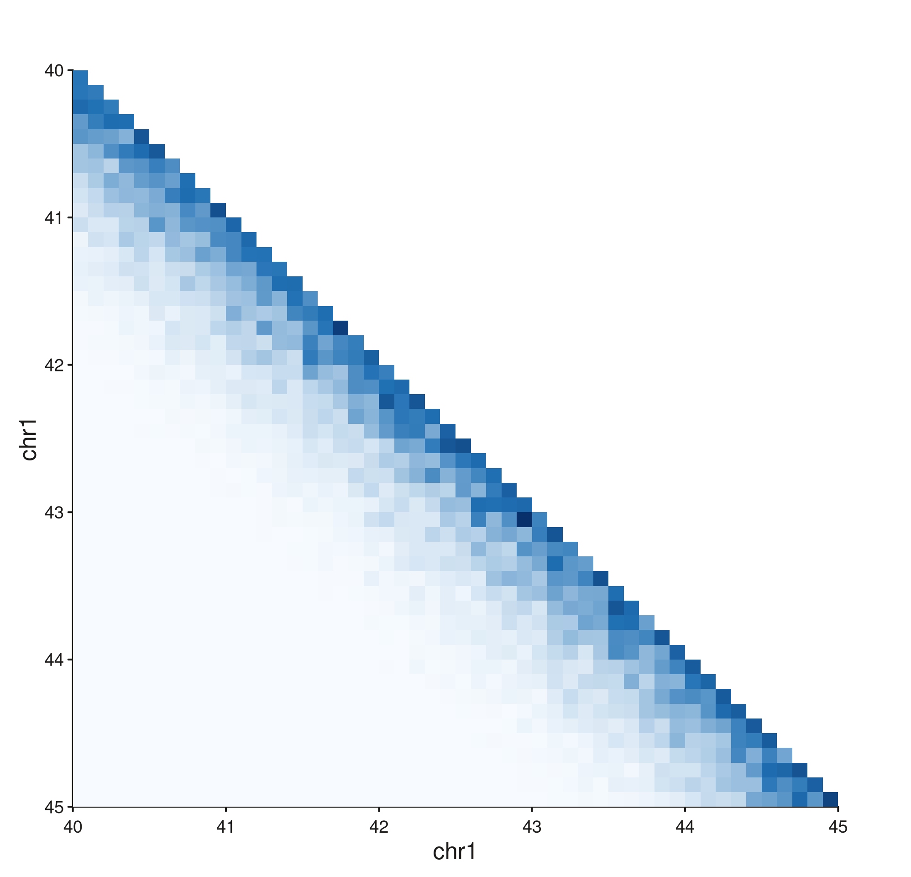

### Full, mirrored on x

``` r

seq_hic(gr, windows = win, style = "full",
        flip_x = TRUE)$plot()
```

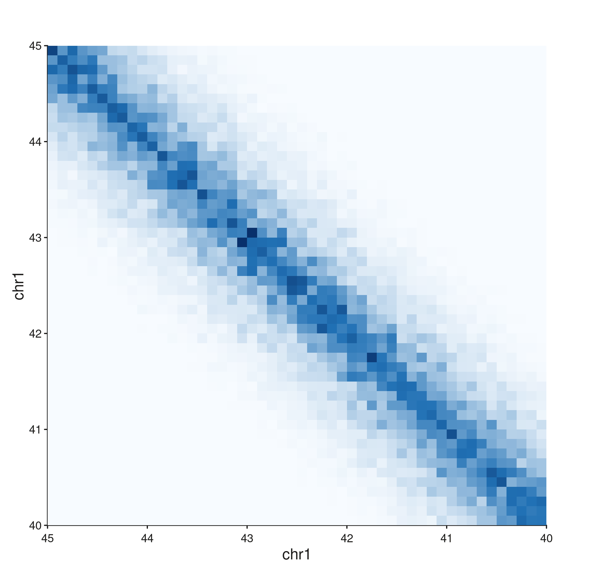

### Stacking a normal triangle above a flipped one

A common publication-style layout: two samples shown back-to-back, the
second flipped so its peak meets the first’s. Use
[`seq_resolve()`](http://andrewlynch.io/SeqPlotR/reference/seq_resolve.md)
to compose them in one figure.

``` r

p_top    <- seq_hic(gr, windows = win, style = "triangle",
                    track_id = "top")
p_bottom <- seq_hic(gr, windows = win, style = "triangle",
                    flip_y = TRUE, track_id = "bottom")
seq_resolve(seq_plot(), p_top, p_bottom)$plot()
```

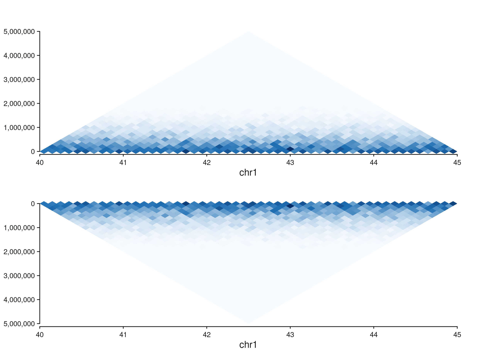

## Mixed-style figures via `seq_resolve()`

[`seq_hic()`](http://andrewlynch.io/SeqPlotR/reference/seq_hic.md) is
one call per style — but
[`seq_resolve()`](http://andrewlynch.io/SeqPlotR/reference/seq_resolve.md)
makes it easy to combine several Hi-C views in a single figure. Useful
when one style answers one question (long-range patterns via `triangle`)
and another a different one (TAD structure via `full`).

``` r

gr <- hic_region("chr1", 40e6, 45e6, bin_size = 1e5, decay = 0.25,
                 seed = 1)
win <- GRanges("chr1", IRanges(40e6, 45e6))

p_full <- seq_hic(gr, windows = win, style = "full",
                  track_id = "FullView")
p_tri  <- seq_hic(gr, windows = win, style = "triangle",
                  track_id = "TriView")

fig <- seq_resolve(seq_plot(), p_full, p_tri)
fig$plot()
```

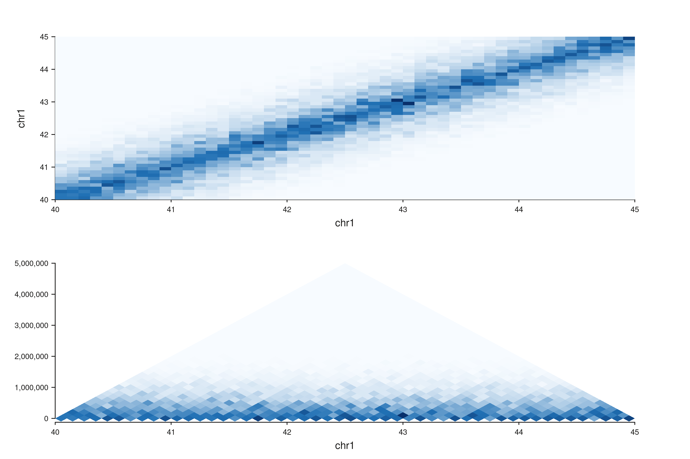

## Choosing a style

| Style | When to reach for it |
|----|----|
| `full` | Detailed per-cell inspection, asymmetric regions on x and y, full symmetric matrix you want to read either direction. |
| `diagonal` | Like `full` but with the redundant lower triangle stripped — a half-matrix view that uses the same coordinate system. |
| `triangle` | Browser-style overview, stacking with other genomic tracks, and any time interaction distance is the question. |
| `rectangle` | Large genomes / fine resolutions where only short-to-medium-range contacts matter. The `max_dist` cap removes noise from sparse long-range tiles and lets you compare regions on the same distance scale. |

## Combining Hi-C with annotation tracks

Rotated styles (`triangle`, `rectangle`) compose naturally above
annotation tracks because they share the same x-axis.
[`seq_resolve()`](http://andrewlynch.io/SeqPlotR/reference/seq_resolve.md)
or the operator chain stitches them together:

``` r

# Synthetic gene track for the same window.
genes <- GRanges("chr1",
                 IRanges(start = c(40.5e6, 41.4e6, 42.6e6, 43.5e6, 44.2e6),
                         width = c(1.2e5, 2.0e5, 8e4,    1.5e5, 9e4)),
                 gene = paste0("g", 1:5),
                 type = "exon",
                 strand = c("+", "-", "+", "+", "-"))

p_hic <- seq_hic(gr, windows = win, style = "triangle",
                 track_id = "HiC")

p_genes <- seq_plot() %+%
  seq_track(data = genes, windows = win, track_id = "Genes",
            track_height = 0.4) %+%
  seq_gene(map(group = gene, type = type, strand = strand,
               label = gene))

seq_resolve(seq_plot(), p_hic, p_genes)$plot()
```

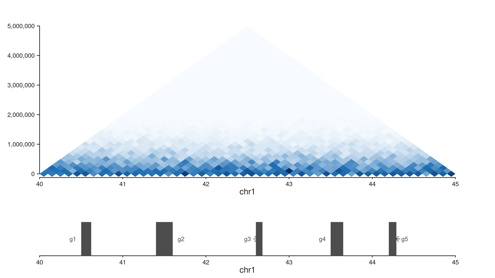
