# SeqPlotR Links: Arches, SV Reconstruction, and Cross-Track Connectors

This vignette walks through the **link** elements — drawables that
connect two genomic loci. The arch family stays within one track:

- `seq_arc` — Bezier arch between two loci, no stems.
- `seq_arch` — same, with vertical stems and partial-window stubs.
- `seq_recon` — `seq_arch` plus automatic SV classification by strand
  pair and chromosome.

The cross-track family connects two *different* tracks:

- `seq_string` — smooth Bezier curve whose shape (C vs. S) is inferred
  from the strand pair.
- `seq_synteny` — filled trapezoid between homologous / syntenic blocks
  in two tracks.
- `seq_zoom` — four-corner polygon projecting a region from one track
  (e.g. an overview) onto another (e.g. a detail view).

The final section shows how to flip a track so that genomic position
runs along **y**, which is how cross-track connectors naturally pair
with orthogonal data axes.

``` r

library(SeqPlotR)
#> 
#> Attaching package: 'SeqPlotR'
#> The following object is masked from 'package:base':
#> 
#>     %||%
library(GenomicRanges)
#> Loading required package: stats4
#> Loading required package: BiocGenerics
#> Loading required package: generics
#> 
#> Attaching package: 'generics'
#> The following objects are masked from 'package:base':
#> 
#>     as.difftime, as.factor, as.ordered, intersect, is.element, setdiff,
#>     setequal, union
#> 
#> Attaching package: 'BiocGenerics'
#> The following objects are masked from 'package:stats':
#> 
#>     IQR, mad, sd, var, xtabs
#> The following objects are masked from 'package:base':
#> 
#>     anyDuplicated, aperm, append, as.data.frame, basename, cbind,
#>     colnames, dirname, do.call, duplicated, eval, evalq, Filter, Find,
#>     get, grep, grepl, is.unsorted, lapply, Map, mapply, match, mget,
#>     order, paste, pmax, pmax.int, pmin, pmin.int, Position, rank,
#>     rbind, Reduce, rownames, sapply, saveRDS, table, tapply, unique,
#>     unsplit, which.max, which.min
#> Loading required package: S4Vectors
#> 
#> Attaching package: 'S4Vectors'
#> The following object is masked from 'package:utils':
#> 
#>     findMatches
#> The following objects are masked from 'package:base':
#> 
#>     expand.grid, I, unname
#> Loading required package: IRanges
#> Loading required package: Seqinfo

win <- GRanges("chr1", IRanges(1e6, 3e6))
```

### Anatomy of a `seq_link`

Every link has two anchors. SeqPlotR encodes them in a single `data`
argument with paired column names — there is no `data2`/`mapping2`.
`data` may be:

1.  A `data.frame` (BEDPE-like). All anchor fields come from named
    columns.
2.  A `GRanges` whose `mcols` carry the anchor-1 fields. The GRanges
    contributes anchor 0 via its `seqnames` / `start` / `strand`; anchor
    1 is read from `mcols` columns named in
    [`map()`](http://andrewlynch.io/SeqPlotR/reference/map.md).
3.  A plain `GRanges` (single locus). Anchor 0 is `start`, anchor 1 is
    `end` of the same range — used for compact within-locus arcs.

The [`map()`](http://andrewlynch.io/SeqPlotR/reference/map.md)
vocabulary is **always explicit**:

| field | meaning | required? |
|----|----|----|
| `x0`, `x1` | genomic position of each anchor | always |
| `chrom0`, `chrom1` | chromosome / seqname of each anchor | for data.frame; auto for GRanges |
| `strand0`, `strand1` | strand of each anchor | for `seq_recon`; optional otherwise |
| `y0`, `y1` | data-scale baselines | optional (default `0`) |
| `height` | arch peak height in data-scale units | optional |

GRanges accessors `seqnames` and `strand` are injected as
[`map()`](http://andrewlynch.io/SeqPlotR/reference/map.md) specials
alongside `start` / `end` / `width` / `mid`, so a typical
GRanges-with-mcols call can use bare names:
`map(chrom0 = seqnames, strand0 = strand, ...)`.

#### Where links live

- **Inside a `seq_track`** (added via `%+%`): both `t0` and `t1` are
  locked to that track. Use this for within-track arcs that summarise
  intra-region relationships.
- **At the `seq_plot` level** (added via `%+%`): with both `t0` and `t1`
  unset, the link attaches to the most recently added track (just like
  any other element). With `t0` / `t1` set, the link is **deferred** —
  stored on the plot and drawn last, after every track has been laid
  out.

### `seq_arc` — within-track arch, no stems

`seq_arc` draws a single Bezier arch between two loci. The simplest form
encodes the loci as `start` / `end` of one GRanges row.

``` r

arc_gr <- GRanges(
  "chr1",
  IRanges(start = c(1.2e6, 1.6e6, 2.1e6),
          end   = c(1.5e6, 2.0e6, 2.7e6)),
  score = c(0.3, 0.7, 0.5)
)

seq_plot() %|%
  seq_track(track_id = "A",
            data = arc_gr,
            mapping = map(x = start, y = score),
            windows = win) %+%
  seq_arc(map(x0 = start, x1 = end,
              y0 = score, height = score),
          aesthetics = aes(color = "#4385BE", linewidth = 1.2)) -> p
p$plot()
```

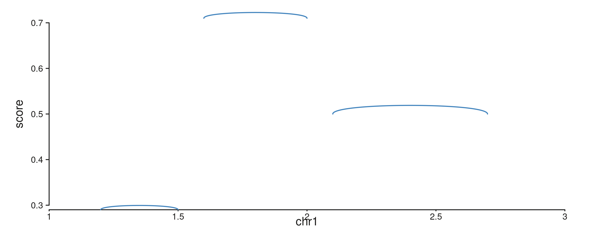

`map(height = score)` makes each arch’s peak as tall as its score; the
peak heights are interpreted in the track’s `yscale`.

#### Curve and orientation

`aes(curve = ...)` controls how high the arch bulges:

- `"length"` (default) — bulge scales with the genomic span of the link.
- `"equal"` — fixed bulge of 0.2 data-units regardless of span.
- a numeric value — used directly as the bulge offset.

`aes(orientation = "+")` arches up (default), `"-"` arches down.

``` r

seq_plot() %|%
  seq_track(track_id = "A",
            data = arc_gr,
            mapping = map(x = start, y = score),
            windows = win) %+%
  seq_arc(map(x0 = start, x1 = end, height = score),
          aesthetics = aes(color = "#AF3029",
                           linewidth = 1.5,
                           curve = "equal")) -> p
p$plot()
```

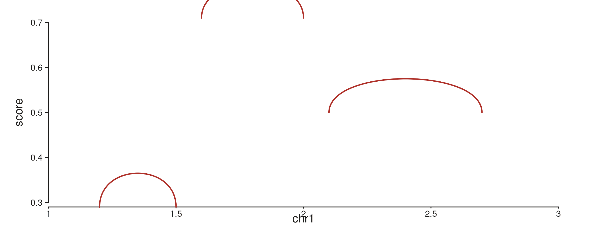

### `seq_arch` — arch with stems and stubs

`seq_arch` adds vertical stems from each anchor’s baseline (`y0` / `y1`)
up to the arch endpoints. When one anchor falls outside every visible
window, `seq_arch` instead draws a half-height **stub** at the visible
end with a small angled hook and a label naming the partner chromosome.

#### A BEDPE-style data.frame

``` r

sv_df <- data.frame(
  chr1    = "chr1",
  start1  = c(1.15e6, 1.40e6, 1.85e6, 2.20e6),
  chr2    = "chr1",
  start2  = c(1.55e6, 2.05e6, 2.45e6, 2.75e6),
  height  = c(0.8,    0.5,    0.7,    0.6),
  stringsAsFactors = FALSE
)

seq_plot() %|%
  seq_track(track_id = "A", windows = win) %+%
  seq_arch(data = sv_df,
           mapping = map(x0 = start1, x1 = start2,
                         chrom0 = chr1, chrom1 = chr2,
                         height = height),
           aesthetics = aes(color = "#205EA6", linewidth = 1.2)) -> p
p$plot()
```

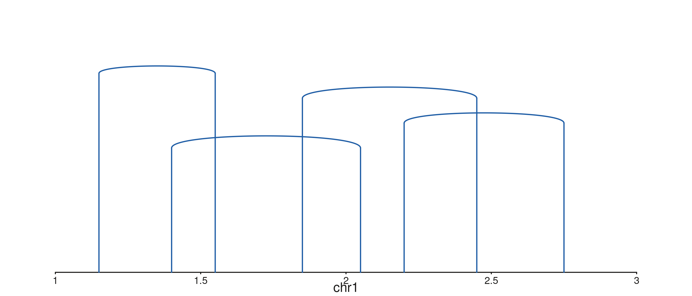

#### Stubs for half-visible links

When an anchor lies outside the visible window, `seq_arch` draws a stub
labelled with the partner chromosome. Toggle with
`aes(plotStubs = TRUE/FALSE)`; control hook geometry with
`aes(stubAngle = 45, stubLength = 0.02)`.

``` r

# Two in-window pairs and three half-visible (anchor 1 off the right edge,
# or onto chr2).
stub_df <- data.frame(
  chr1 = "chr1",
  start1 = c(1.15e6, 1.40e6, 1.85e6, 2.20e6, 2.60e6),
  chr2 = c("chr1", "chr1", "chr1", "chr2", "chr1"),
  start2 = c(1.55e6, 2.05e6, 4.50e6, 5.00e5, 4.20e6),
  height = c(0.7, 0.5, 0.8, 0.6, 0.9),
  stringsAsFactors = FALSE
)

seq_plot() %|%
  seq_track(track_id = "A", windows = win) %+%
  seq_arch(data = stub_df,
           mapping = map(x0 = start1, x1 = start2,
                         chrom0 = chr1, chrom1 = chr2,
                         height = height),
           aesthetics = aes(color   = "#66800B",
                            linewidth = 1.1,
                            stubLength = 0.04)) -> p
p$plot()
```

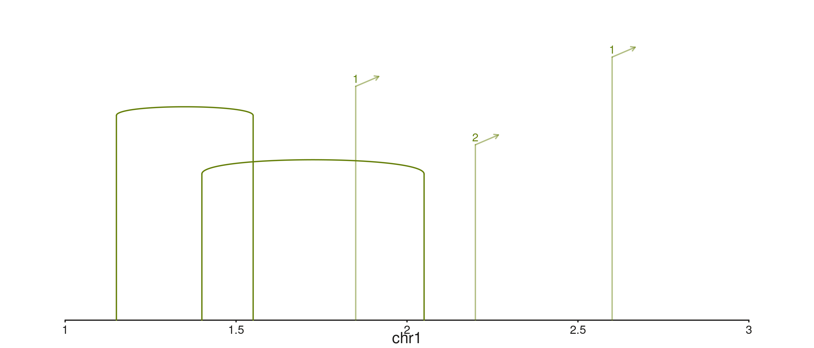

### `seq_recon` — SV reconstruction by strand pair

`seq_recon` extends `seq_arch` and colours each arch by the strand pair
on its two anchors:

| strand pair        | class                  | tier | default colour          |
|--------------------|------------------------|------|-------------------------|
| `+/+`              | head-to-head inversion | low  | `flexoki_palette(9)[3]` |
| `-/-`              | tail-to-tail inversion | low  | `flexoki_palette(9)[4]` |
| `-/+`              | tandem duplication     | mid  | `flexoki_palette(9)[1]` |
| `+/-`              | deletion               | mid  | `flexoki_palette(9)[2]` |
| different `chrom`s | translocation          | high | `flexoki_palette(9)[9]` |

Both `strand0` and `strand1` must be supplied via
[`map()`](http://andrewlynch.io/SeqPlotR/reference/map.md) — `seq_recon`
errors at `prep()` time if either is missing.

#### A mixed SV table

A handful of synthetic structural variants spanning all five classes:

``` r

sv_tbl <- data.frame(
  chr1    = "chr1",
  start1  = c(1.15e6, 1.30e6, 1.55e6, 1.80e6, 2.10e6,
              2.35e6, 2.55e6, 2.75e6),
  chr2    = c("chr1","chr1","chr1","chr1","chr1",
              "chr1","chr1","chr2"),
  start2  = c(1.50e6, 1.85e6, 2.05e6, 2.30e6, 2.60e6,
              2.85e6, 4.20e6, 5.00e5),
  strand1 = c("+","-","-","+","+",
              "-","+","+"),
  strand2 = c("+","-","+","-","+",
              "-","+","+"),
  stringsAsFactors = FALSE
)
sv_tbl
#>   chr1  start1 chr2  start2 strand1 strand2
#> 1 chr1 1150000 chr1 1500000       +       +
#> 2 chr1 1300000 chr1 1850000       -       -
#> 3 chr1 1550000 chr1 2050000       -       +
#> 4 chr1 1800000 chr1 2300000       +       -
#> 5 chr1 2100000 chr1 2600000       +       +
#> 6 chr1 2350000 chr1 2850000       -       -
#> 7 chr1 2550000 chr1 4200000       +       +
#> 8 chr1 2750000 chr2  500000       +       +
```

Plot with the canonical recon mapping:

``` r

seq_plot() %|%
  seq_track(track_id = "SV", windows = win) %+%
  seq_recon(data = sv_tbl,
            mapping = map(x0 = start1, x1 = start2,
                          chrom0 = chr1, chrom1 = chr2,
                          strand0 = strand1, strand1 = strand2)) -> p
p$plot()
```

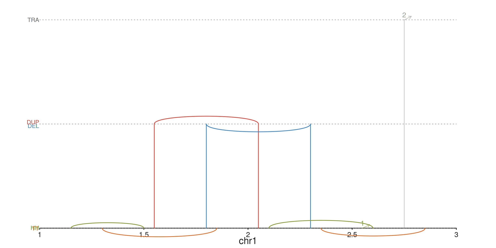

The three horizontal guide lines mark the inversion / Dup-Del /
translocation tiers; HH/TT, DEL/DUP, and TRA labels sit on the left
margin.

#### Recoloring classes

Override any default colour via
`aes(h2hColor = ..., t2tColor = ..., dupColor = ..., delColor = ..., transColor = ...)`.
A high-contrast palette:

``` r

seq_plot() %|%
  seq_track(track_id = "SV", windows = win) %+%
  seq_recon(data = sv_tbl,
            mapping = map(x0 = start1, x1 = start2,
                          chrom0 = chr1, chrom1 = chr2,
                          strand0 = strand1, strand1 = strand2),
            aesthetics = aes(h2hColor   = "#AF3029",
                             t2tColor   = "#205EA6",
                             dupColor   = "#66800B",
                             delColor   = "#BC5215",
                             transColor = "#5E409D")) -> p
p$plot()
```

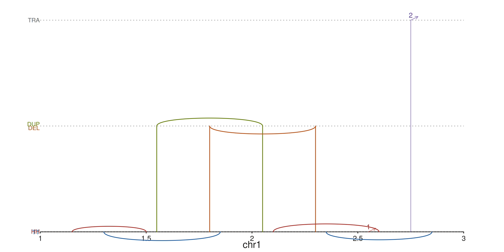

#### Subsetting the rendered tiers

`drawClasses` controls which tiers are drawn (and which guides / labels
appear). Drop the translocation row to focus on intra-chromosome calls:

``` r

seq_plot() %|%
  seq_track(track_id = "SV", windows = win) %+%
  seq_recon(data = sv_tbl,
            mapping = map(x0 = start1, x1 = start2,
                          chrom0 = chr1, chrom1 = chr2,
                          strand0 = strand1, strand1 = strand2),
            drawClasses = c("Inversion", "Dup/Del")) -> p
p$plot()
```

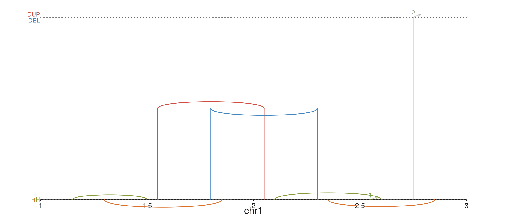

### Combining links with other tracks

Links compose with everything else. The example below stacks a coverage
ribbon, a structural-variant `seq_recon` row, and a gene model track.

``` r

xs        <- seq(1.05e6, 2.95e6, length.out = 80)
mu        <- sin((xs - 1e6) / 3e5) * 0.3 + 0.5
cov_gr    <- GRanges("chr1", IRanges(start = xs, width = 1),
                     mean = mu, lo = mu - 0.12, hi = mu + 0.12)

gene_gr <- GRanges(
  "chr1",
  IRanges(start = c(1.10e6, 1.30e6, 1.55e6, 1.78e6,
                    2.05e6, 2.30e6, 2.55e6, 2.78e6),
          width = c(1.5e5,  1.8e5,  1.5e5,  2.0e5,
                    1.8e5,  1.5e5,  1.8e5,  1.5e5)),
  gene_id   = c("A","A","A","A","B","B","B","B"),
  gene_name = c("GENEA","GENEA","GENEA","GENEA",
                "GENEB","GENEB","GENEB","GENEB"),
  strand_col = c(rep("+", 4), rep("-", 4)),
  feature = rep(c("UTR", "exon", "exon", "UTR"), 2),
  color   = c(rep("#205EA6", 4), rep("#AF3029", 4))
)

seq_plot() %|%
  seq_track(track_id = "Coverage",
            data = cov_gr,
            mapping = map(x = start, y_min = lo, y_max = hi),
            windows = win,
            track_height = 1.5) %+%
  seq_ribbon(aesthetics = aes(fill = "#4385BE", alpha = 0.5)) %__%
  seq_track(track_id = "SV",
            windows = win,
            track_height = 1.6) %+%
  seq_recon(data = sv_tbl,
            mapping = map(x0 = start1, x1 = start2,
                          chrom0 = chr1, chrom1 = chr2,
                          strand0 = strand1, strand1 = strand2)) %__%
  seq_track(track_id = "Genes",
            data = gene_gr,
            mapping = map(group  = gene_id,
                          type   = feature,
                          strand = strand_col,
                          label  = gene_name,
                          color  = color),
            windows = win,
            track_height = 1) %+%
  seq_gene(map(group  = gene_id,
               type   = feature,
               strand = strand_col,
               label  = gene_name,
               color  = color)) -> p
p$plot()
```

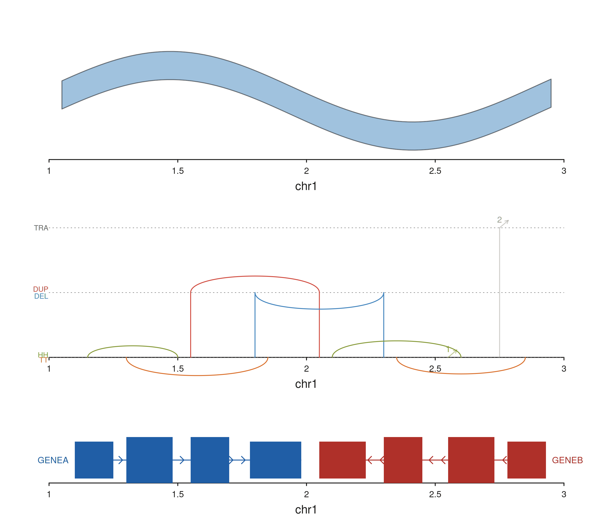

## Cross-track connectors

Cross-track links are added at the **plot level** — after both
referenced tracks have been defined — with `t0` / `t1` naming the two
tracks explicitly. Anchors are still encoded in a single `data` object
via the BEDPE-style
[`map()`](http://andrewlynch.io/SeqPlotR/reference/map.md) vocabulary.

A recurring subtlety: when a cross-track link carries its own `data`,
keep track-level `mapping` minimal. Anything in a track’s mapping is
merged into the link’s mapping before evaluation, so expressions like
`map(x = start, y = logR)` on the track will try to find `logR` in the
link’s BEDPE table and error out. The idiomatic fix is to attach the
per-track `data` and `mapping` to the elements that use them, not to the
track itself.

### `seq_string` — smooth curves between two tracks

`seq_string` draws a cubic Bezier curve between anchors in `t0` and
`t1`. The `strand0` / `strand1` fields drive automatic curve-shape
inference:

- matching strands (`+/+`, `-/-`) → **C** curve
- opposing strands (`+/-`, `-/+`) → **S** curve

Force a specific shape with `aes(type = "c")` or `aes(type = "s")`.

#### SV breakpoints across copy-number and coverage tracks

A simulated copy-number scatter over a coverage ribbon, with three SV
breakpoints connecting loci across the two tracks. Per-link `y0` / `y1`
values anchor each string to a specific data-scale y in its track.

``` r

xs     <- seq(1.05e6, 2.95e6, length.out = 120)
cn_gr  <- GRanges("chr1", IRanges(xs, width = 1),
                  logR = sin((xs - 1e6) / 5e5) + rnorm(length(xs), 0, 0.08))
cov_gr <- GRanges("chr1", IRanges(xs, width = 1),
                  score = 0.5 + 0.3 * cos((xs - 1e6) / 4e5))

sv_df <- data.frame(
  c0 = "chr1", p0 = c(1.30e6, 1.75e6, 2.25e6),
  c1 = "chr1", p1 = c(1.60e6, 2.10e6, 2.65e6),
  s0 = c("+", "-", "+"),
  s1 = c("-", "+", "-"),
  y0 = c( 0.8, -0.6,  0.4),
  y1 = c( 0.6,  0.7,  0.5),
  stringsAsFactors = FALSE
)

seq_plot() %|%
  seq_track(track_id = "CN",  windows = win, track_height = 1.2) %+%
    seq_point(data = cn_gr, mapping = map(x = start, y = logR),
              aesthetics = aes(color = "#205EA6", size = 0.35)) %__%
  seq_track(track_id = "COV", windows = win, track_height = 1.2) %+%
    seq_area(data = cov_gr, mapping = map(x = start, y = score),
             aesthetics = aes(fill = "#66800B", alpha = 0.5)) %+%
  seq_string(data = sv_df,
             map(x0 = p0, x1 = p1, chrom0 = c0, chrom1 = c1,
                 strand0 = s0, strand1 = s1,
                 y0 = y0, y1 = y1),
             t0 = "CN", t1 = "COV",
             aesthetics = aes(color = "#AF3029", linewidth = 1.3,
                              alpha = 0.75)) -> p
p$plot()
```

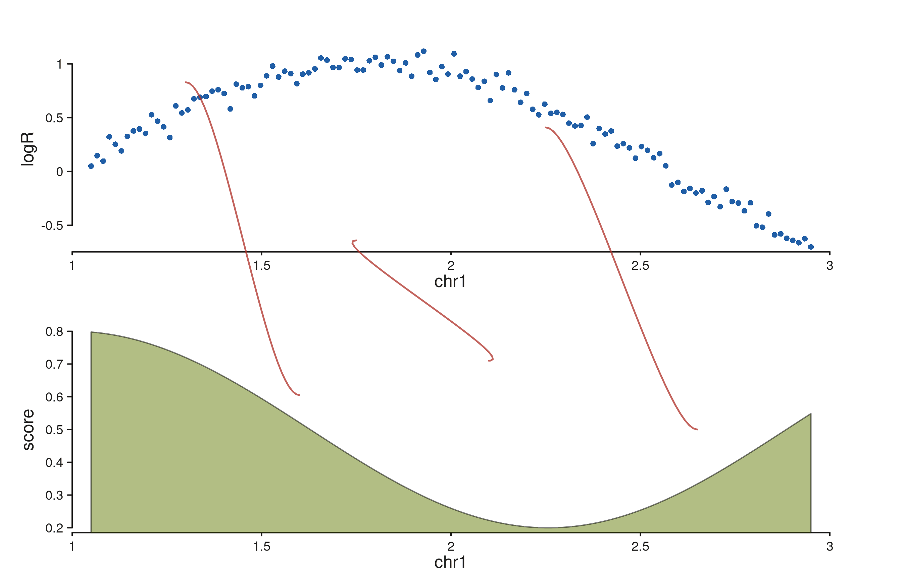

Each string lands at `(x0, y0)` in the CN track and `(x1, y1)` in the
COV track. Strands drive the curve shape: the first and third links
(mixed strands) bend as S-curves, the middle link (matching strands
after swap) bends as a C-curve.

#### Forcing a shape

Drop the strand fields (or set `aes(type = "c")`) to render every string
as a C-curve regardless of strand:

``` r

seq_plot() %|%
  seq_track(track_id = "CN",  windows = win, track_height = 1.2) %+%
    seq_point(data = cn_gr, mapping = map(x = start, y = logR),
              aesthetics = aes(color = "#205EA6", size = 0.35)) %__%
  seq_track(track_id = "COV", windows = win, track_height = 1.2) %+%
    seq_area(data = cov_gr, mapping = map(x = start, y = score),
             aesthetics = aes(fill = "#66800B", alpha = 0.5)) %+%
  seq_string(data = sv_df,
             map(x0 = p0, x1 = p1, chrom0 = c0, chrom1 = c1,
                 y0 = y0, y1 = y1),
             t0 = "CN", t1 = "COV",
             aesthetics = aes(color = "#BC5215", linewidth = 1.3,
                              alpha = 0.75, type = "c")) -> p
p$plot()
```

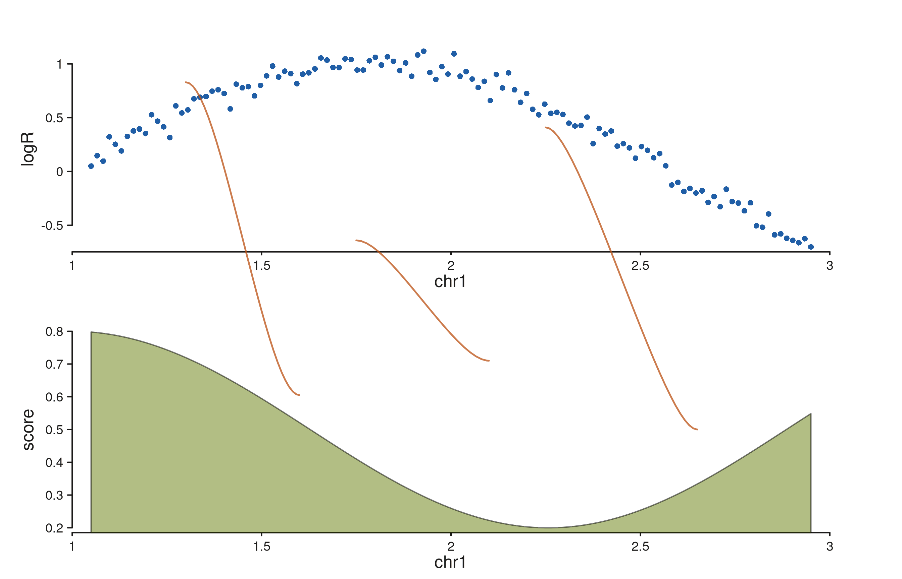

### `seq_synteny` — filled trapezoids between tracks

`seq_synteny` draws a filled quadrilateral connecting a **region** in
`t0` to a homologous region in `t1`. Both edges of each region come from
[`map()`](http://andrewlynch.io/SeqPlotR/reference/map.md):

- `x0`, `x0_end` — left/right genomic edge in track `t0`
- `x1`, `x1_end` — left/right genomic edge in track `t1`

When `y0` / `y1` are absent from
[`map()`](http://andrewlynch.io/SeqPlotR/reference/map.md), the polygon
attaches to the bottom edge of `t0`’s inner panel and the top edge of
`t1`’s inner panel — so it fills the gap between the two tracks exactly.

#### Syntenic blocks between two assemblies

Two gene-model tracks representing homologous segments in two
assemblies, with a trapezoid per block coloured by the mapped `fill`
column:

``` r

genes_top <- GRanges("chr1",
  IRanges(start = c(1.20e6, 1.70e6, 2.30e6),
          width = c(2.0e5,  1.5e5,  2.5e5)),
  gene_id    = c("G1", "G2", "G3"),
  feature    = "exon",
  strand_col = c("+", "-", "+"),
  color      = c("#205EA6", "#AF3029", "#66800B")
)
genes_bot <- GRanges("chr1",
  IRanges(start = c(1.25e6, 1.60e6, 2.40e6),
          width = c(1.8e5,  2.0e5,  2.2e5)),
  gene_id    = c("G1p", "G2p", "G3p"),
  feature    = "exon",
  strand_col = c("+", "-", "+"),
  color      = c("#205EA6", "#AF3029", "#66800B")
)

syn_df <- data.frame(
  c0 = "chr1",
  p0 = c(1.20e6, 1.70e6, 2.30e6),
  p0e = c(1.40e6, 1.85e6, 2.55e6),
  c1 = "chr1",
  p1 = c(1.25e6, 1.60e6, 2.40e6),
  p1e = c(1.43e6, 1.80e6, 2.62e6),
  col = c("#205EA6", "#AF3029", "#66800B"),
  stringsAsFactors = FALSE
)

seq_plot() %|%
  seq_track(track_id = "AsmA", windows = win, track_height = 0.9) %+%
    seq_gene(data = genes_top,
             mapping = map(group = gene_id, type = feature,
                           strand = strand_col, color = color)) %__%
  seq_track(track_id = "AsmB", windows = win, track_height = 0.9) %+%
    seq_gene(data = genes_bot,
             mapping = map(group = gene_id, type = feature,
                           strand = strand_col, color = color)) %+%
  seq_synteny(data = syn_df,
              map(x0 = p0, x0_end = p0e, x1 = p1, x1_end = p1e,
                  chrom0 = c0, chrom1 = c1, fill = col),
              t0 = "AsmA", t1 = "AsmB",
              aesthetics = aes(alpha = 0.35, linewidth = 0.3)) -> p
p$plot()
```

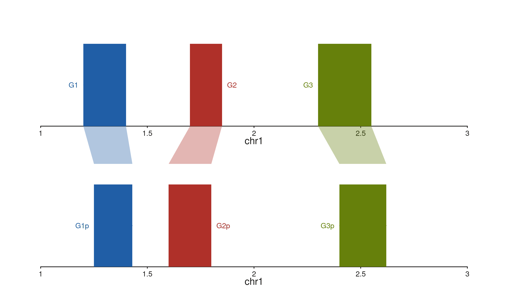

The trapezoids start at `AsmA`’s bottom inner edge and end at `AsmB`’s
top inner edge, with left / right corners driven by the `x0` / `x0_end`
and `x1` / `x1_end` fields. The per-link `fill` column is picked up from
the mapping; the `aes(alpha = ...)` applies globally to the fill.

### `seq_zoom` — overview-to-detail projection

`seq_zoom` connects the same genomic region as it appears in two tracks
that span different window ranges — a chromosome-scale overview stacked
above a zoomed detail panel, for example. Only `x0` / `x0_end` are
required; `x1` / `x1_end` default to the same region (the most common
case: “show *this* region in both tracks”).

The polygon auto-detects which track is above and attaches to its bottom
edge; the lower track gets the top edge. A small stem offset
(`aes(stemOffset = 0.01)`) nudges the polygon clear of the track
borders.

#### Chromosome-scale overview into a zoomed detail

``` r

# Overview spans 5 Mb; detail zooms into 1.6 – 2.4 Mb.
overview_win <- GRanges("chr1", IRanges(1,      5e6))
detail_win   <- GRanges("chr1", IRanges(1.6e6,  2.4e6))

xs_o  <- seq(1,      5e6,   length.out = 160)
xs_d  <- seq(1.6e6,  2.4e6, length.out = 120)
sig_o <- GRanges("chr1", IRanges(xs_o, width = 1),
                 score = 0.5 + 0.3 * sin((xs_o - 1) / 6e5))
sig_d <- GRanges("chr1", IRanges(xs_d, width = 1),
                 score = 0.5 + 0.3 * sin((xs_d - 1) / 6e5) +
                         rnorm(length(xs_d), 0, 0.03))

zoom_region <- GRanges("chr1", IRanges(1.6e6, 2.4e6))

seq_plot() %|%
  seq_track(track_id = "Overview", windows = overview_win,
            track_height = 0.5) %+%
    seq_area(data = sig_o, mapping = map(x = start, y = score),
             aesthetics = aes(fill = "#4385BE", alpha = 0.55)) %__%
  seq_track(track_id = "Detail", windows = detail_win,
            track_height = 1.3) %+%
    seq_area(data = sig_d, mapping = map(x = start, y = score),
             aesthetics = aes(fill = "#205EA6", alpha = 0.8)) %+%
  seq_zoom(data = zoom_region,
           map(x0 = start, x0_end = end),
           t0 = "Overview", t1 = "Detail",
           aesthetics = aes(fill = "#878580", alpha = 0.2,
                            color = "#878580", linewidth = 0.4)) -> p
p$plot()
```

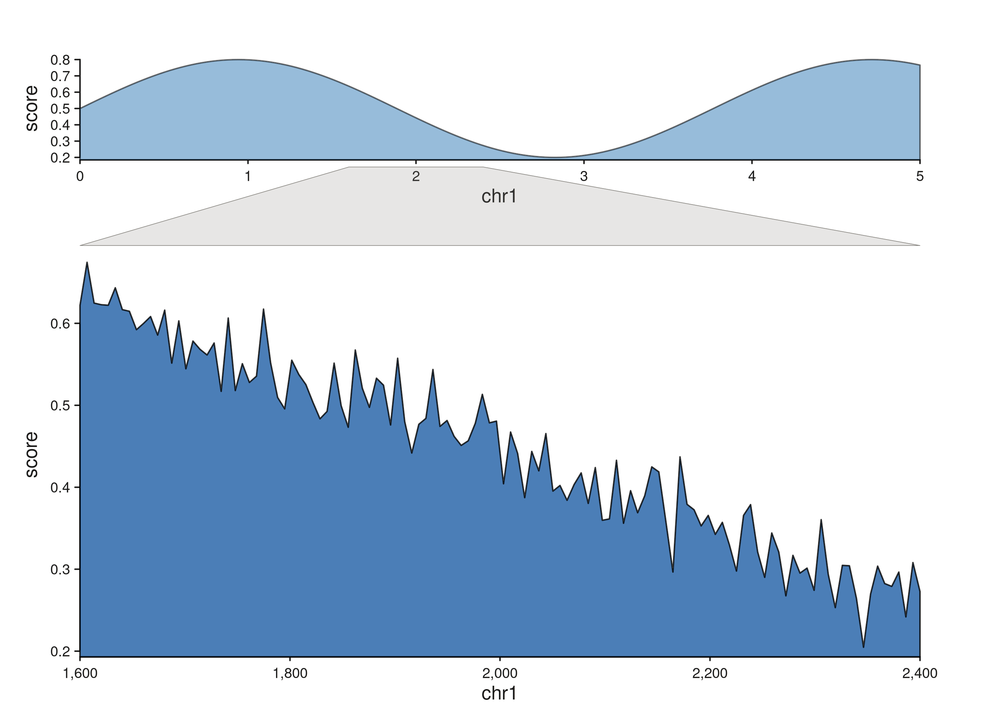

The grey quadrilateral fans from the narrow slice of the overview track
out to the full width of the detail panel. Multiple zoom polygons are
fine — drop more rows into `zoom_region` to connect more than one region
at once.

#### Projecting different regions onto the two tracks

Supply separate `x1` / `x1_end` fields when the region in `t1` isn’t
identical to the one in `t0` — useful when connecting paralogous or
translocated segments:

``` r

zoom_df <- data.frame(
  c0   = "chr1", p0  = 1.60e6, p0e  = 2.00e6,
  c1   = "chr1", p1  = 1.80e6, p1e  = 2.30e6,
  stringsAsFactors = FALSE
)

seq_plot() %|%
  seq_track(track_id = "Overview", windows = overview_win,
            track_height = 0.5) %+%
    seq_area(data = sig_o, mapping = map(x = start, y = score),
             aesthetics = aes(fill = "#4385BE", alpha = 0.55)) %__%
  seq_track(track_id = "Detail", windows = detail_win,
            track_height = 1.3) %+%
    seq_area(data = sig_d, mapping = map(x = start, y = score),
             aesthetics = aes(fill = "#205EA6", alpha = 0.8)) %+%
  seq_zoom(data = zoom_df,
           map(x0 = p0, x0_end = p0e, x1 = p1, x1_end = p1e,
               chrom0 = c0, chrom1 = c1),
           t0 = "Overview", t1 = "Detail",
           aesthetics = aes(fill = "#AF3029", alpha = 0.18,
                            color = "#AF3029", linewidth = 0.4)) -> p
p$plot()
```

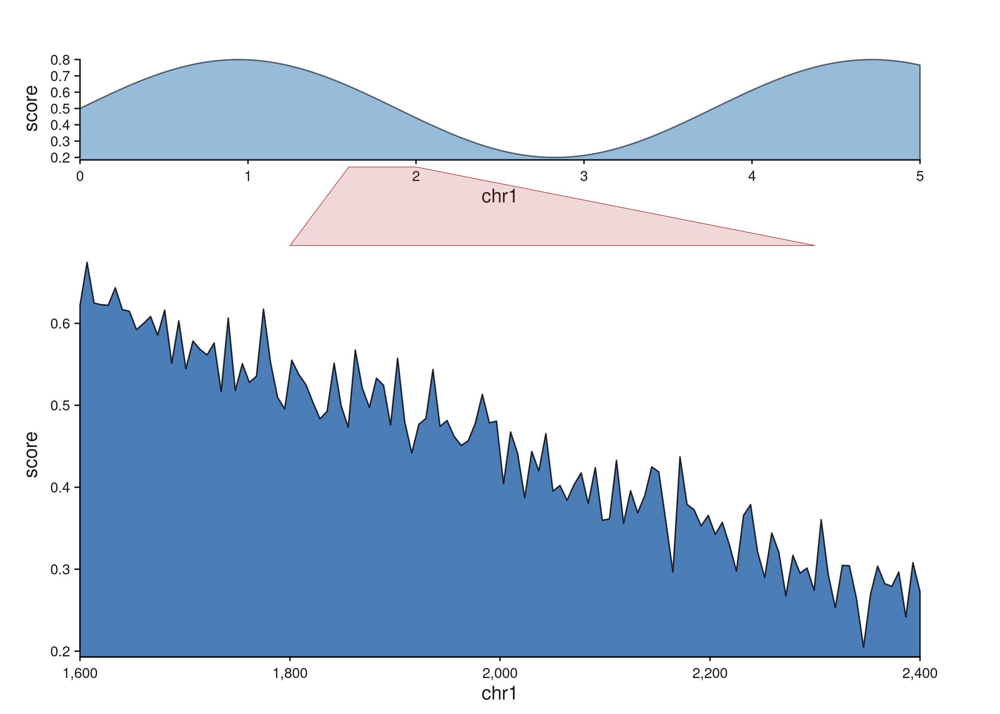

#### Fanning out to two detail panels with a patchwork layout

Zoom polygons compose naturally with `seq_plot(layout = "...")`. Drop a
wide overview into the top row and pair it with two independent detail
panels below, then emit one `seq_zoom` per detail region. Because
plot-level links validate that `t0` and `t1` refer to tracks already
added to the plot, the zooms go at the end of the chain.

``` r

fan_layout <- "
AAAA
BBCC
"
seq_preview_layout(layout = fan_layout)
```

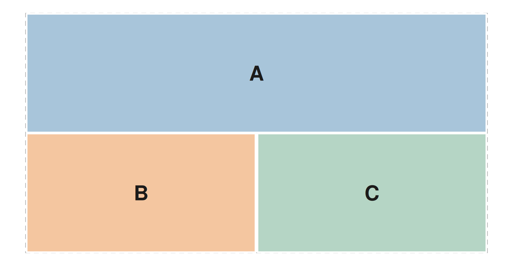

``` r

# Overview spans chr1:1-5 Mb; B zooms into 1.2-1.8 Mb, C into 3.2-4.0 Mb.
overview_win <- GRanges("chr1", IRanges(1,      5e6))
detail_b_win <- GRanges("chr1", IRanges(1.2e6,  1.8e6))
detail_c_win <- GRanges("chr1", IRanges(3.2e6,  4.0e6))

xs_a  <- seq(1,      5e6,   length.out = 200)
xs_b  <- seq(1.2e6,  1.8e6, length.out =  80)
xs_c  <- seq(3.2e6,  4.0e6, length.out =  80)
mk_sig <- function(xs, jitter = 0) {
  GRanges("chr1", IRanges(xs, width = 1),
          score = 0.5 + 0.3 * sin((xs - 1) / 5e5) +
                  rnorm(length(xs), 0, jitter))
}
sig_a <- mk_sig(xs_a, jitter = 0.00)
sig_b <- mk_sig(xs_b, jitter = 0.03)
sig_c <- mk_sig(xs_c, jitter = 0.03)

zoom_b <- GRanges("chr1", IRanges(1.2e6, 1.8e6))
zoom_c <- GRanges("chr1", IRanges(3.2e6, 4.0e6))

seq_plot(layout = fan_layout) %+%
  seq_track(track_id = "A", windows = overview_win) %+%
    seq_area(data = sig_a, mapping = map(x = start, y = score),
             aesthetics = aes(fill = "#4385BE", alpha = 0.55)) %+%
  seq_track(track_id = "B", windows = detail_b_win) %+%
    seq_area(data = sig_b, mapping = map(x = start, y = score),
             aesthetics = aes(fill = "#66800B", alpha = 0.8)) %+%
  seq_track(track_id = "C", windows = detail_c_win) %+%
    seq_area(data = sig_c, mapping = map(x = start, y = score),
             aesthetics = aes(fill = "#AF3029", alpha = 0.8)) %+%
  seq_zoom(data = zoom_b, map(x0 = start, x0_end = end),
           t0 = "A", t1 = "B",
           aesthetics = aes(fill = "#66800B", alpha = 0.22,
                            color = "#66800B", linewidth = 0.5)) %+%
  seq_zoom(data = zoom_c, map(x0 = start, x0_end = end),
           t0 = "A", t1 = "C",
           aesthetics = aes(fill = "#AF3029", alpha = 0.22,
                            color = "#AF3029", linewidth = 0.5)) -> p
p$plot()
```

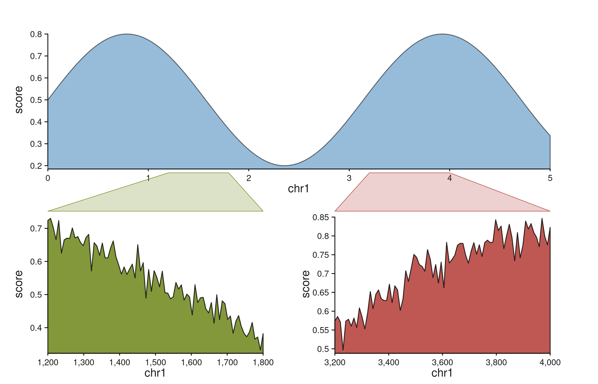

Each zoom polygon inherits the color of its destination track, so the
left and right fan-outs are visually distinguishable at a glance. The
same idiom scales to more panels — add more letters to the layout
string’s second row and a matching `seq_zoom` per region.

### `seq_highlight` — multi-track region annotation

`seq_highlight` draws a continuous filled band that passes through every
track from `t0` down to `t1` (inclusive) at the same genomic
coordinates; widths in NPC follow each track’s own scale, so the band
naturally fans or compresses across tracks with different windows.
Unlike `seq_zoom` (which is a polygon between a pair of tracks),
`seq_highlight` is a single shape that crosses many panels, intended for
highlighting one or more loci of interest across a stack — the typical
ChIP-seq / ATAC-seq use case.

#### Stacked tracks with shared windows

``` r

win <- GRanges("chr1", IRanges(1, 1e6))
xs  <- seq(1, 1e6, length.out = 400)
mk_sig <- function(seed, freq, jitter = 0.03) {
  set.seed(seed)
  GRanges("chr1", IRanges(xs, width = 1),
          score = 0.5 + 0.3 * sin((xs - 1) / freq) +
                  rnorm(length(xs), 0, jitter))
}
sig_a <- mk_sig(1, 1.5e5)
sig_b <- mk_sig(2, 2.0e5)
sig_c <- mk_sig(3, 2.5e5)

# Two genomic regions to flag across all three tracks.
hl <- GRanges("chr1", IRanges(c(2.0e5, 6.5e5),
                              c(2.6e5, 7.4e5)))

seq_plot() %|%
  seq_track(track_id = "A", windows = win) %+%
    seq_area(data = sig_a, mapping = map(x = start, y = score),
             aesthetics = aes(fill = "#4385BE", alpha = 0.7)) %__%
  seq_track(track_id = "B", windows = win) %+%
    seq_area(data = sig_b, mapping = map(x = start, y = score),
             aesthetics = aes(fill = "#205EA6", alpha = 0.7)) %__%
  seq_track(track_id = "C", windows = win) %+%
    seq_area(data = sig_c, mapping = map(x = start, y = score),
             aesthetics = aes(fill = "#24837B", alpha = 0.7)) %+%
  seq_highlight(data = hl, map(x0 = start, x0_end = end),
                t0 = "A", t1 = "C",
                aesthetics = aes(fill = "#AF3029", alpha = 0.18)) -> p
p$plot()
```

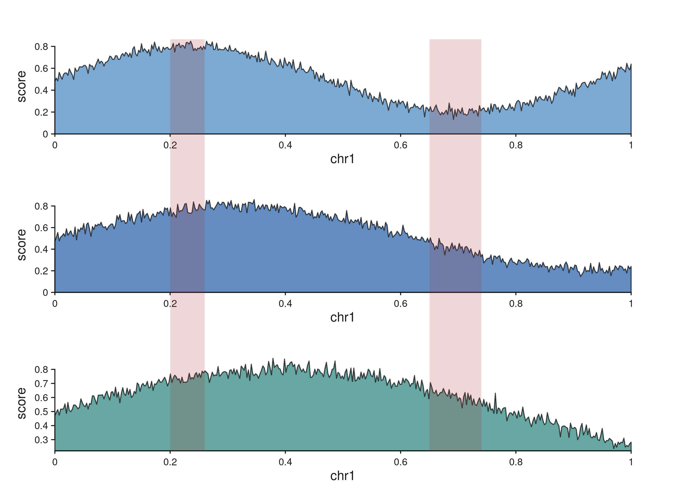

Each highlight region produces a single band that spans all three
tracks. Per-track rectangles share their inner panel y-range, and
trapezoids in the gaps between tracks bridge each pair.

#### Different scales: bands fan and compress

When the tracks span different genomic ranges, the highlight follows
each track’s own scale, producing a fanning shape across the scale
change. Pair an overview with a zoomed detail, drop a single
`seq_highlight`, and the band traces the zoom relationship visually:

``` r

overview_win <- GRanges("chr1", IRanges(1,      5e6))
detail_win   <- GRanges("chr1", IRanges(1.6e6,  2.4e6))

xs_o  <- seq(1,      5e6,   length.out = 200)
xs_d  <- seq(1.6e6,  2.4e6, length.out = 120)
sig_o <- GRanges("chr1", IRanges(xs_o, width = 1),
                 score = 0.5 + 0.3 * sin((xs_o - 1) / 6e5))
sig_d <- GRanges("chr1", IRanges(xs_d, width = 1),
                 score = 0.5 + 0.3 * sin((xs_d - 1) / 6e5))

# A single 1.8 - 2.2 Mb region of interest.
hl <- GRanges("chr1", IRanges(1.8e6, 2.2e6))

seq_plot() %|%
  seq_track(track_id = "Overview", windows = overview_win,
            track_height = 0.5) %+%
    seq_area(data = sig_o, mapping = map(x = start, y = score),
             aesthetics = aes(fill = "#4385BE", alpha = 0.55)) %__%
  seq_track(track_id = "Detail", windows = detail_win,
            track_height = 1.3) %+%
    seq_area(data = sig_d, mapping = map(x = start, y = score),
             aesthetics = aes(fill = "#205EA6", alpha = 0.8)) %+%
  seq_highlight(data = hl, map(x0 = start, x0_end = end),
                t0 = "Overview", t1 = "Detail",
                aesthetics = aes(fill = "#878580", alpha = 0.22,
                                 color = "#878580", linewidth = 0.4)) -> p
p$plot()
```

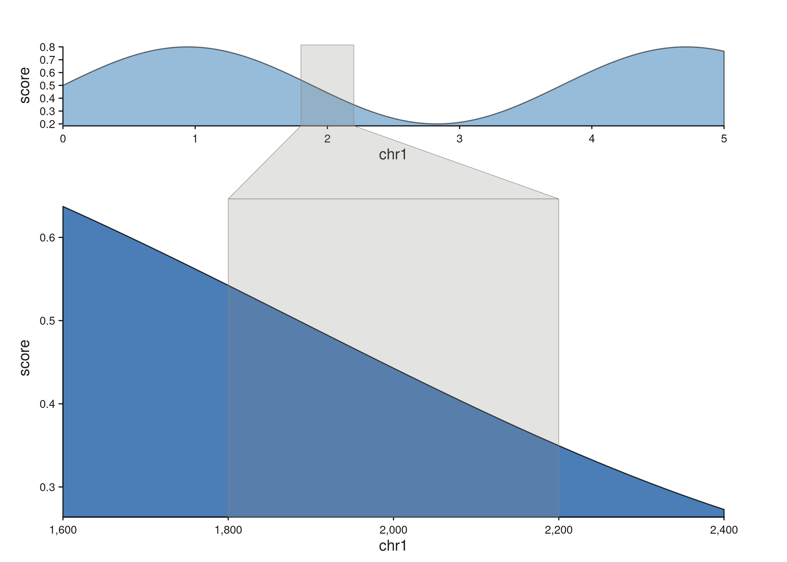

The band is narrow inside the overview (a 5 Mb window) and wide inside
the zoomed detail (an 800 kb window covering the same region), with a
trapezoid bridging the two.

## Flipped tracks: genomic y with scalar x

Elements and links are axis-agnostic — they transform resolved data
coordinates to canvas npc without caring which axis is genomic. A
track’s orientation comes entirely from its
[`map()`](http://andrewlynch.io/SeqPlotR/reference/map.md). Write
`map(y = start / end / mid / width)` and SeqPlotR auto-flips the track:
y becomes a genomic axis (covering the `windows` extent) and x becomes a
scalar data axis whose range is inferred from the element data. No
`scale_x` / `scale_y` arguments are required.

``` r

gene_meta <- GRanges("chr1",
  IRanges(start = seq(1.05e6, 2.95e6, length.out = 14),
          width = 1e4),
  log2fc = rnorm(14, 0, 1.3),
  sig    = sample(c("up", "down", "ns"),
                  14, replace = TRUE,
                  prob = c(0.35, 0.35, 0.3))
)
up_col <- c(up = "#AF3029", down = "#205EA6", ns = "#878580")

# `y = mid` is a genomic special, so SeqPlotR flips the track: the
# y-axis becomes genomic (1–3 Mb) and the x-axis carries log2fc.
seq_plot() %|%
  seq_track(data = gene_meta,
            mapping = map(x = log2fc, y = mid, color = sig),
            windows = win, track_width = 0.6) %+%
  seq_segment(mapping = map(x = 0, x_end = log2fc,
                            y = mid, y_end = mid,
                            color = sig),
              aesthetics = aes(linewidth = 2.2)) %+%
  seq_point(aesthetics = aes(size = 0.6)) -> p
p$plot()
```

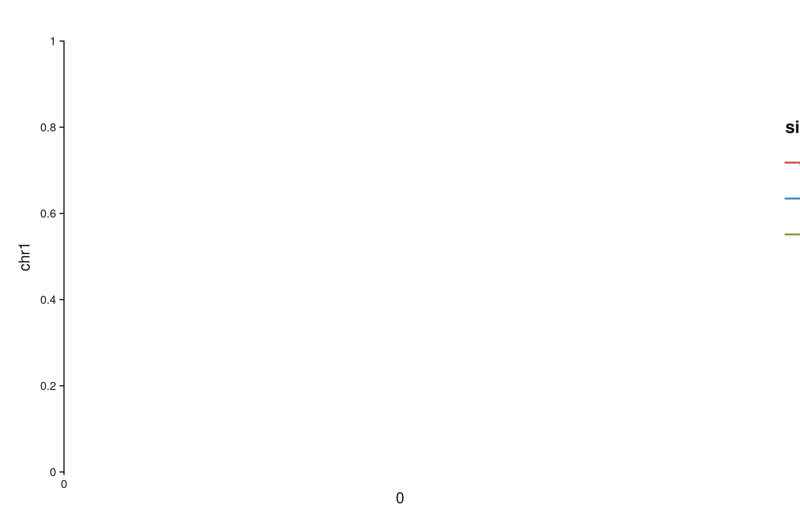

Each gene sits at its true genomic coordinate along the y-axis; the
horizontal segment plus terminal point show a scalar per-gene statistic.
Override the auto-inferred scales with explicit
`scale_x = seq_scale_continuous(limits = ...)` or
`scale_y = seq_scale_genomic(...)` on
[`seq_track()`](http://andrewlynch.io/SeqPlotR/reference/seq_track.md)
when you need a fixed range; the same operator chain otherwise works in
either orientation.
