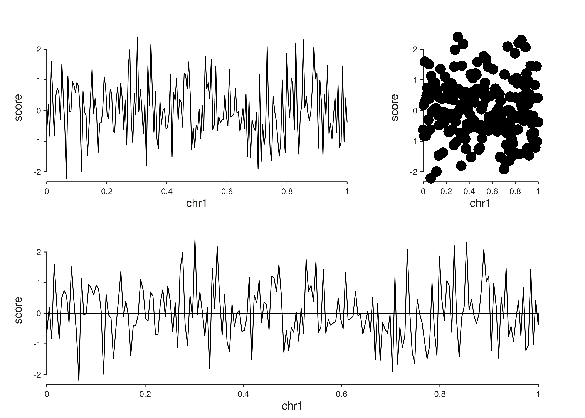
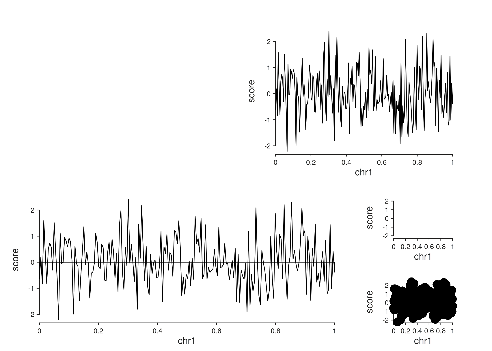
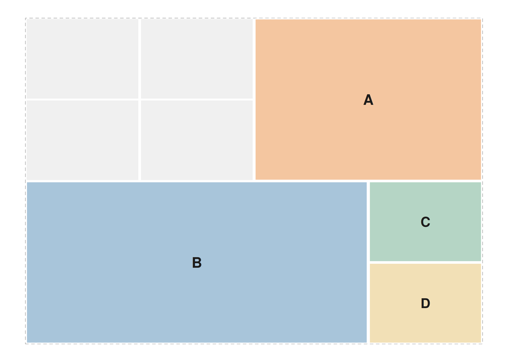
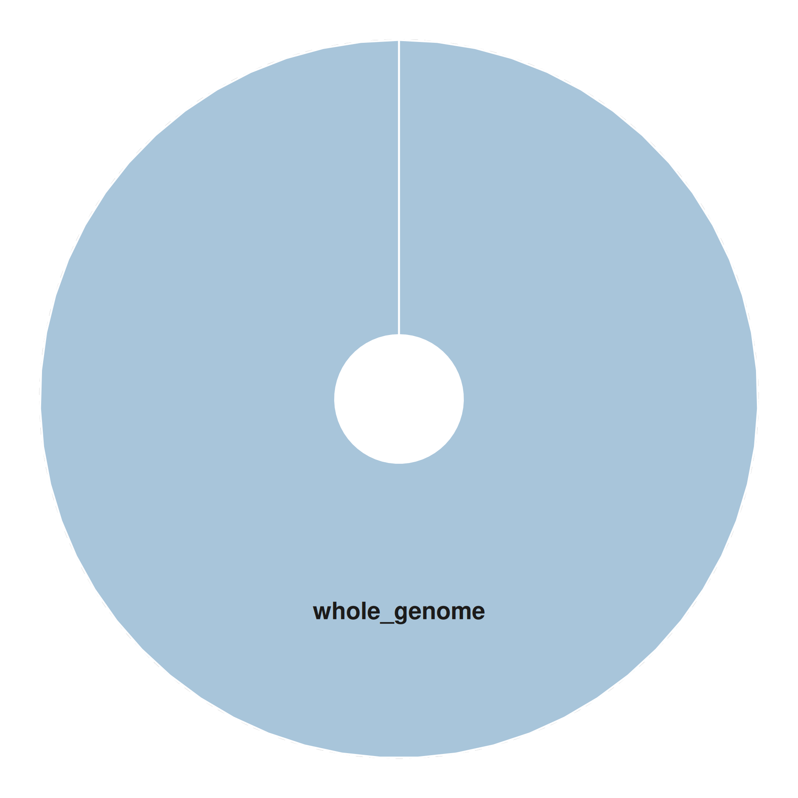
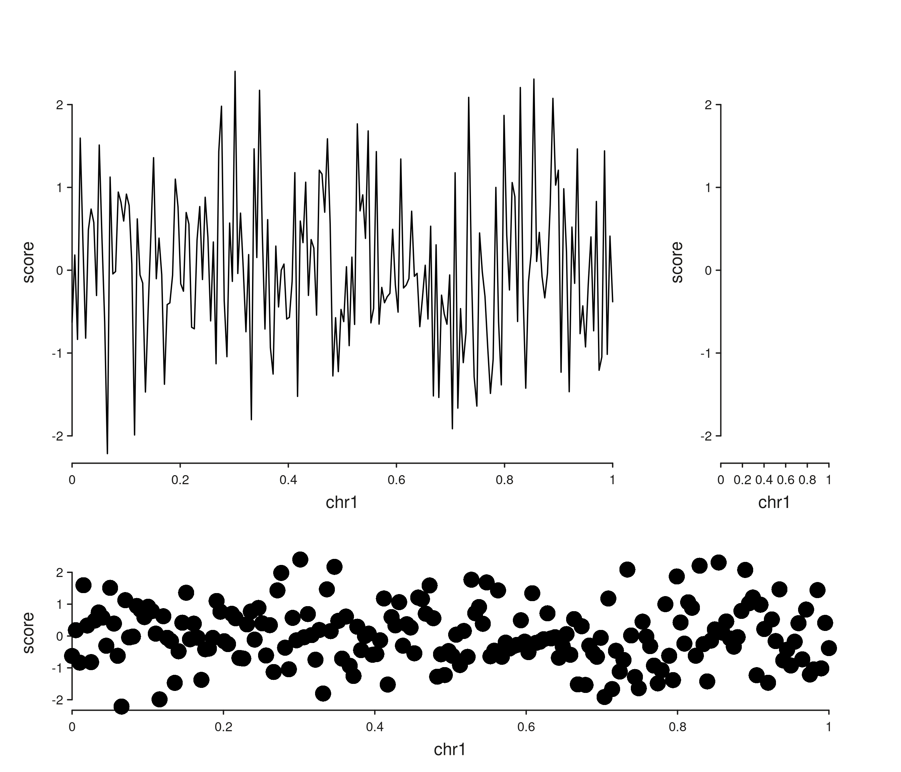

# Patchwork Layouts in SeqPlotR

SeqPlotR supports two layout modes:

- **Positional** — tracks flow using `direction = "right"` or `"under"`
  (aliased by the `%|%` and `%__%` operators).
- **Patchwork** — a multiline string assigns each track to a named
  rectangular region. This is inspired by the
  [`patchwork`](https://patchwork.data-imaginist.com) layout string.

``` r

library(SeqPlotR)
#> 
#> Attaching package: 'SeqPlotR'
#> The following object is masked from 'package:base':
#> 
#>     %||%
library(GenomicRanges)
#> Loading required package: stats4
#> Loading required package: BiocGenerics
#> Loading required package: generics
#> 
#> Attaching package: 'generics'
#> The following objects are masked from 'package:base':
#> 
#>     as.difftime, as.factor, as.ordered, intersect, is.element, setdiff,
#>     setequal, union
#> 
#> Attaching package: 'BiocGenerics'
#> The following objects are masked from 'package:stats':
#> 
#>     IQR, mad, sd, var, xtabs
#> The following objects are masked from 'package:base':
#> 
#>     anyDuplicated, aperm, append, as.data.frame, basename, cbind,
#>     colnames, dirname, do.call, duplicated, eval, evalq, Filter, Find,
#>     get, grep, grepl, is.unsorted, lapply, Map, mapply, match, mget,
#>     order, paste, pmax, pmax.int, pmin, pmin.int, Position, rank,
#>     rbind, Reduce, rownames, sapply, saveRDS, table, tapply, unique,
#>     unsplit, which.max, which.min
#> Loading required package: S4Vectors
#> 
#> Attaching package: 'S4Vectors'
#> The following object is masked from 'package:utils':
#> 
#>     findMatches
#> The following objects are masked from 'package:base':
#> 
#>     expand.grid, I, unname
#> Loading required package: IRanges
#> Loading required package: Seqinfo

win <- GRanges("chr1", IRanges(1, 1e6))
```

## Positional layout via track widths and heights

``` r

gr <- GRanges("chr1", IRanges(seq(1, 1e6, length.out = 200), width = 1),
              score = rnorm(200))

p <- seq_plot() %+%
  seq_track(data = gr, mapping = map(x = start, y = score),
            windows = win, track_id = "A", track_width = 2) %+% seq_line() %|%
  seq_track(data = gr, mapping = map(x = start, y = score),
            windows = win, track_id = "B") %+% seq_point() %__%
  seq_track(data = gr, mapping = map(x = start, y = score),
            windows = win, track_id = "C") %+% seq_area()

p$plot()
```



`track_width` and `track_height` are *relative* within the row and
column respectively: track `A` above is twice as wide as `B`.

## Patchwork layout string

Passing a layout string to
[`seq_plot()`](http://andrewlynch.io/SeqPlotR/reference/seq_plot.md)
makes every cell position explicit. Each unique letter is a region; `#`
cells stay blank.

``` r

layout <- "
##AA
##AA
BBBC
BBBD
"
p <- seq_plot(layout = layout) %+%
  seq_track(data = gr, mapping = map(x = start, y = score),
            windows = win, track_id = "A") %+% seq_line() %+%
  seq_track(data = gr, mapping = map(x = start, y = score),
            windows = win, track_id = "B") %+% seq_area()  %+%
  seq_track(data = gr, mapping = map(x = start, y = score),
            windows = win, track_id = "C") %+% seq_bar()   %+%
  seq_track(data = gr, mapping = map(x = start, y = score),
            windows = win, track_id = "D") %+% seq_point()

p$plot()
```



With a layout string, each track’s `direction` is ignored — placement is
decided entirely by the `track_id` matching the letters.

## Previewing a layout before adding data

[`seq_preview_layout()`](http://andrewlynch.io/SeqPlotR/reference/seq_preview_layout.md)
is the fastest way to validate a layout string:

``` r

seq_preview_layout(layout = layout)
```



You can also preview a positional plot built from the operator chain:

``` r

seq_preview_layout(plot_obj = p)
```


## Circular preview

[`seq_preview_circos()`](http://andrewlynch.io/SeqPlotR/reference/seq_preview_circos.md)
draws a minimal circular layout, useful as a schematic for whole-genome
plots. It extracts the track structure from a positional `seq_plot`
(patchwork layouts are not supported):

``` r

gw  <- default_genome_windows()
circ <- seq_plot() %+%
  seq_track(windows = gw, track_id = "whole_genome") %+% seq_line()
seq_preview_circos(plot_obj = circ)
```



## Relative widths and heights revisited

Both positional and patchwork layouts respect `track_width` and
`track_height` *within* a cell; the outer cell bounds come from the
layout string.

``` r

layout <- "
AAAB
AAAB
CCCC
"
p <- seq_plot(layout = layout) %+%
  seq_track(data = gr, mapping = map(x = start, y = score),
            windows = win, track_id = "A", track_height = 2) %+% seq_line() %+%
  seq_track(data = gr, mapping = map(x = start, y = score),
            windows = win, track_id = "B") %+% seq_bar() %+%
  seq_track(data = gr, mapping = map(x = start, y = score),
            windows = win, track_id = "C") %+% seq_point()

p$plot()
```


