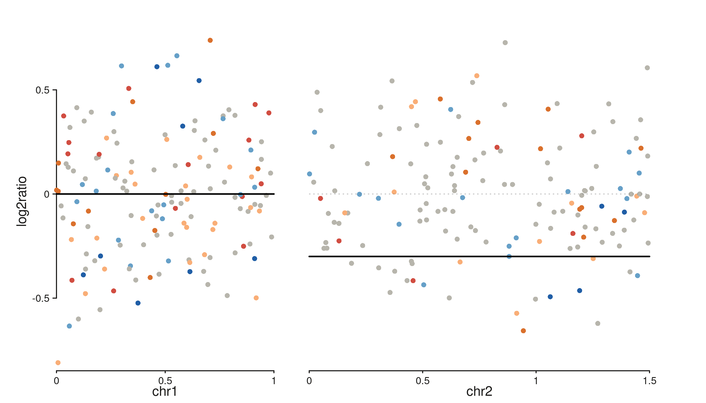
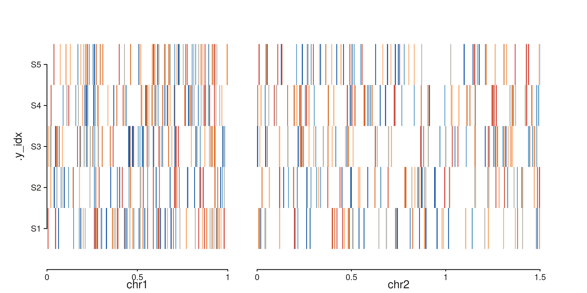
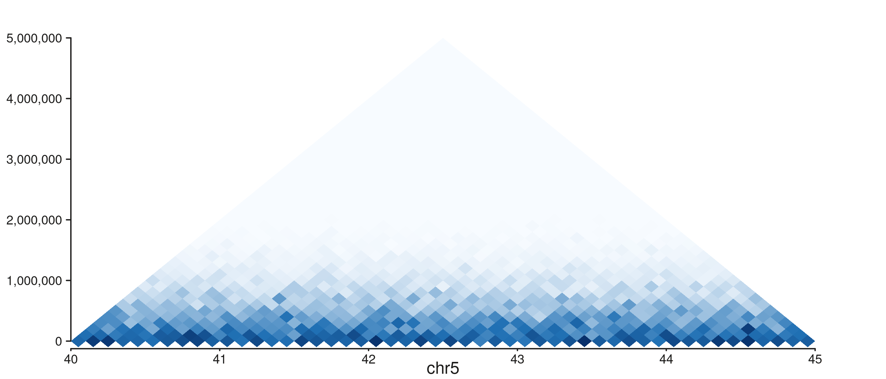
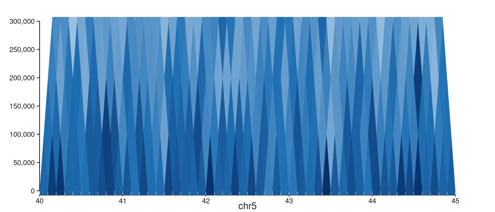
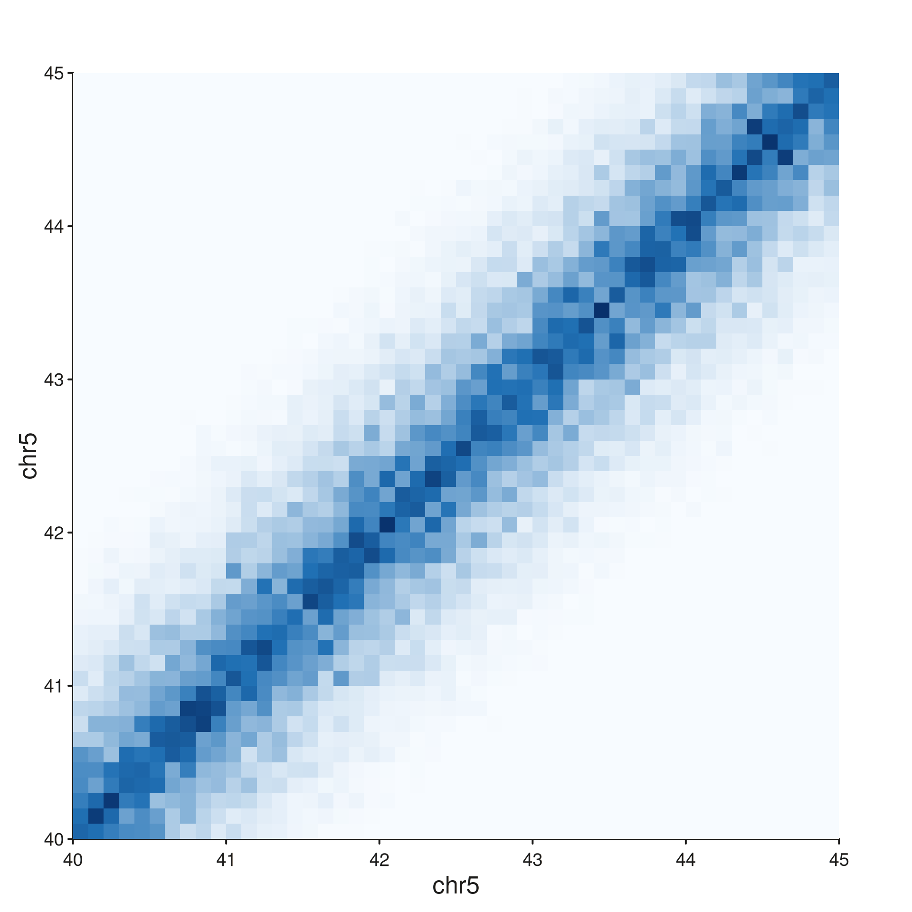
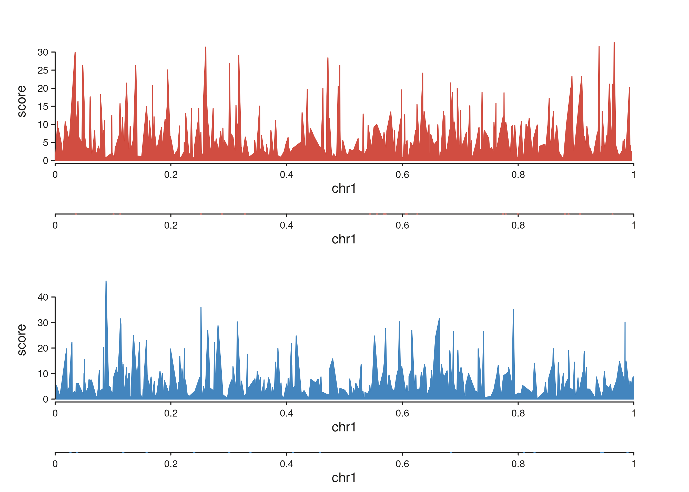
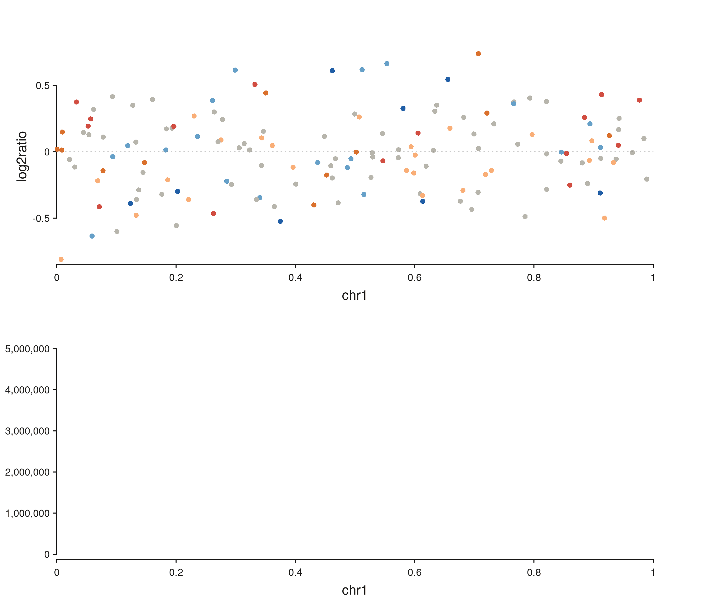

# High-Level Wrappers: Copy Number, Hi-C, and ChIP

SeqPlotR ships a small family of wrapper functions that assemble common
genomic visualisations from the primitive elements. Each wrapper returns
a `seq_plot` that can be further composed with `%+%`, `%|%`, `%__%`, or
\[[`seq_resolve()`](http://andrewlynch.io/SeqPlotR/reference/seq_resolve.md)\].

``` r

library(SeqPlotR)
#> 
#> Attaching package: 'SeqPlotR'
#> The following object is masked from 'package:base':
#> 
#>     %||%
library(GenomicRanges)
#> Loading required package: stats4
#> Loading required package: BiocGenerics
#> Loading required package: generics
#> 
#> Attaching package: 'generics'
#> The following objects are masked from 'package:base':
#> 
#>     as.difftime, as.factor, as.ordered, intersect, is.element, setdiff,
#>     setequal, union
#> 
#> Attaching package: 'BiocGenerics'
#> The following objects are masked from 'package:stats':
#> 
#>     IQR, mad, sd, var, xtabs
#> The following objects are masked from 'package:base':
#> 
#>     anyDuplicated, aperm, append, as.data.frame, basename, cbind,
#>     colnames, dirname, do.call, duplicated, eval, evalq, Filter, Find,
#>     get, grep, grepl, is.unsorted, lapply, Map, mapply, match, mget,
#>     order, paste, pmax, pmax.int, pmin, pmin.int, Position, rank,
#>     rbind, Reduce, rownames, sapply, saveRDS, table, tapply, unique,
#>     unsplit, which.max, which.min
#> Loading required package: S4Vectors
#> 
#> Attaching package: 'S4Vectors'
#> The following object is masked from 'package:utils':
#> 
#>     findMatches
#> The following objects are masked from 'package:base':
#> 
#>     expand.grid, I, unname
#> Loading required package: IRanges
#> Loading required package: Seqinfo
```

## `seq_copynumber()`

Single-sample CN scatter coloured by integer state, with optional
segmentation overlay.

``` r

win <- GRanges(c("chr1", "chr2"), IRanges(c(1, 1), c(1e6, 1.5e6)))

cn_gr <- GRanges(
  rep(c("chr1", "chr2"), each = 150),
  IRanges(start = c(sample(1:1e6, 150), sample(1:1.5e6, 150)), width = 5000),
  cn        = sample(0:5, 300, replace = TRUE,
                     prob = c(.05, .1, .55, .15, .1, .05)),
  log2ratio = rnorm(300, 0, 0.3)
)

seg <- GRanges(c("chr1", "chr2"),
               IRanges(c(1, 1), c(1e6, 1.5e6)),
               seg_mean = c(0.0, -0.3))

p <- seq_copynumber(cn_gr, windows = win,
                    segment_data = seg, segment_col = "seg_mean")
p$plot()
#> 5 out-of-bounds data points excluded! (seq_segment)
#> 5 out-of-bounds data points excluded! (seq_segment)
```



Column detection is automatic — `cn_col` falls back through
`c("cn", "copy_number", "CN", "state", "integer_cn")` and `ratio_col`
through `c("log2ratio", "logR", "log2R", "ratio", "log2_ratio")`.

## `seq_cn_heatmap()`

Multi-sample CN heatmap — one row per sample, tiles coloured by CN
state.

``` r

samples <- paste0("S", 1:5)
cnh_gr  <- GRanges(
  rep(c("chr1", "chr2"), each = 300),
  IRanges(start = c(sample(1:1e6, 300, replace = TRUE),
                    sample(1:1.5e6, 300, replace = TRUE)), width = 5000),
  sample = sample(samples, 600, replace = TRUE),
  cn     = sample(0:5, 600, replace = TRUE)
)

p <- seq_cn_heatmap(cnh_gr, windows = win,
                    sample_col = "sample", cn_col = "cn",
                    sample_order = samples)
p$plot()
```



## `seq_hic()` — four styles

One call to
[`seq_hic()`](http://andrewlynch.io/SeqPlotR/reference/seq_hic.md)
produces one style. Combine styles via
[`seq_resolve()`](http://andrewlynch.io/SeqPlotR/reference/seq_resolve.md)
for side-by-side panels.

### `style = "triangle"`

``` r

seq_hic(hic_gr, windows = win1, style = "triangle")$plot()
```



### `style = "rectangle"`

Caps the distance axis at `max_dist`:

``` r

seq_hic(hic_gr, windows = win1, style = "rectangle", max_dist = 3e5)$plot()
```



### `style = "full"` and `"diagonal"`

The full contact matrix lives on a 2D genomic grid:

``` r

seq_hic(hic_gr, windows = win1, style = "full")$plot()
```



## `seq_chip()`

ChIP-style signal + peak tracks. `data` is either a named list of
`GRanges` (one per sample) or a single `GRanges` with a sample column.

``` r

make_sig <- function(nm) {
  g <- GRanges("chr1",
               IRanges(sort(sample(1:1e6, 400)), width = 500),
               score = rexp(400, rate = 0.15))
  S4Vectors::mcols(g)$sample <- nm
  g
}
sig <- list(Rad21 = make_sig("Rad21"), NippedB = make_sig("NippedB"))
peaks <- list(Rad21   = GRanges("chr1", IRanges(sort(sample(1:1e6, 20)), width = 2000)),
              NippedB = GRanges("chr1", IRanges(sort(sample(1:1e6, 15)), width = 2000)))

p <- seq_chip(sig, peaks = peaks,
              windows = GRanges("chr1", IRanges(1, 1e6)))
p$plot()
```



## Composing wrappers with `seq_resolve()`

[`seq_resolve()`](http://andrewlynch.io/SeqPlotR/reference/seq_resolve.md)
is the key plumbing function for combining wrapper plots — it extracts
each child’s tracks and appends them to a parent `seq_plot` under the
requested direction.

``` r

win1 <- GRanges("chr1", IRanges(1, 1e6))

cn1 <- seq_copynumber(cn_gr[seqnames(cn_gr) == "chr1"],
                      windows = win1, track_id = "CN1")
hic <- seq_hic(hic_gr, windows = win1, style = "triangle",
               track_id = "HiC")

fig <- seq_resolve(seq_plot(), cn1, hic)
fig$plot()
#> 5 out-of-bounds data points excluded! (seq_segment)
```



    #> Warning in .merge_two_Seqinfo_objects(x, y): The 2 combined objects have no sequence levels in common. (Use
    #>   suppressWarnings() to suppress this warning.)

Pass unique `track_id` values to each wrapper call to avoid ID
collisions when resolving multiple plots into one figure.
